### <span style="color: lime">Что такое микросервисная архитектура?</span>
**`Микросервисная архитектура`** — это подход к разработке ПО, при котором приложение разбивается на несколько небольших, независимых сервисов (микросервисов). Каждый микросервис отвечает за свою конкретную задачу, и все они взаимодействуют друг с другом через четко определенные интерфейсы, обычно через HTTP или очереди сообщений.

Основные особенности микросервисной архитектуры:
- **Независимость сервисов**: Каждый микросервис можно разрабатывать, разворачивать и масштабировать независимо от других. Например, если сервис отвечает за работу с пользователями, изменения в нем не повлияют на сервис, который обрабатывает заказы.
- **Четкие границы ответственности**: Каждый микросервис решает конкретную задачу. Например, один сервис может быть ответственен за аутентификацию, другой — за обработку платежей, третий — за отправку уведомлений.
- **Взаимодействие через API**: Микросервисы общаются друг с другом через четко определенные интерфейсы (обычно это HTTP-запросы или другие протоколы). В Go для этого можно использовать `net/http`, чтобы отправлять запросы между микросервисами.
- **Автономность разработки**: Команды разработчиков могут работать над разными микросервисами независимо друг от друга. Это ускоряет процесс разработки, так как изменения в одном микросервисе не требуют изменений в других.
- **Гибкость в выборе технологий**: Каждый микросервис может быть написан на своем языке программирования или использовать свою базу данных. Например, в одной системе можно использовать Go для высоконагруженных микросервисов и Python для обработки данных.

Преимущества микросервисной архитектуры:
- **Легкость в масштабировании**: Можно масштабировать конкретный микросервис, который требует дополнительных ресурсов, не затрагивая всю систему.
- **Упрощенная поддержка**: Легче поддерживать и обновлять небольшие сервисы по отдельности, чем одно большое монолитное приложение.
- **Быстрота разработки**: Разные команды могут работать над своими микросервисами параллельно, не мешая друг другу.
- **Гибкость развертывания**: Микросервисы можно развертывать независимо. Например, если нужно исправить баг только в одном сервисе, это не требует остановки всей системы.

Недостатки микросервисной архитектуры:
- **Сложность в управлении**: Много независимых сервисов сложно координировать. Требуются продуманные механизмы для мониторинга, логирования и оркестрации.
- **Дополнительные накладные расходы**: Так как микросервисы общаются по сети, это может снижать производительность и требовать тщательного управления сетью.
- **Разбиение на сервисы**: Неправильное разбиение системы на микросервисы может привести к дублированию кода и увеличению сложности.

### <span style="color: lime">Сравнение микросервисной и монолитной архитектуры, плюсы и минусы каждой</span>
**`Монолитная архитектура`** представляет собой подход, при котором все компоненты системы (например, интерфейс, логика работы, база данных) разрабатываются и развертываются как одно целое. Все части системы находятся в одном кодовом пространстве и исполняются как единый блок.

Преимущества монолитной архитектуры:
- **Простота разработки и развертывания**: Один кодовый репозиторий, одна среда разработки. Все части системы можно запускать и тестировать вместе.
- **Целостность системы**: Все модули системы находятся в одном приложении, и взаимодействие между ними происходит в памяти, что делает их интеграцию и взаимодействие быстрее и проще.
- **Меньшие накладные расходы**: Взаимодействие между компонентами происходит напрямую внутри приложения, без необходимости использования сетевых вызовов или API. Это снижает задержки и потребление ресурсов.
- **Легкость тестирования**: Поскольку все компоненты разрабатываются как единая система, тестировать и отлаживать приложение в монолите зачастую проще.
- **Единая среда развертывания**: Все части системы развертываются одновременно, что упрощает управление версионностью и миграцией.

Недостатки монолитной архитектуры:
- **Трудности с масштабированием**: Чтобы масштабировать часть системы, приходится масштабировать все приложение. Это может привести к избыточным ресурсам и снижению эффективности.
- **Сложность поддержки**: По мере роста приложения монолитный код может становиться слишком сложным для понимания и модификации. Изменение одной части системы может непредсказуемо повлиять на другие части.
- **Долгое развертывание**: Из-за того, что приложение является единым целым, любое изменение требует развертывания всей системы. Это может замедлять внедрение обновлений и усложнять релиз новых версий.
- **Ограничения гибкости**: Использовать разные технологии для разных частей системы в монолитной архитектуре сложно. Всё должно быть написано на одном стеке технологий.

Сравнение монолитной и микросервисной архитектур:
<table>
  <tr>
    <th>Критерий</th>
    <th>Монолитная архитектура</th>
    <th>Микросервисная архитектура</th>
  </tr>
  <tr>
    <td>Масштабируемость</td>
    <td>Трудно масштабировать отдельные части системы</td>
    <td>Легко масштабировать отдельные сервисы</td>
  </tr>
  <tr>
    <td>Гибкость разработки</td>
    <td>Единый стек технологий, трудно изменить</td>
    <td>Возможность выбора технологий для каждого микросервиса</td>
  </tr>
  <tr>
    <td>Сложность развертывания</td>
    <td>Единое развертывание всей системы</td>
    <td>Независимое развертывание каждого сервиса</td>
  </tr>
  <tr>
    <td>Производительность</td>
    <td>Быстрое взаимодействие компонентов внутри приложения</td>
    <td>Задержки из-за сетевых взаимодействий</td>
  </tr>
  <tr>
    <td>Устойчивость к отказам</td>
    <td>Поломка одного компонента может привести к сбою системы</td>
    <td>Отказ одного микросервиса не ломает всю систему</td>
  </tr>
  <tr>
    <td>Поддержка и развитие</td>
    <td>Трудно поддерживать по мере роста кода</td>
    <td>Проще поддерживать и обновлять отдельные сервисы</td>
  </tr>
  <tr>
    <td>Мониторинг и логирование</td>
    <td>Проще, так как вся система единая</td>
    <td>Требует сложных инструментов для распределенных сервисов</td>
  </tr>
</table>

### <span style="color: lime">Что такое DDD, BDD, TDD и в чем их разница?</span>
**`DDD, BDD и TDD`** — это методологии и подходы, используемые в разработке программного обеспечения, которые помогают командам эффективно управлять процессом разработки и обеспечивать высокое качество кода. Давайте рассмотрим каждую из них и их различия.

#### DDD (Domain-Driven Design):
- **`DDD (Domain-Driven Design)`** — это подход к проектированию программного обеспечения, который акцентирует внимание на понимании предметной области (domain) и использовании этого понимания для создания модели приложения.
- **`Основная цель DDD`** — создать общую модель, которая будет понятна как разработчикам, так и бизнес-экспертам, чтобы упростить коммуникацию и сделать систему более адаптивной к изменениям.

Ключевые понятия DDD:
- **Узкая предметная область (Bounded Context)**: четко определенная область, где используется определенная модель, что помогает избежать путаницы между различными частями системы.
- **Сущности (Entities)**: объекты, имеющие уникальный идентификатор и меняющиеся со временем.
- **Значимые объекты (Value Objects)**: объекты, определяемые их атрибутами, но не имеющие уникального идентификатора.
- **Агрегаты (Aggregates)**: группы связанных сущностей и значимых объектов, которые рассматриваются как единое целое.

#### BDD (Behavior-Driven Development):
- **`BDD (Behavior-Driven Development)`** — это подход к разработке, который акцентирует внимание на поведении системы с точки зрения пользователя и использует язык, понятный всем участникам процесса, включая технических и нетехнических людей.
- **`BDD`** помогает создать спецификации, которые служат основой для тестов и документируют требования к системе.

Ключевые особенности BDD:
- Использование формата "Given-When-Then":
	- **Given**: начальное состояние или контекст.
	- **When**: действие, которое выполняется.
	- **Then**: ожидаемый результат.
- Тесты, написанные в стиле BDD, могут быть понятны как разработчикам, так и заказчикам.

#### TDD (Test-Driven Development):
- **`TDD (Test-Driven Development)`** — это методология разработки, при которой сначала пишутся тесты, а затем реализуется функциональность, которая эти тесты проходит.
- **`Этот подход`** помогает обеспечить высокое качество кода и способствует более гибкому реагированию на изменения требований.

Ключевые этапы TDD:
- **Написание теста**: Создается тест, который описывает желаемое поведение функциональности, но этот тест изначально не проходит (фейлится).
- **Реализация кода**: Пишется код, который проходит написанный тест.
- **Рефакторинг**: Код рефакторится для улучшения структуры и читаемости, сохраняя при этом проходящие тесты.

#### Основные различия между DDD, BDD, TDD:
<table>
  <tr>
    <th>Критерий</th>
    <th>DDD (Domain-Driven Design)</th>
    <th>BDD (Behavior-Driven Development)</th>
    <th>TDD (Test-Driven Development)</th>
  </tr>
  <tr>
    <td>Фокус</td>
    <td>Понимание предметной области и создание модели</td>
    <td>Поведение системы и спецификация требований</td>
    <td>Тестирование и качество кода</td>
  </tr>
  <tr>
    <td>Коммуникация</td>
    <td>Совместная работа между разработчиками и бизнес-экспертами</td>
    <td>Использование понятного языка для всех участников</td>
    <td>Команда разработчиков</td>
  </tr>
  <tr>
    <td>Подход</td>
    <td>Модельирование и проектирование</td>
    <td>Описание поведения системы</td>
    <td>Итеративная разработка с фокусом на тестах</td>
  </tr>
  <tr>
    <td>Инструменты</td>
    <td>Ubiquitous Language, Aggregates, Entities</td>
    <td>Сценарии в формате Given-When-Then</td>
    <td>Юнит-тесты, интеграционные тесты</td>
  </tr>
  <tr>
    <td>Временные рамки</td>
    <td>Долгосрочная работа над пониманием области</td>
    <td>Определение поведения перед реализацией</td>
    <td>Тестирование перед или одновременно с написанием кода</td>
  </tr>
</table>

#### Заключение:
- **DDD** помогает создать качественную модель предметной области, которая служит основой для разработки.
- **BDD** фокусируется на поведении системы и описании требований, обеспечивая понимание между всеми участниками процесса.
- **TDD** акцентирует внимание на тестировании и качестве кода, что способствует созданию надежных и поддерживаемых приложений.

Каждый из этих подходов решает разные задачи и может использоваться в комбинации в процессе разработки для достижения наилучших результатов.

### <span style="color: lime">Концепция паттерна saga?</span>
**`Saga`** — это паттерн для управления долгими транзакциями и асинхронными процессами в распределенных системах. Он используется для обработки сложных бизнес-процессов, состоящих из множества шагов, которые могут быть выполнены различными микросервисами. Saga помогает поддерживать согласованность данных между разными сервисами, минимизируя необходимость в блокировках и повышая надежность системы.

Основные характеристики паттерна Saga:
- **Долгосрочные транзакции**: 
	- Saga разбивает большую транзакцию на более мелкие, которые могут выполняться независимо друг от друга. Каждая такая подзадача должна завершаться успешно или вызывать компенсацию в случае неудачи.
- **Компенсация**: 
	- Если один из шагов в саге не может быть выполнен (например, возникает ошибка), для отмены предыдущих шагов выполняются компенсационные действия. Это помогает вернуть систему в согласованное состояние.
- **Асинхронность**:
	- Saga работает в асинхронном режиме, что позволяет избежать блокировок и снижает нагрузку на систему. Каждое действие может происходить независимо и по мере готовности.
- **Модели выполнения**:
	- Существуют два основных подхода к реализации паттерна Saga:
		- **Choreography (Хореография)**: В этом подходе каждый микросервис уведомляет другие о завершении своих действий. Это позволяет избежать центрального координатора, но может усложнить отслеживание состояния саги.
		- **Orchestration (Оркестрация)**: Используется центральный координатор, который управляет выполнением шагов саги. Он отвечает за вызов необходимых сервисов и обработку их результатов.

Преимущества паттерна Saga:
- **Согласованность данных**:
	- Saga помогает поддерживать согласованность между различными сервисами, даже если они работают независимо.
- **Отказоустойчивость**:
	- При возникновении ошибки можно выполнить компенсацию, что позволяет системе оставаться в согласованном состоянии.
- **Гибкость**:
	- Позволяет легко добавлять или изменять шаги в процессе, что делает систему более адаптивной.
- **Асинхронное взаимодействие**:
	- Снижается нагрузка на систему, так как операции выполняются асинхронно.

Недостатки паттерна Saga:
- **Сложность**:
	- Управление долгосрочными транзакциями и компенсациями может быть сложным, особенно при использовании подхода хореографии.
- **Трудности в отладке**:
	- Асинхронность и распределенность системы могут усложнить отладку и мониторинг состояния саги.
- **Избыточность**:
	- Некоторые шаги могут быть повторяемыми, если система требует выполнения нескольких действий для достижения согласованности.

**`Паттерн Saga`** представляет собой мощный инструмент для управления долгими транзакциями в распределенных системах. Он позволяет поддерживать согласованность данных и повышать отказоустойчивость, однако требует careful planning и учета сложностей, связанных с асинхронностью и компенсацией. Этот паттерн особенно полезен в архитектуре микросервисов, где распределенные системы и долгосрочные транзакции являются нормой.

### <span style="color: lime">Способы общения сервисов между собой?</span>
#### HTTP/REST API:
**Описание**:
- Один из наиболее распространённых способов взаимодействия сервисов в микросервисной архитектуре — через HTTP-запросы, используя REST API. Каждый микросервис предоставляет свои интерфейсы для других сервисов, и взаимодействие происходит через стандартные HTTP методы: GET, POST, PUT, DELETE.

**Плюсы**:
- Простота и универсальность.
- Широкая поддержка в разных языках и фреймворках.
- Легко интегрируется с существующими веб-сервисами.

**Минусы**:
- Высокая задержка из-за сетевых вызовов.
- Появление "слабых мест", если сервисы становятся сильно зависимыми друг от друга.

#### gRPC
**Описание**:
- `gRPC` — это высокопроизводительный протокол удалённого вызова процедур (RPC), который использует HTTP/2 и бинарный формат данных (Protocol Buffers). В `gRPC` сервисы могут напрямую вызывать методы друг друга, что делает этот способ общения более эффективным и быстрым по сравнению с `REST API`.

**Плюсы**:
- Высокая производительность и меньший объём данных благодаря бинарной передаче.
- Поддержка стриминга (streaming) для больших или последовательных данных.
- Стабильная работа в распределённых системах.

**Минусы**:
- Более сложная настройка и поддержка.
- Потребность в знании Protocol Buffers и дополнительных инструментов для генерации кода.

#### Message Broker (Брокеры сообщений)
**Описание**:
- Асинхронное взаимодействие между сервисами через очередь сообщений — это ещё один популярный способ общения в микросервисной архитектуре. Сервисы могут отправлять сообщения в брокер (например, `RabbitMQ, Apache Kafka`), а другие сервисы могут подписываться на получение этих сообщений и обрабатывать их. Это позволяет развязать сервисы друг от друга и повысить отказоустойчивость.

**Плюсы**:
- Асинхронность: сервисы могут продолжать работу, не дожидаясь завершения задачи.
- Масштабируемость: очередь сообщений может быть распределена на несколько серверов.
- Уменьшение зависимостей между сервисами.

**Минусы**:
- Требуется дополнительная инфраструктура (брокер сообщений).
- Возможны сложности в отслеживании состояний сообщений (например, потеря сообщений).

#### Event-Driven Architecture (Архитектура на основе событий)
**Описание**:
- В микросервисной архитектуре часто используется событийная модель. В этой модели сервисы реагируют на события, а не отправляют прямые запросы друг другу. Например, один сервис может "выпускать" событие, которое другие сервисы "слушают" и обрабатывают. Это делает систему более гибкой и модульной.

**Плюсы**:
- Высокая модульность: сервисы могут добавляться и удаляться без изменения других.
- Хорошо подходит для распределённых и масштабируемых систем.
- Повышенная отказоустойчивость.

**Минусы**:
- Более сложная отладка и мониторинг системы.
- Не всегда очевиден порядок обработки событий.

#### WebSockets
**Описание**:
- WebSockets обеспечивают постоянное двустороннее соединение между клиентом и сервером. Это полезно для приложений, требующих обмена данными в реальном времени (например, чаты, трекеры).

**Плюсы**:
- Постоянное соединение для передачи данных в реальном времени.
- Эффективное использование ресурсов.

**Минусы**:
- Может быть избыточным, если реальное время не критично.
- Сложность управления большим количеством соединений.

#### Shared Database (Общая база данных)
**Описание**:
- Иногда микросервисы могут общаться друг с другом через общую базу данных. Это не лучший подход с точки зрения разделения ответственности, но в некоторых случаях может быть полезным, если системы работают с одними и теми же данными.

**Плюсы**:
- Простота реализации.
- Нет необходимости в настройке дополнительных протоколов или брокеров.

**Минусы**:
- Снижение гибкости и независимости сервисов.
- Проблемы с производительностью и отказоустойчивостью базы данных могут затронуть все сервисы.

### <span style="color: lime">Что такое чистая архитектура?</span>
**Чистая архитектура** (Clean Architecture) — это архитектурный стиль проектирования программного обеспечения, предложенный Робертом Мартином (известным как Uncle Bob). Она предназначена для создания систем, которые легко расширять, модифицировать, тестировать и поддерживать. Основная идея чистой архитектуры заключается в разделении системы на слои, где внешние слои зависят от внутренних, но не наоборот. Это помогает разделить бизнес-логику (то есть, "суть" приложения) от деталей реализации, таких как пользовательский интерфейс или работа с базой данных.

#### Основные принципы чистой архитектуры:
- **Зависимости направлены внутрь**: Компоненты на более низком уровне (например, работа с базами данных, фреймворки и внешние библиотеки) не должны влиять на бизнес-логику. Внутренние слои, которые содержат логику приложения, не знают и не зависят от внешних слоёв.
- **Слои архитектуры**: Чистая архитектура делит приложение на несколько слоев. Основные из них:
	- **Entities (Сущности)**: Это центральный слой, который содержит бизнес-правила. Сущности — это абстракции, представляющие основной функционал системы.
	- **Use Cases (Сценарии использования)**: Этот слой содержит логику приложения. Здесь находятся бизнес-правила, которые отвечают за выполнение задач и взаимодействие между сущностями.
	- **Interface Adapters (Адаптеры интерфейсов)**: Этот слой преобразует данные из форматов, которые подходят для сущностей и сценариев использования, в форматы, которые подходят для пользовательского интерфейса или внешних источников данных (например, баз данных, API).
	- **Frameworks and Drivers (Фреймворки и драйверы)**: Это внешний слой. Он включает всё, что связано с техническими деталями — базы данных, веб-серверы, пользовательский интерфейс и т. д. Эти компоненты являются "деталями", и система должна минимально зависеть от них.
- **Зависимость от абстракций, а не от реализаций**: В чистой архитектуре конкретные реализации (например, база данных, внешние API) зависят от абстракций (интерфейсов), а не наоборот. Это позволяет легко заменять компоненты системы без необходимости переписывать бизнес-логику.
- **Тестируемость**: Поскольку бизнес-логика отделена от деталей реализации, её можно тестировать независимо от пользовательского интерфейса, базы данных и других компонентов. Это делает систему более модульной и гибкой для тестирования.

#### Пример в контексте Go:
Рассмотрим, как можно организовать приложение в стиле чистой архитектуры на Go. Пример: интернет-магазин:
1. **Entities (Сущности)**:
```go
type Product struct {
    ID       int
    Name     string
    Price    float64
}
```

2. **Use Cases (Сценарии использования)**: Сценарий использования для получения информации о продукте.
```go
type ProductUsecase interface {
    GetProductByID(id int) (*Product, error)
}

type productUsecase struct {
    productRepo ProductRepository
}

func (u *productUsecase) GetProductByID(id int) (*Product, error) {
    return u.productRepo.FindByID(id)
}
```

3. **Interface Adapters (Адаптеры интерфейсов)**: Адаптеры преобразуют данные из хранилища для использования в сценариях. Например, адаптер для базы данных:
```go
type ProductRepository interface {
    FindByID(id int) (*Product, error)
}

type productRepo struct {
    db *sql.DB
}

func (r *productRepo) FindByID(id int) (*Product, error) {
    row := r.db.QueryRow("SELECT id, name, price FROM products WHERE id = ?", id)
    var product Product
    err := row.Scan(&product.ID, &product.Name, &product.Price)
    return &product, err
}
```

4. **Frameworks and Drivers (Фреймворки и драйверы)**: Это внешний слой, который может включать веб-сервер. Например, HTTP-контроллер для обработки запросов:
```go
func GetProductHandler(w http.ResponseWriter, r *http.Request, uc ProductUsecase) {
    id, _ := strconv.Atoi(r.URL.Query().Get("id"))
    product, err := uc.GetProductByID(id)
    if err != nil {
        http.Error(w, err.Error(), http.StatusInternalServerError)
        return
    }
    json.NewEncoder(w).Encode(product)
}
```

### <span style="color: lime">Какие слои есть в чистой архитектуре?</span>
В **`чистой архитектуре`** выделяют несколько ключевых слоёв, каждый из которых имеет своё назначение и правила взаимодействия. Важно помнить, что слои зависят друг от друга только в одном направлении — из внешних слоёв во внутренние. Внутренние слои не зависят от внешних.

#### Основные слои в чистой архитектуре:
1. Entities (Сущности):
	- **Описание:** Этот слой содержит бизнес-объекты и правила (бизнес-логику), которые описывают ключевую функциональность системы. Сущности представляют собой объекты с атрибутами и методами, которые определяют поведение системы независимо от внешних факторов (например, базы данных или пользовательского интерфейса).
	- **Назначение:** Сущности содержат минимальный набор бизнес-правил и данных, которые важны для системы. Они не зависят от того, как они будут использоваться (через веб-интерфейс, консоль или API).
	- **Пример:** В системе интернет-магазина сущностью может быть объект Product, который описывает товар.
```go
type Product struct {
    ID       int
    Name     string
    Price    float64
}
```

2. Use Cases (Сценарии использования):
	- **Описание:** Этот слой описывает бизнес-логику, но в более прикладном смысле. Он управляет тем, как сущности взаимодействуют друг с другом для решения конкретных задач. Здесь находится логика сценариев использования, которая определяет, как данные проходят через систему и какие операции выполняются.
	- **Назначение:** Сценарии использования управляют потоками данных и не зависят от внешних факторов, таких как пользовательский интерфейс или хранилище данных. Их задача — выполнять бизнес-правила, используя сущности.
	- **Пример:** В интернет-магазине сценарий использования может быть: "Получить информацию о товаре по ID".
```go
type ProductUsecase interface {
    GetProductByID(id int) (*Product, error)
}
```

3. Interface Adapters (Адаптеры интерфейсов):
	- **Описание:** Этот слой служит для преобразования данных между внутренними слоями (сценариями использования и сущностями) и внешними слоями (например, базой данных или веб-интерфейсом). Он адаптирует данные из одного формата в другой. Например, преобразует запрос от веб-интерфейса в формат, который может обработать сценарий использования.
	- **Назначение:** Адаптеры интерфейсов отделяют внутреннюю логику системы от внешних источников данных или интерфейсов, таких как базы данных, API, пользовательские интерфейсы. Это позволяет легко изменять внешний слой без затрагивания внутренней логики.
	- **Пример:** Адаптер для работы с базой данных.
```go
type ProductRepository interface {
    FindByID(id int) (*Product, error)
}

type productRepo struct {
    db *sql.DB
}

func (r *productRepo) FindByID(id int) (*Product, error) {
    row := r.db.QueryRow("SELECT id, name, price FROM products WHERE id = ?", id)
    var product Product
    err := row.Scan(&product.ID, &product.Name, &product.Price)
    return &product, err
}
```

4. Frameworks and Drivers (Фреймворки и драйверы):
	- **Описание:** Это внешний слой, который содержит конкретные реализации деталей, таких как работа с базами данных, веб-серверами или пользовательскими интерфейсами. Этот слой зависит от внутренней логики, но сама бизнес-логика и сценарии использования от него не зависят.
	- **Назначение:** Этот слой отвечает за конкретные технологии и фреймворки, которые используются в системе, такие как базы данных, пользовательские интерфейсы, внешние API. Его задача — предоставить интерфейсы для взаимодействия с реальными данными или внешним миром.
	- **Пример:** Веб-сервер, который обрабатывает HTTP-запросы и передаёт их внутрь системы.
```go
func GetProductHandler(w http.ResponseWriter, r *http.Request, uc ProductUsecase) {
    id, _ := strconv.Atoi(r.URL.Query().Get("id"))
    product, err := uc.GetProductByID(id)
    if err != nil {
        http.Error(w, err.Error(), http.StatusInternalServerError)
        return
    }
    json.NewEncoder(w).Encode(product)
}
```

#### Правила зависимости между слоями:
- **Зависимости направлены внутрь**: Внешние слои могут зависеть от внутренних, но не наоборот. Это правило помогает изолировать бизнес-логику от деталей реализации.
- **Использование абстракций**: Слои взаимодействуют через абстракции (интерфейсы), что позволяет легко изменять конкретные реализации (например, сменить базу данных), не затрагивая бизнес-логику.

### <span style="color: lime">Как применить принцип инверсии зависимостей при разработке приложения с использованием чистой архитектуры?</span>
**`Принцип инверсии зависимостей (DIP — Dependency Inversion Principle)`** является ключевым компонентом чистой архитектуры. Этот принцип гласит, что высокоуровневые модули (или компоненты) не должны зависеть от низкоуровневых модулей. Вместо этого оба модуля должны зависеть от абстракций (интерфейсов). Таким образом, детали (низкоуровневые компоненты) зависят от абстракций, а не наоборот.

Применение принципа инверсии зависимостей позволяет достичь более гибкой, масштабируемой и тестируемой системы. В контексте чистой архитектуры DIP помогает изолировать бизнес-логику от деталей реализации, таких как работа с базами данных, API или пользовательским интерфейсом.

#### Как применить принцип инверсии зависимостей при разработке приложения с использованием чистой архитектуры:
- Создайте абстракции (интерфейсы) для всех зависимостей:
	- Прежде чем реализовать какую-либо функциональность, определите интерфейсы, через которые компоненты будут взаимодействовать. Высокоуровневые слои, такие как бизнес-логика (сценарии использования), будут работать с этими интерфейсами, не зная деталей реализации.
	- **Пример:** Пусть у нас есть сценарий использования, который должен получать данные из репозитория продуктов. Вместо того, чтобы напрямую взаимодействовать с базой данных, вы создаете интерфейс, который будет определять контракт для взаимодействия с любым хранилищем данных.
```go
// Определяем интерфейс репозитория для работы с продуктами
type ProductRepository interface {
    FindByID(id int) (*Product, error)
}
```

- Реализуйте бизнес-логику через зависимости на интерфейсы:
	- Сценарии использования, которые реализуют бизнес-логику, должны зависеть только от абстракций (интерфейсов), а не от конкретных реализаций. Это позволяет легко подменять зависимости и делает бизнес-логику независимой от деталей реализации.
	- **Пример:** Сценарий использования, который зависит от абстрактного репозитория, а не от конкретной реализации.
```go
type ProductUsecase struct {
    repository ProductRepository
}

func (u *ProductUsecase) GetProductByID(id int) (*Product, error) {
    return u.repository.FindByID(id)
}
```

- Реализуйте конкретные детали (адаптеры) как зависимости:
	- Реализация конкретных зависимостей, таких как базы данных или API, должна находиться в более низких слоях (например, в адаптерах интерфейсов), а сами реализации должны соответствовать интерфейсам, которые используются в бизнес-логике.
	- **Пример:** Реализация репозитория для работы с базой данных (реализация интерфейса `ProductRepository`).
```go
type productRepo struct {
    db *sql.DB
}

func (r *productRepo) FindByID(id int) (*Product, error) {
    row := r.db.QueryRow("SELECT id, name, price FROM products WHERE id = ?", id)
    var product Product
    err := row.Scan(&product.ID, &product.Name, &product.Price)
    return &product, err
}
```

4. Связывайте зависимости через внедрение (Dependency Injection):
	- Важным шагом при реализации инверсии зависимостей является внедрение зависимостей. Это можно сделать вручную, передавая реализации интерфейсов в конструкторы объектов, либо с помощью специальных инструментов для внедрения зависимостей.
	- **Пример:** Передача конкретной реализации репозитория в бизнес-логику при создании сценария использования.
```go
func main() {
    // Создаём соединение с базой данных
    db, _ := sql.Open("mysql", "user:password@tcp(127.0.0.1:3306)/shop")
    
    // Создаём конкретную реализацию репозитория
    repo := &productRepo{db: db}
    
    // Передаём репозиторий в сценарий использования
    usecase := ProductUsecase{repository: repo}

    // Теперь бизнес-логика может использоваться с любым адаптером репозитория
    product, err := usecase.GetProductByID(1)
    if err != nil {
        log.Fatal(err)
    }
    fmt.Println(product)
}
```

5. Используйте принцип инверсии для легкой подмены зависимостей в тестах:
	- Одним из главных преимуществ инверсии зависимостей является лёгкость в тестировании. Поскольку бизнес-логика зависит только от интерфейсов, для тестов можно подменять конкретные реализации моками (фейковыми объектами), что упрощает процесс тестирования.
	- **Пример:** Мок (fake) для тестирования сценария использования.
```go
type mockProductRepo struct{}

func (m *mockProductRepo) FindByID(id int) (*Product, error) {
    return &Product{ID: id, Name: "Mock Product", Price: 9.99}, nil
}

func TestGetProductByID(t *testing.T) {
    repo := &mockProductRepo{}
    usecase := ProductUsecase{repository: repo}

    product, err := usecase.GetProductByID(1)
    if err != nil {
        t.Fatal(err)
    }

    if product.Name != "Mock Product" {
        t.Errorf("Expected 'Mock Product', got %s", product.Name)
    }
}
```

#### Преимущества применения принципа инверсии зависимостей в чистой архитектуре:
- **Гибкость**: Можно легко менять детали реализации (например, заменять одну базу данных на другую) без изменения бизнес-логики.
- **Тестируемость**: Благодаря абстрагированию зависимостей через интерфейсы, становится проще тестировать отдельные части системы, подменяя реальные реализации фейковыми.
- **Модульность**: Слои системы чётко разграничены, что делает код более понятным и поддерживаемым.
- **Расширяемость**: Новые функциональные возможности можно добавлять без значительных изменений в существующем коде, так как новый код будет работать с существующими интерфейсами.

### <span style="color: lime">Где должны располагаться интерфейсы? На стороне потребителя или на стороне производителя?</span>
В контексте чистой архитектуры и принципа инверсии зависимостей (DIP), **интерфейсы должны располагаться на стороне потребителя**, а не производителя. Это одно из ключевых правил, которое помогает реализовать инверсию зависимостей.

#### Объяснение:
- **Потребитель** — это компонент, который использует определённый функционал. В случае чистой архитектуры, это может быть бизнес-логика (сценарии использования), которая требует доступ к данным или другим сервисам.
- **Производитель** — это компонент, который предоставляет реализацию этого функционала. Например, это может быть адаптер для базы данных, который реализует доступ к данным через SQL-запросы.

#### Почему интерфейс должен быть на стороне потребителя:
- **Контроль и абстракция**: Потребитель (например, сценарий использования) контролирует, как будет использоваться интерфейс. Он определяет, какие методы и операции ему нужны для выполнения своих задач. Таким образом, интерфейс проектируется исходя из нужд потребителя, а не исходя из возможностей производителя.
    
- **Независимость от конкретных реализаций**: Когда интерфейс находится на стороне потребителя, он становится независимым от конкретных деталей реализации (например, конкретной базы данных или API). Это позволяет легко менять производители (например, разные базы данных) без необходимости изменять сам интерфейс или бизнес-логику.
    
- **Поддержка принципа инверсии зависимостей**: Принцип инверсии зависимостей предполагает, что бизнес-логика (высокоуровневый модуль) не зависит от низкоуровневых модулей (например, базы данных). Если интерфейс находится на стороне потребителя, то бизнес-логика зависит только от абстракций (интерфейсов), а не от конкретных реализаций.

#### Представим сценарий использования, который зависит от репозитория для получения данных о продуктах:
- **Интерфейс на стороне потребителя** — определённый в слое бизнес-логики (Use Cases):
```go
// Интерфейс репозитория на стороне потребителя
type ProductRepository interface {
    FindByID(id int) (*Product, error)
}
```

- **Реализация на стороне производителя** — реализована в слое адаптеров (Interface Adapters), например, для работы с базой данных:
```go
type productRepo struct {
    db *sql.DB
}

// Реализация интерфейса, созданного на стороне потребителя
func (r *productRepo) FindByID(id int) (*Product, error) {
    row := r.db.QueryRow("SELECT id, name, price FROM products WHERE id = ?", id)
    var product Product
    err := row.Scan(&product.ID, &product.Name, &product.Price)
    return &product, err
}
```

#### Основные преимущества такого подхода:
- **Гибкость и расширяемость**: Можно легко подменять реализацию (например, использовать другую базу данных) без изменения логики приложения.
- **Легкость тестирования**: При написании тестов можно легко использовать моки (фейковые реализации интерфейсов), что упрощает тестирование бизнес-логики.
- **Чистая изоляция**: Потребитель не зависит от деталей реализации, что поддерживает принцип "разделяй и властвуй", снижая сложность системы.

### <span style="color: lime">26 основных паттернов микросервисной разработки</span>
Основная цель - предоставить проверенные временем решения для таких, задач, как разработка микросервисной архитектуры, организация взаимодействия микросервисов друг с другом, клиентскими приложениями, базами данных, обеспечения их отказаустойчивости.

#### Паттерны декомпозиции на микросервисы
Блок шаблонов предлагает решения для декомпозиции, то есть разделения приложений на микросервисы.
1. **`Шаблон «Разбиение по бизнес-возможностям» (Decompose By Business Capability)`**:
	- Один из наиболее известных способов разбиения на микросервисы - это определение бизнес-возможностей приложения и создание по одному микросервису на каждую из них. Бизнес-возможности представляют собой функции, которые будут доступны пользователям при работе с приложением. 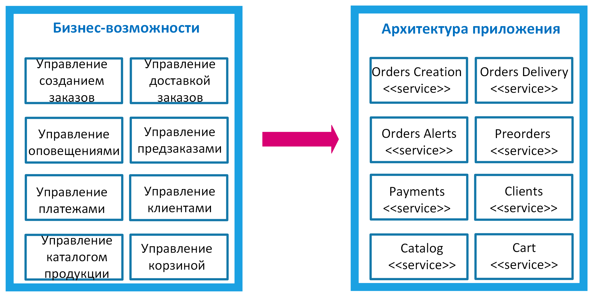

2. **`Шаблон «Разбиение по поддоменам» (Decompose By Subdomain)`**:
	- Этот шаблон помогает избежать появления слишком сложных и общих классов (God Classes) при работе с микросервисами. Вместо того чтобы создавать много микросервисов вокруг бизнес-функций, как, например, разные сервисы для заказа, доставки, уведомлений, используется подход предметно-ориентированного проектирования (DDD). Он разбивает систему на поддомены, у каждого из которых есть свой ограниченный контекст (свои данные и правила). Так, для интернет-магазина всё, что связано с заказами, можно поместить в один поддомен и создать один микросервис для управления заказами, а не несколько. 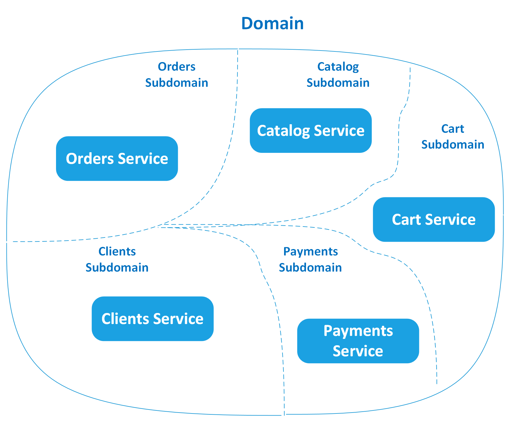

#### Паттерны рефакторинга для перехода на микросервисы
Эта группа шаблонов предназначена для организации взаимодействия с Legacy-приложениями и/или их постепенного перевода на микросервисную архитектуру.
1. **`Шаблон «Душитель» (Strangler)`**:
	- Этот шаблон помогает постепенно преобразовать старое монолитное приложение в микросервисную архитектуру. Вместо того чтобы сразу переписывать весь код, старые функции поэтапно переносят в микросервисы. Для этого настраивают специальный фасад, который направляет запросы к новым микросервисам, а не к монолиту. Когда все функции перенесены, монолит убирают. Этот подход удобен для больших систем, но для небольших приложений лучше сделать переход сразу, так как добавление фасада может усложнить работу. 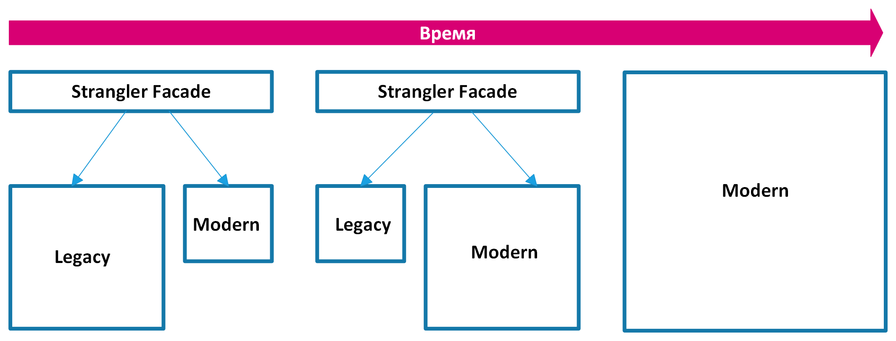

2. **`Шаблон «Уровень защиты от повреждений» (Anti-Corruption Layer)`**:
	- Этот шаблон помогает взаимодействовать с устаревшими системами при переходе на микросервисы. Если невозможно быстро обновить старую систему, между ней и новыми микросервисами добавляется специальный слой. Этот слой переводит данные и запросы из формата старой системы в формат новых микросервисов и наоборот, чтобы обе части могли работать независимо и без изменений. Это защищает новые микросервисы от `повреждений` устаревшими технологиями. 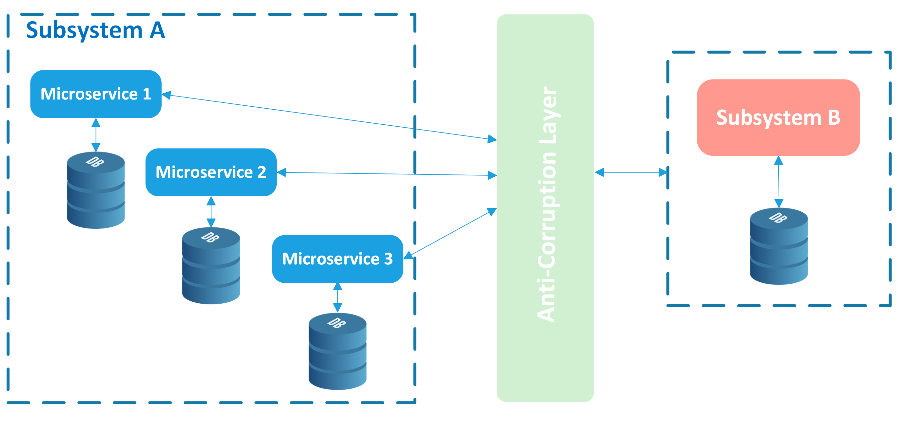

#### Паттерны управления данными в микросервисной архитектуре
Этот блок шаблонов описывает возможные варианты взаимодействия микросервисов с базами данных.
1. **`Шаблон «База данных на сервис» (Database Per Service)`**:
	- Этот шаблон означает, что каждый микросервис должен иметь свое собственное хранилище данных, чтобы уменьшить зависимости между ними. Это повышает независимость микросервисов и позволяет разным командам работать быстрее. Микросервисы могут использовать одну физическую базу данных, но с отдельными схемами или таблицами. Недостаток в том, что становится сложнее обмениваться данными между сервисами и обеспечивать транзакции. Этот подход лучше использовать в крупных проектах с множеством микросервисов, а не в маленьких приложениях. 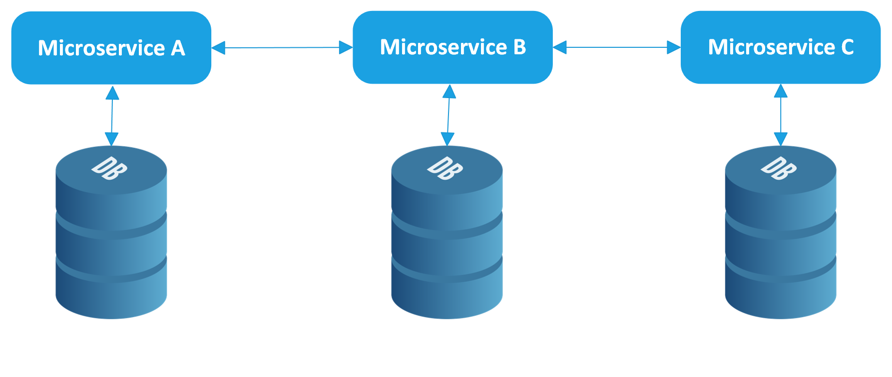

2. **`Шаблон «API-композиция» (API Composition)`**:
	- Этот шаблон используется для получения данных из нескольких микросервисов, у которых свои базы данных. Создается отдельное API, которое запрашивает данные у нужных сервисов и объединяет их в памяти. Это простой способ собрать данные из разных источников, но может быть неэффективным для работы с большими объемами данных. Для более сложных случаев может подойти другой шаблон — CQRS. 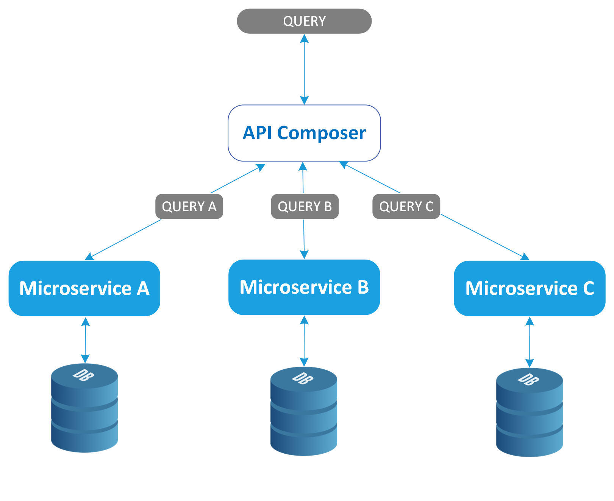

3. **`Шаблон «Разделение команд и запросов» (Command Query Responsibility Segregation, CQRS)`**:
	- Этот шаблон разделяет операции изменения данных (команды) и их чтения (запросы). Шаблон CQRS имеет две формы: простую и расширенную. 
	- В `простой форме` данные хранятся в одном месте, но используются разные модели для чтения и записи. 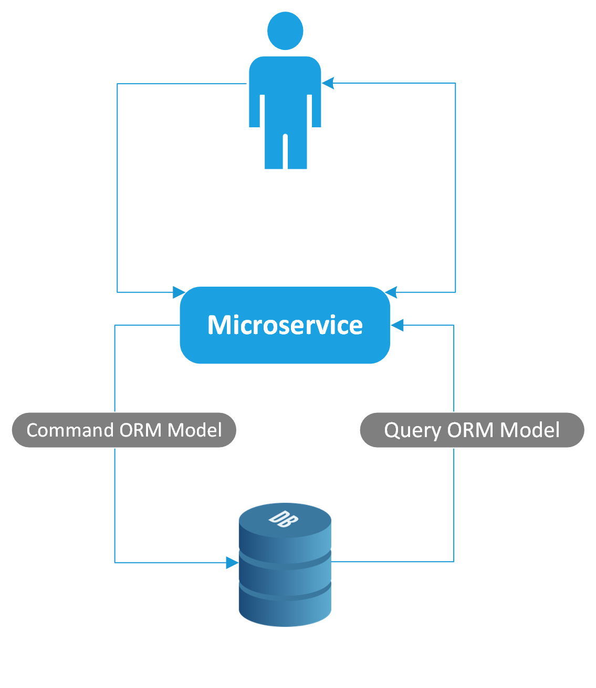 
	- В `расширенной форме` - используются отдельные базы для чтения и записи, синхронизируемые асинхронно. Это ускоряет чтение и позволяет масштабировать системы отдельно для запросов и изменений, но усложняет архитектуру и может привести к задержкам в согласованности данных. CQRS полезен для сложных систем с разными нагрузками на чтение и запись. 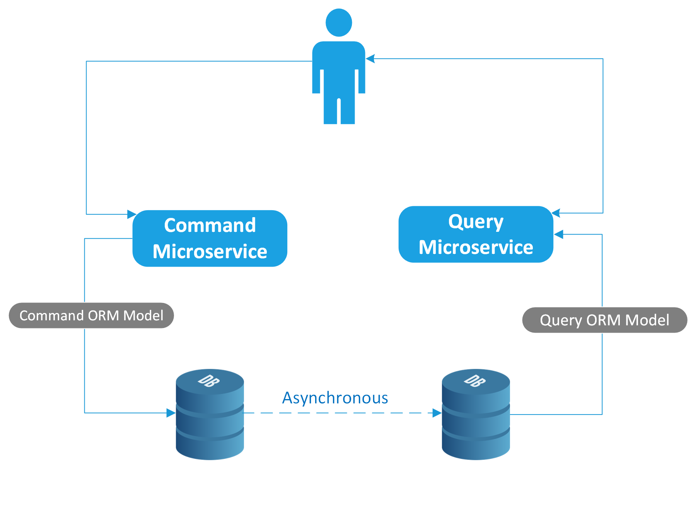

4. **`Шаблон «Поиск событий» (Event Sourcing)`**:
	- Этот шаблон сохраняет не текущее состояние объектов, а все события, которые привели к изменениям. Чтобы узнать текущее состояние, система просто повторяет все события по порядку. Это полезно для сложных систем, где важно отслеживать каждое изменение, и позволяет другим микросервисам использовать эти события для обновления своих данных. Этот подход подходит для больших систем, где нужно обрабатывать много данных и событий. Но для простых приложений, где микросервисы могут напрямую обмениваться данными, он излишне сложен. 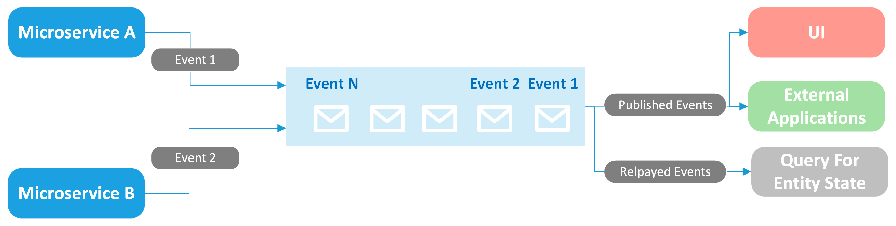

5. **`Шаблон «Сага» (Saga)`**:
	- Этот шаблон помогает управлять транзакциями в микросервисах, когда обычные методы, как двухфазная фиксация (2PC), не работают. В каждой транзакции один микросервис обновляет свои данные и отправляет событие, которое запускает следующую транзакцию в другом микросервисе. Если что-то идет не так, включаются компенсирующие транзакции, чтобы отменить изменения. Есть два способа координации: 
	- **`Хореография`**: микросервисы сами слушают события друг друга и решают, что делать дальше. 
	- **`Оркестровка`**: отдельный компонент (оркестратор) управляет всем процессом.
	- Сага полезна для систем с событиями и NoSQL базами, но усложняет отладку и не всегда подходит для SQL баз и циклических зависимостей. 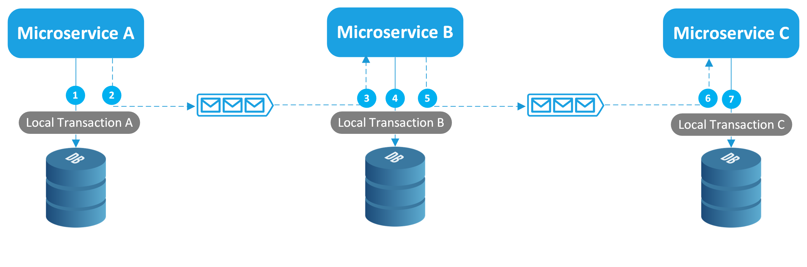

#### Паттерны коммуникации микросервисов
Этот блок шаблонов охватывает способы внешних взаимодействий микросервисов: с клиентскими приложениями, удаленными сервисами и так далее.
1. **`Шаблон «API-шлюз» (API Gateway)`**:
	- Этот шаблон используется в крупных проектах для упрощения взаимодействия между клиентами и множеством микросервисов. Вместо того чтобы клиент напрямую общался с каждым микросервисом, добавляется шлюз — единая точка входа. Он принимает запросы от клиента и передает их нужным микросервисам. Есть три варианта использования: 
	- **Gateway Routing**: Шлюз перенаправляет запросы к нужному сервису.
	- **Gateway Aggregation**: Шлюз собирает данные с нескольких сервисов и возвращает один ответ клиенту.
	- **Gateway Offloading**: Шлюз выполняет общие задачи для всех сервисов, как авторизация или шифрование.
	- API-шлюз помогает упростить взаимодействие, но может стать узким местом, если его не масштабировать или мониторить. 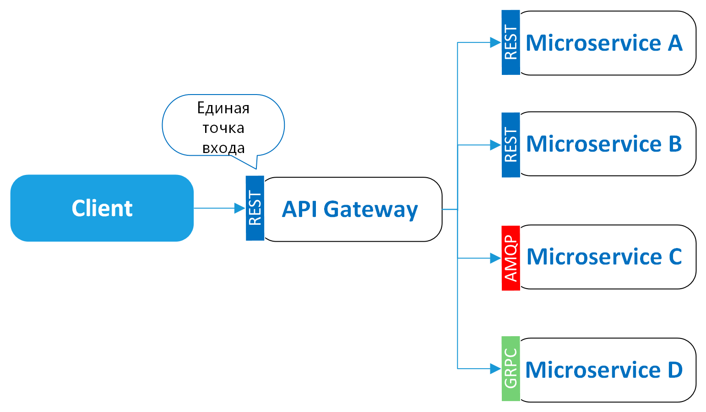

2. **`Шаблон «Бэкенды для фронтендов» (Backends for Frontends, BFF)`**:
	- Когда разные устройства (например, веб-сайт, мобильное приложение, настольное приложение) обращаются к серверу, у них могут быть разные требования к данным. Чтобы не заставлять все эти устройства использовать один и тот же универсальный сервер (где много лишнего для каждого), можно сделать несколько специальных "шлюзов" — серверов, каждый из которых будет адаптирован под конкретное устройство. Каждое устройство будет общаться со своим "шлюзом" (BFF), который уже знает, что именно нужно этому клиенту. Это уменьшает лишнюю сложность и делает работу с сервером быстрее и удобнее для каждого устройства. Но если требования у устройств почти одинаковые или приложение маленькое, такой подход может быть излишним и приведет к дублированию работы и лишним серверам. 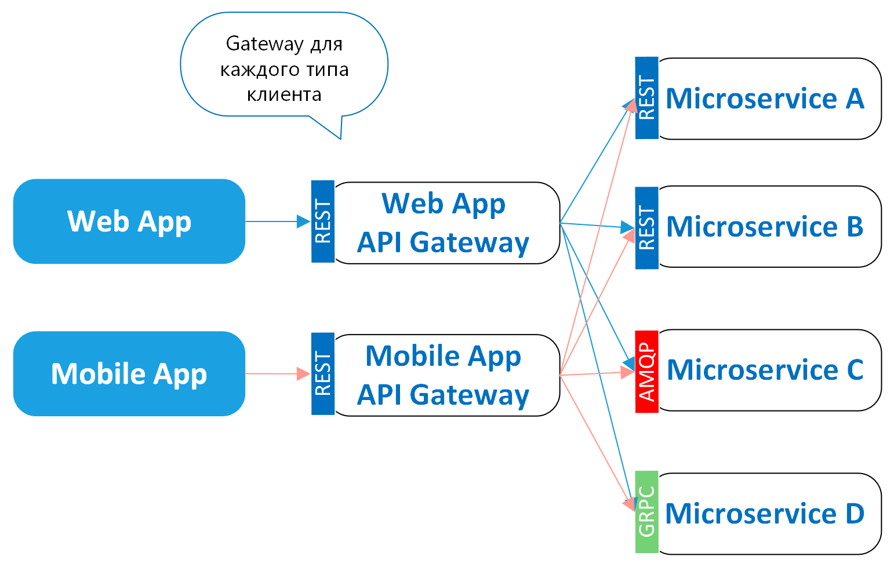

#### Паттерны построения пользовательского интерфейса
Эта группа шаблонов предлагает решения для отображения на одной странице или экране пользовательского интерфейса данных из нескольких микросервисов.
1. **`Шаблон «Сборка пользовательского интерфейса на стороне клиента» (Client-Side UI Composition)`**:
	- Когда мы создаем веб-страницу, она состоит из разных частей, например, заголовка, меню, контента и подвала. Вместо того чтобы загружать всю страницу целиком с сервера, мы можем разбить ее на маленькие фрагменты. Каждый фрагмент получает свои данные от различных микросервисов.
	- Каждый из этих фрагментов можно представить как маленькое приложение, которое может показывать и обновлять свою информацию независимо от других частей страницы. Это значит, что если, например, обновляется только часть с новостями, страница не будет перезагружаться целиком, что делает работу более быстрой и удобной. 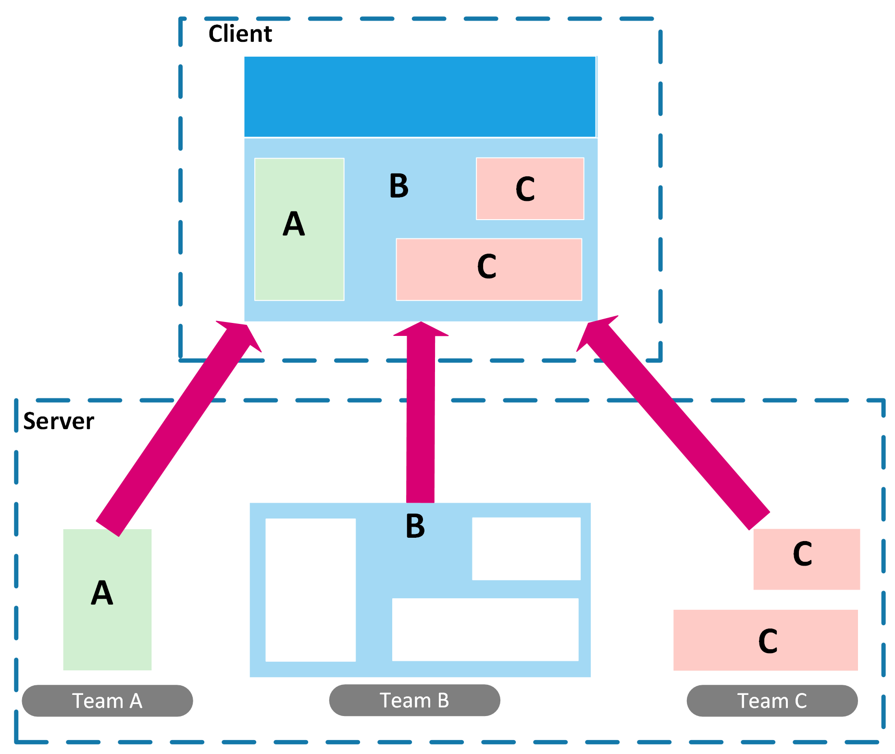

2. **`Шаблон «Сборка фрагментов страниц на стороне сервера» (Server-Side Page Fragment Composition)`**:
	- При использовании этого шаблона сборка фрагментов пользовательского интерфейса происходит на сервере, а клиентская часть получает уже полностью собранную страницу, благодаря чему достигается более высокая скорость загрузки. Сборка обычно выполняется отдельной службой, которая находится между браузером и серверами приложений: Nginx, Varnish, CDN. 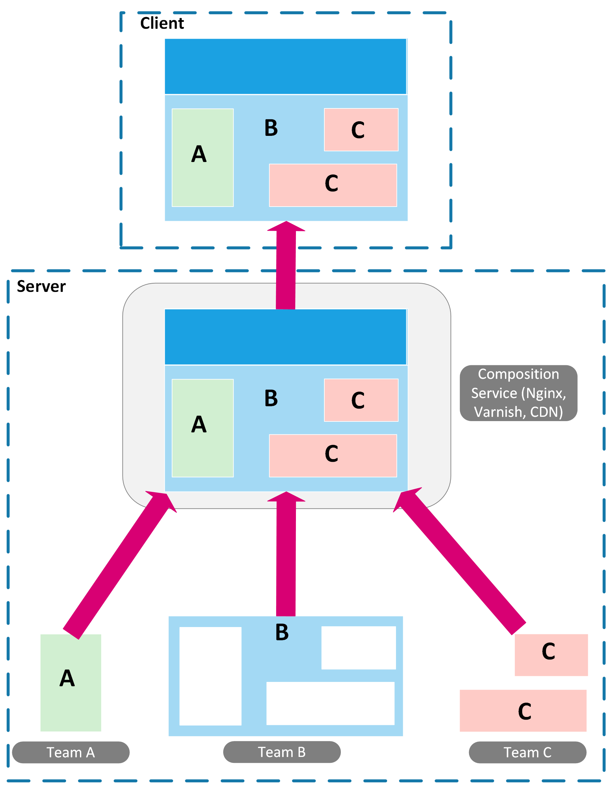

#### Паттерны обнаружения сервисов в микросервисной архитектуре
Эта группа шаблонов объясняет, как приложения находят необходимые им сервисы, особенно в системах с микросервисами, где сервисы могут постоянно появляться и исчезать.
Ключевым компонентом обнаружения микросервисов выступает **`реестр сервисов`** — это база данных, где хранится информация о доступных сервисах и их местоположении. Когда сервисы запускаются или останавливаются, реестр обновляется.
1. **`Шаблон «Обнаружение сервисов на стороне клиента» (Client-Side Service Discovery)`**:
	- Шаблон при котором приложения сами находят необходимые сервисы, обращаясь к реестру сервисов. Вот как это работает:
		- **Регистрация**: Когда сервис запускается, он регистрируется в реестре, сообщая свое местоположение и, возможно, URL для проверки работоспособности.
		- **Получение списка сервисов**: Клиент (приложение) запрашивает реестр, чтобы получить список доступных сервисов. Чтобы ускорить работу, он может сохранять этот список у себя.
		- **Выбор сервиса**: Клиент выбирает один из сервисов для взаимодействия, используя алгоритмы, такие как случайный выбор или циклическое распределение нагрузки.
	- Преимущества: **`Совместимость`**: Работает независимо от того, где развернуты сервисы, что удобно для различных платформ.
	- Недостатки: **`Сложность`**: Требует использования разных библиотек для разных языков программирования и добавляет нагрузку на команду по настройке и обслуживанию реестра сервисов. 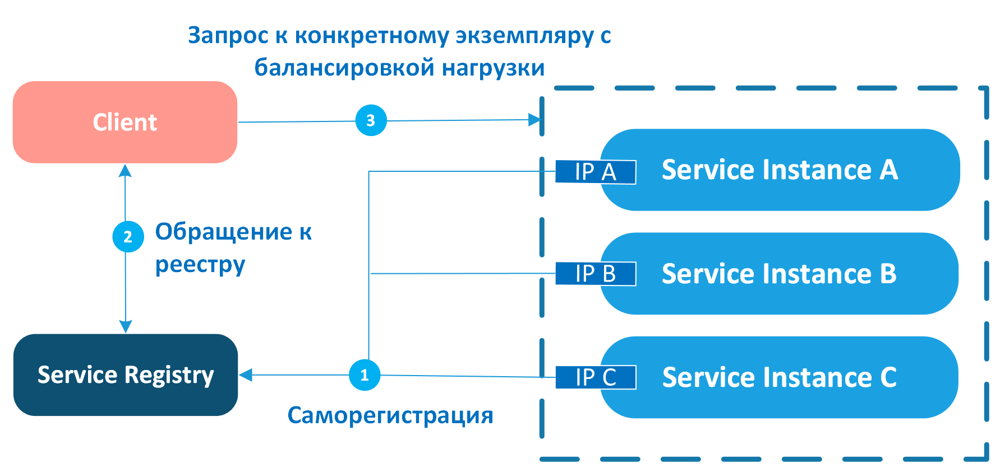

2. **`Шаблон «Обнаружение сервисов на стороне сервера» (Server-Side Service Discovery)`**:
	- Шаблон при котором инфраструктура сама управляет регистрацией и нахождением сервисов, а клиенту не нужно делать это напрямую.
		- **`Регистрация`**: Платформа развертывания (например, Kubernetes) автоматически регистрирует все сервисы в реестре.
		- **`Запрос`**: Клиент просто отправляет запрос на DNS-имя сервиса, не взаимодействуя с реестром напрямую.
		- **`Маршрутизация`**: Платформа (маршрутизатор) находит нужный сервис в реестре, выбирает один экземпляр с помощью балансировки нагрузки и перенаправляет запрос.
	- Преимущества:
		- **Упрощение**: Клиенту не нужно писать дополнительный код, всё управление сервисами делает платформа.
		- **Универсальность**: Подходит для любых языков и фреймворков.
	- Недостатки:
		- **Ограниченность**: Работает только с сервисами, запущенными на одной платформе.
	- 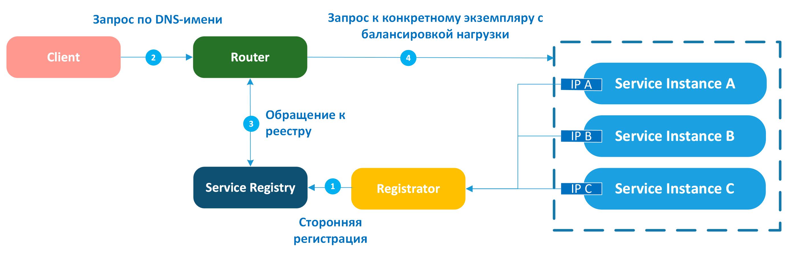

#### Паттерны развертывания микросервисов
Этот блок шаблонов описывает возможные варианты развертывания разработанных микросервисов.
1. **`Шаблон «Экземпляр сервиса на хост» (Service Instance Per Host)`**:
	- Шаблон означает, что каждый экземпляр сервиса разворачивается на отдельном сервере (физическом или виртуальном). Это позволяет:
		- Изолировать сервисы друг от друга (чтобы не мешали друг другу).
		- Избежать конфликтов версий и проблем с ресурсами.
		- Упрощает повторные развертывания.
	- Однако такой подход может использовать ресурсы менее эффективно, чем если бы на одном сервере было несколько сервисов. Есть две основные версии этого шаблона:
		- **Экземпляр сервиса на виртуальную машину (VM)**: каждый сервис разворачивается в виде отдельной виртуальной машины.
		- **Экземпляр сервиса на контейнер**: каждый сервис разворачивается в виде отдельного контейнера (например, с Docker).
	- 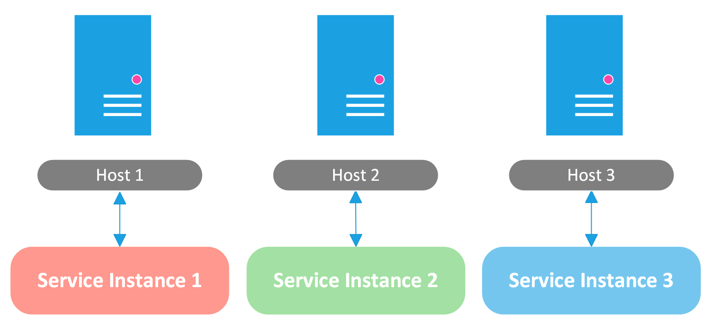

2. **`Шаблон «Сине-зеленое развертывание» (Blue-Green Deployment)`**:
	- Паттерн позволяет выполнить развертывание новых версий сервисов максимально незаметно для пользователей, сократив время простоя до минимума. Это достигается за счет запуска двух идентичных производственных сред — условно синего и зеленого цвета. Предположим, что синий — это существующий активный экземпляр, а зеленый — это новая версия приложения, развернутая параллельно с ним.
	- В любой момент времени только одна из сред является активной, и именно она обслуживает весь производственный трафик. После успешного развертывания новой версии — с прохождением всех тестов и так далее — трафик переключается на нее. В случае ошибок всегда можно вернуться к предыдущей версии. 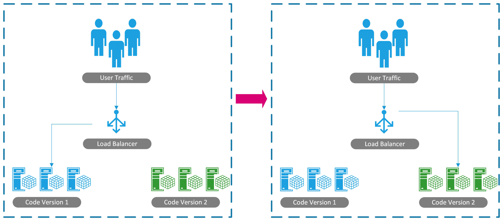

#### Паттерны повышения отказаустойчивости
Эта группа шаблонов предназначена для повышения надежности приложений с микросервисной архитектурой.
1. **`Шаблон «Автоматический выключатель» (Circuit Breaker)`**:
	- Шаблон помогает защитить микросервисы от повторных попыток обращаться к неработающим сервисам. Используется так называемый `Proxy-сервер`, который может находиться в одном из трех состояний. Это предотвращает ненужную трату ресурсов и помогает системе восстановиться. Как это работает:
		- **`Closed.`** Идет передача запросов между сервисами и подсчет количества сбоев. Если число сбоев за заданный интервал времени превышает пороговое значение, выключатель Proxy-сервера переводится в состояние `Open`.
		- **`Open.`** Запросы от исходного сервиса немедленно возвращаются с ошибкой. По истечении заданного тайм-аута выключатель переводится в состояние `Half-Open`.
		- **`Half-Open.`** Выключатель пропускает ограниченное количество запросов от исходного сервиса и подсчитывает число успешных запросов. Если необходимое количество достигнуто, выключатель переходит в состояние `Closed`, если нет — возвращается в статус `Open`.
	- 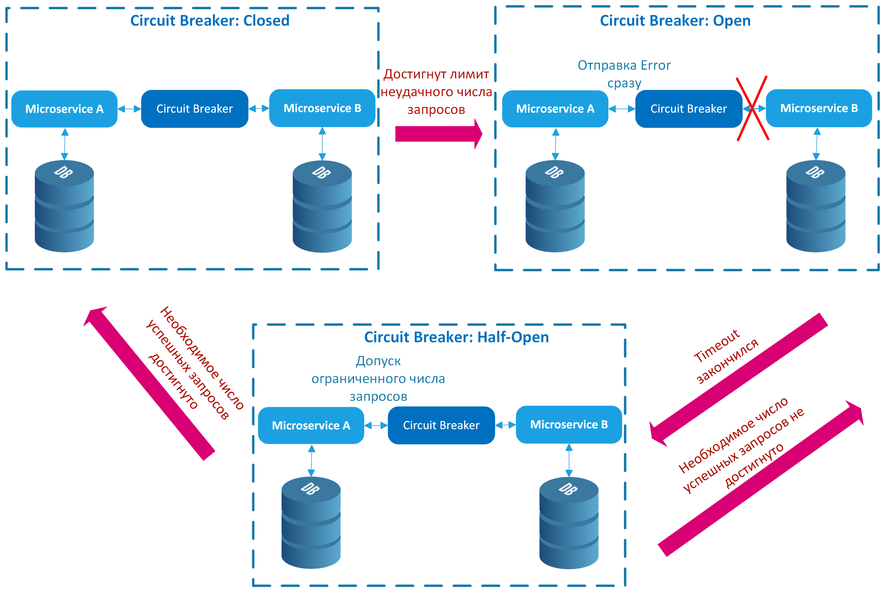

2. **`Шаблон «Переборка» (Bulkhead)`**:
	- Этот шаблон получил название по аналогии с переборками на кораблях, которые изолируют части судна, предотвращая его полное затопление в случае аварии. В приложении этот подход работает аналогично: ресурсы разделяются на независимые "пулы", чтобы сбой одного компонента не влиял на работу других.
	- Проще говоря, каждый сервис или ресурс получает свой отдельный "блок", чтобы если один из них перестанет работать, другие продолжали функционировать. Например, можно выделить отдельный пул соединений для каждого сервиса, чтобы один сбой не нарушал работу всех остальных. 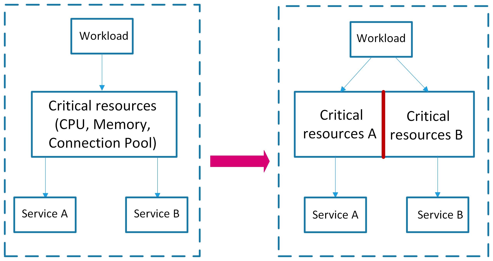

#### Паттерны мониторинга микросервисов
Этот блок шаблонов охватывает возможные варианты построения мониторинга работы микросервисов.
1. **`Шаблон «Агрегация логов» (Log Aggregation)`**:
	- Хорошей практикой при разработке микросервисов считается ведение логов каждым экземпляром сервиса. Логи могут содержать ошибки, предупреждения, информационные и отладочные сообщения. Но с увеличением числа сервисов анализ логов, разнесенных по различным хостам, становится затруднительным.
	- Паттерн Log Aggregation предлагает использовать централизованную службу ведения логов, которая будет собирать логи от каждого экземпляра сервиса. Это предоставит пользователям единую точку для поиска, анализа логов и настройки предупреждений, которые будут запускаться при появлении в них определенных сообщений. 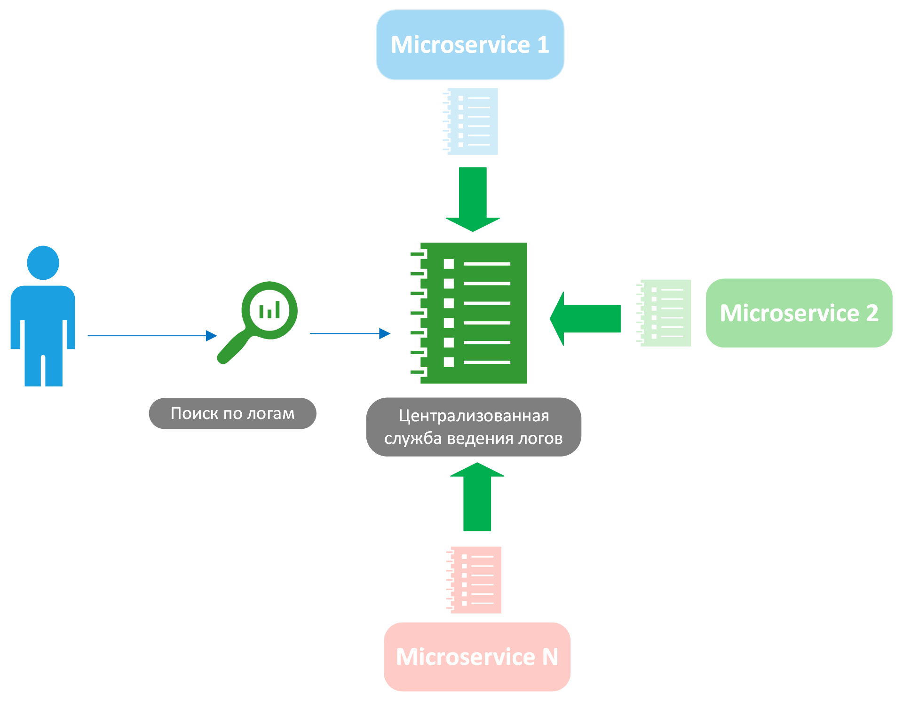

2. **`Шаблон «Распределенная трассировка» (Distributed Tracing)`**:
	- Шаблон помогает отслеживать ошибки в системах с микросервисами, где один запрос может пройти через несколько сервисов. Как это работает:
		- Каждому внешнему запросу назначается уникальный идентификатор (**TraceId**).
		- Этот идентификатор передается между всеми сервисами, участвующими в обработке запроса.
		- В журналах каждого сервиса фиксируется этот TraceId.
	- Благодаря этому разработчики могут отслеживать весь путь запроса через разные сервисы и легко находить, где произошла ошибка. 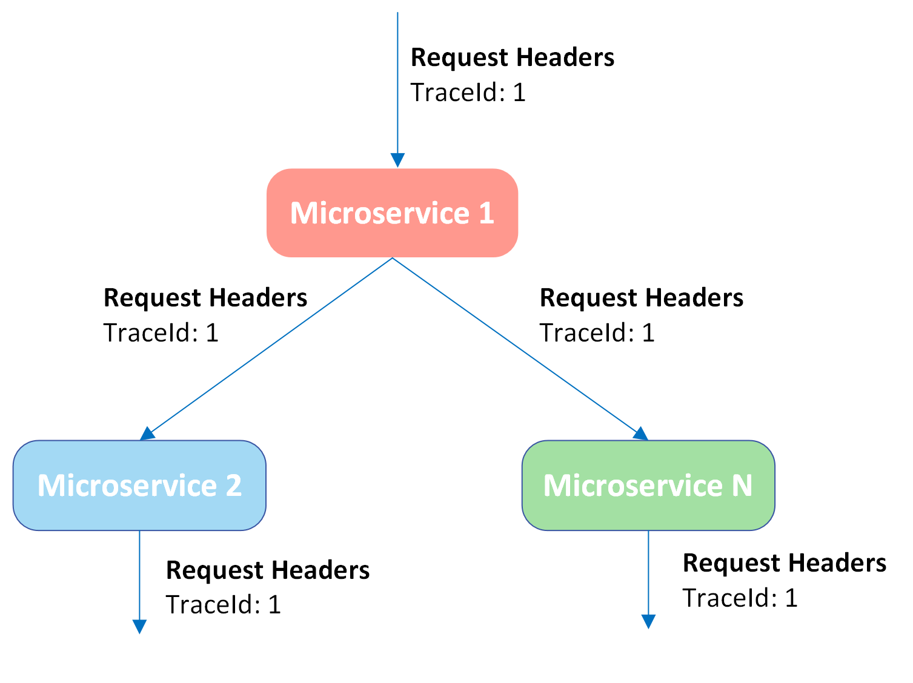

3. **`Шаблон «Проверки здоровья» (Health Check)`**:
	- Шаблон используется для того, чтобы проверять, может ли сервис обрабатывать запросы нормально. Даже если сервис доступен, он может не работать корректно, например, из-за проблем с базой данных. Как это работает:
		- Для каждого сервиса создается специальная точка проверки (например, `/health`), которая проверяет его состояние.
		- Система мониторинга или балансировщик нагрузки периодически запрашивают эту точку, чтобы узнать, работает ли сервис правильно.
		- Если сервис не отвечает или работает с ошибками, его исключают из списка активных сервисов, и запросы больше не направляются к нему.
	- Это помогает избегать отправки запросов на неработающие сервисы и вовремя выявлять проблемы. 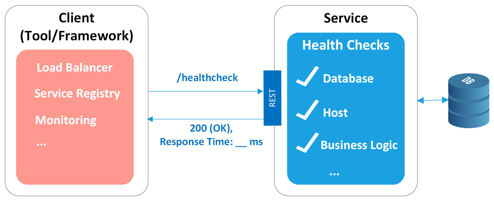

#### Прочие паттерны проектирования микросервисов
1. **`Шаблон «Посредник» («Посол», Ambassador)`**:
	- Шаблон помогает добавлять дополнительные функции для микросервисов (такие как мониторинг, безопасность, логирование) через отдельный сервис-прокси. Это полезно, когда каждый микросервис написан на разных языках и технологиях, и требуется решать задачи, общие для всех. Как это работает:
		- Вместо добавления нужных функций в сам сервис, создается отдельный прокси-сервис (Ambassador), который становится посредником между основным сервисом и другими частями системы.
		- Прокси берет на себя такие задачи, как управление сетевыми вызовами, безопасность и мониторинг, освобождая основной сервис от лишнего кода.
	- Преимущества:
		- **Унификация**: Решает общие задачи независимо от языка или технологии сервиса.
		- **Централизованное управление**: Функции можно развивать отдельно, не трогая основной сервис.
		- **Поддержка старых приложений**: Позволяет добавлять новые возможности без изменения старого кода.
	- Недостатки:
		- **Задержки**: Дополнительный прокси может немного замедлить работу.
		- **Не всегда нужен**: Если все сервисы на одном языке, или задачи можно решить стандартной библиотекой, его использование может быть излишним.
	- 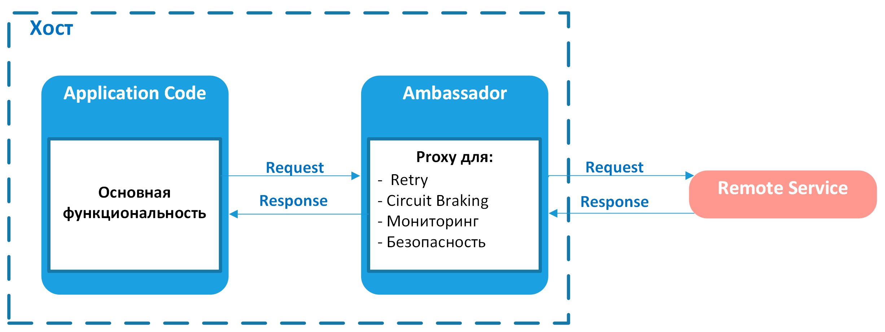

2. **`Шаблон «Коляска» («Прицеп», Sidecar)`**:
	- Шаблон подразумевает вынесение дополнительных задач (мониторинг, безопасность, логирование) в отдельный компонент, который разворачивается рядом с основным приложением. Этот компонент работает вместе с приложением, но как отдельный процесс или контейнер. Как это работает:
		- **`Sidecar`** разворачивается вместе с каждым экземпляром основного приложения и имеет такой же жизненный цикл.
		- Он выполняет задачи, которые не нужно встраивать в сам сервис, например, сбор логов или управление сетевыми вызовами.
	- Преимущества:
		- **Независимость**: Sidecar можно обновлять или развивать отдельно от основного сервиса.
		- **Близкое расположение**: Это минимизирует задержки и позволяет им делить ресурсы, такие как диски или сеть.
		- **Мульти-языковость**: Работает с сервисами, написанными на разных языках.
	- Недостатки:
		- **Накладные расходы**: Создание и управление дополнительным компонентом увеличивает сложность системы.
	- 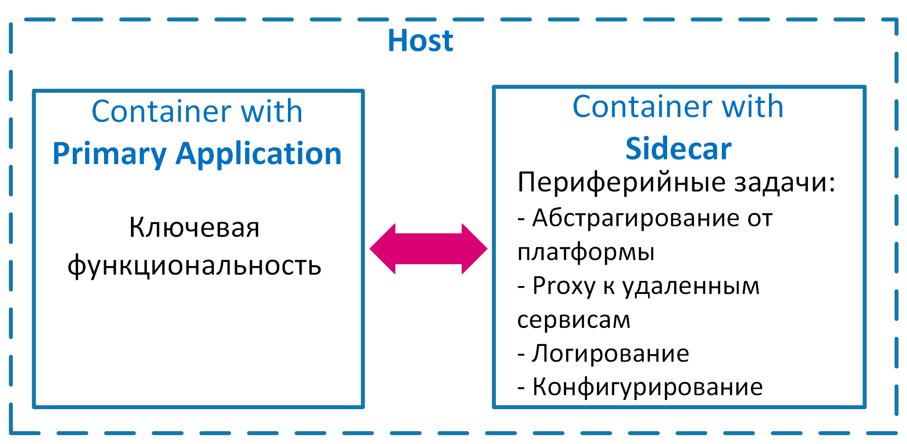

3. **`Шаблон «Тестирование контрактов, ориентированных на потребителя» (Consumer-Driven Contract Testing)`**
	- Это способ проверять, правильно ли взаимодействуют микросервисы, разработанные разными командами. Как это работает:
		- Команды, которые используют чужие сервисы (потребители), пишут тесты для проверки этих сервисов (провайдеров).
		- Эти тесты проверяют, отправляет ли сервис правильные ответы на запросы, которые ему делают другие сервисы.
	- Зачем это нужно:
		- Это помогает убедиться, что если в одном сервисе что-то изменилось, он всё ещё будет работать с другими сервисами.
		- Команды работают более независимо друг от друга, и ошибки легче находить заранее.
	- Недостаток в том, что может потребоваться больше работы, если команды используют разные инструменты для тестирования. 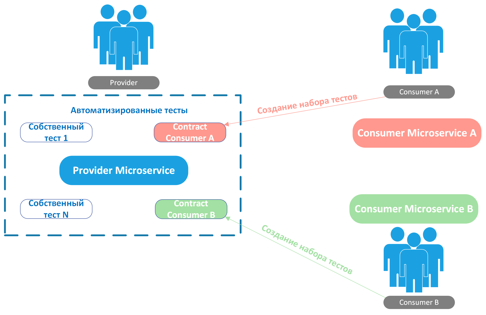

4. **`Шаблон «Внешняя конфигурация» (External Configuration)`**:
	- Шаблон помогает управлять настройками приложения, такими как адреса служб и учетные данные, вне самого приложения. Как это работает:
		- Вместо хранения настроек в файлах, которые идут вместе с приложением, их хранят во внешнем месте, например, в облаке или базе данных.
	- Зачем это нужно:
		- Это позволяет изменять настройки без необходимости повторного развертывания приложения.
		- Повышает безопасность, потому что конфиденциальные данные не хранятся в коде.
	- 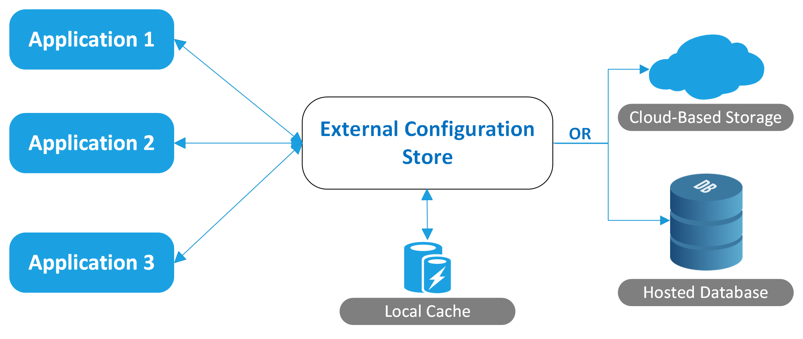

