### <span style="color: lime">Что означает аббревиатура SQL?</span>
#### Основные компоненты обработки SQL-запросов:
- **Парсер**:
	- Это первая часть, которая обрабатывает ваш SQL-запрос.
	- Токенизация: Парсер разбивает запрос на отдельные части (токены), чтобы понять его структуру.
	- **Проверка корректности**: Он проверяет, правильно ли написан запрос (например, закончился ли он точкой с запятой).
	- **Авторизация**: Убедитесь, что у вас есть права выполнять этот запрос. Например, если вы хотите удалить данные, у вас должны быть права администратора.
- **Реляционный движок**:
	- Эта часть отвечает за создание плана выполнения запроса.
	- Он анализирует, как лучше всего извлечь, записать или обновить данные. Это может включать повторное использование предыдущих методов обработки или создание нового плана.
	- Результат этого процесса записывается в специальный формат, называемый байтовым кодом, который помогает выполнять запросы более эффективно.
- **Движок хранения**:
	- Это компонент, который фактически обрабатывает байтовый код и выполняет запрос.
	- Он считывает и сохраняет данные в файлы на физическом диске базы данных.
	- Когда запрос выполнен, результаты возвращаются в приложение, которое сделало запрос.
#### Команды SQL можно классифицировать следующим образом:
- **`DDL (Data Definition Language) (Язык определения данных)`**: это SQL-команды, которые проектируют структуру базы данных. DDL-команды используют для создания и изменения объектов базы данных на основе бизнес-требований. Примеры команд: `CREATE`, `ALTER`, `DROP`.
- **`DQL (Data Query Language) (Язык запросов данных)`**: состоит из инструкций для извлечения данных, хранящихся в реляционных базах данных. Программные приложения используют команду `SELECT` для фильтрации и возврата определенных результатов из таблицы `SQL`.
- **`DML (Data Manipulation Language) (Язык манипулирования данными)`**: записывают новую информацию или изменяют существующие записи в реляционной базе данных. Например, приложение использует команду `INSERT` для сохранения новой записи в базе данных.
- **`DCL (Data Control Language) (Язык управления данными)`**: используется для управления доступом к базе данных для других пользователей или авторизации такого доступа. Например, они могут использовать команду GRANT, чтобы разрешить определенным приложениям манипулировать одной или несколькими таблицами.
- **`TCL (Transaction Control Language) (Язык контроля транзакций)`**: Реляционный движок использует для автоматического внесения изменений в базу данных. Например, база данных использует команду ROLLBACK для отмены ошибочной транзакции.

### <span style="color: lime">Чем декларативный язык отличается от императивного? Примеры таких языков.</span>
#### Императивные языки программирования
- В императивных языках программирования программист указывает **последовательность шагов** (команд), которые компьютер должен выполнить для достижения результата. Этот подход фокусируется на **процессе** решения задачи, задавая точный порядок выполнения операций.
- Основные черты:
	- Программист **управляет состоянием** программы.
	- Команды выполняются последовательно, одна за другой.
	- Есть явные операции изменения состояния (например, присваивание значений переменным).
- **Примеры** императивных языков:
	- C, Java, Python

#### Декларативные языки программирования
- Декларативные языки программирования фокусируются на **описании результата**, а не на том, как его достичь. Программист указывает, **что** должно быть сделано, а не **как** это делать, оставляя реализацию вычислительной части на усмотрение самого языка или среды выполнения.
- Основные черты:
	- Программист **не управляет состоянием** напрямую.
	- Описывается результат, который должен быть получен.
	- Меньше явных инструкций по управлению потоком выполнения.
- **Примеры** декларативных языков:
	- SQL, HTML, Haskell

### <span style="color: lime">Какая БД является реляционной?</span>
**`Реляционная база данных (РБД)`** — это база данных, которая хранит данные в виде таблиц. В таких таблицах данные организованы в строки и столбцы. Каждый столбец содержит информацию одного типа (например, имена, даты, цены), а каждая строка представляет запись или объект (например, одного человека или транзакцию).

#### Ключевые особенности реляционной базы данных:
- **Таблицы**: Данные хранятся в таблицах, каждая таблица имеет столбцы (поля) и строки (записи).
- **Отношения**: Таблицы могут быть связаны друг с другом с помощью ключей. Например, в одной таблице может быть информация о заказах, а в другой — о клиентах, и между ними можно установить связь через уникальные идентификаторы (ID).
- **SQL (Structured Query Language)**: Для работы с данными в реляционных базах данных используется специальный язык — SQL. С его помощью можно добавлять, удалять, изменять и запрашивать данные.

#### Примеры РБД:
- MySQL
- PostgreSQL
- Oracle Database
- Microsoft SQL Server

### <span style="color: lime">Базовые команды в SQL</span>
Основные команды в SQL:
- **`SELECT`** — выбор данных: Команда для извлечения данных из таблицы.
- **`INSERT INTO`** — добавление данных: Команда для добавления новой записи в таблицу.
- **`UPDATE`** — обновление данных: Команда для изменения существующих данных в таблице.
- **`DELETE`** — удаление данных: Команда для удаления записей из таблицы.
- **`CREATE TABLE`** — создание таблицы: Команда для создания новой таблицы.
- **`ALTER TABLE`** — изменение структуры таблицы: Команда для изменения существующей таблицы, например, добавление нового столбца.
- **`DROP TABLE`** — удаление таблицы: Команда для удаления таблицы и всех её данных.
- **`WHERE`** — условие: Используется для фильтрации данных по какому-то критерию.
- **`JOIN`** — соединение таблиц: Команда для объединения данных из нескольких таблиц.

### <span style="color: lime">Что такое SELECT ... LIMIT X, OFFSET Y?</span>
Команда **`SELECT ... LIMIT X, OFFSET Y`** в SQL используется для того, чтобы получить ограниченное количество строк из базы данных, начиная с определённой позиции.

#### Что делают эти параметры?:
- `LIMIT X`: указывает максимальное количество строк, которые нужно выбрать из результатов запроса. Например, если вы хотите получить только 5 строк, вы используете `LIMIT 5`.
- `OFFSET Y`: указывает, сколько строк нужно пропустить перед тем, как начать выборку. Это полезно для указания, с какой строки начать получение данных. Например, если вы хотите пропустить первые 10 строк и начать выборку с 11-й, вы используете `OFFSET 10`.

```sql
select * from employee limit 3 offset 5;
```

### <span style="color: lime">Что такое SELECT ... ORDER BY?</span>
Команда **`SELECT ... ORDER BY`** в SQL используется для сортировки результатов запроса по одному или нескольким столбцам. Это позволяет упорядочить данные по возрастанию или убыванию, в зависимости от ваших нужд.

#### Как работает `ORDER BY`?
- **`ORDER BY`** — указывает, по какому столбцу (или столбцам) следует сортировать данные.
- **`ASC` (по умолчанию)** — сортировка по возрастанию. Если не указывать тип сортировки, то по умолчанию будет использована сортировка по возрастанию.
- **`DESC`** — сортировка по убыванию.

### <span style="color: lime">Что такое SELECT ... JOIN?</span>
Команда **`SELECT ... JOIN`** в SQL используется для объединения данных из двух или более таблиц на основе связанного между ними столбца (ключа). Это позволяет извлекать информацию, которая распределена по нескольким таблицам, и объединять её в одном запросе.

#### Основные типы **`JOIN`**:
- **INNER JOIN**: Возвращает только те строки, у которых есть совпадающие значения в обеих таблицах.
- **LEFT JOIN** (или **LEFT OUTER JOIN**): Возвращает все строки из левой таблицы и совпадающие строки из правой таблицы. Если в правой таблице нет совпадений, то возвращаются `NULL` значения для правой таблицы.
- **RIGHT JOIN** (или **RIGHT OUTER JOIN**): Возвращает все строки из правой таблицы и совпадающие строки из левой таблицы. Если в левой таблице нет совпадений, то возвращаются `NULL` значения для левой таблицы.
- **FULL JOIN** (или **FULL OUTER JOIN**): Возвращает все строки, где есть совпадения хотя бы в одной из таблиц. Если совпадений нет, то возвращаются `NULL` значения для недостающей таблицы.

#### Предположим, у нас есть две таблицы:
Таблица **"клиенты"**: 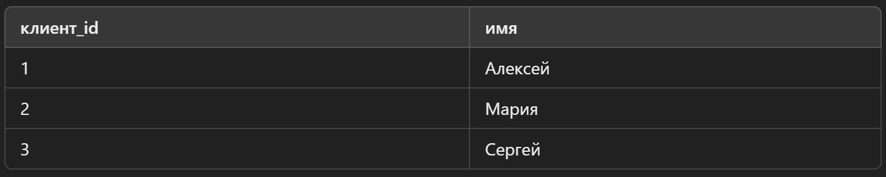
Таблица **"заказы"**: 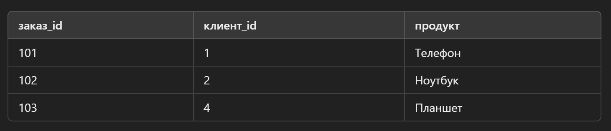

#### INNER JOIN
```sql
select клиенты.имя, заказы.продукт from клиенты 
join заказы on клиенты.клиент_id = заказы.клиент_id
-- result 👇
```


#### LEFT JOIN
```sql
select клиенты.имя, заказы.продукт from клиенты
left join заказы on клиенты.клиент_id = заказы.клиент_id
-- result 👇
```
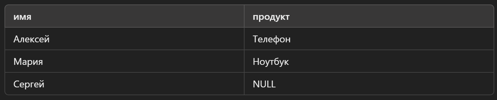

#### RIGHT JOIN
```sql
select клиенты.имя, заказы.продукт from клиенты
right join заказы on клиенты.клиент_id = заказы.клиент_id
-- result 👇
```
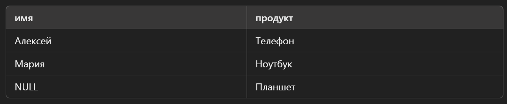

#### FULL JOIN
```sql
select клиенты.имя, заказы.продукт from клиенты 
full join заказы on клиенты.клиент_id = заказы.клиент_id
-- result 👇
```
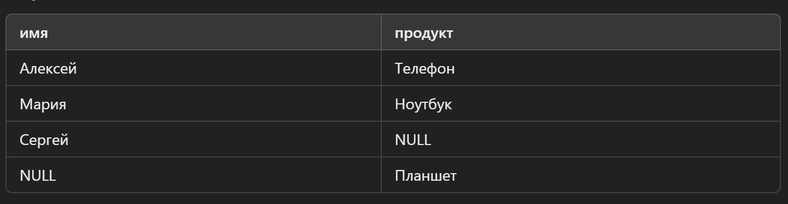

#### Когда использовать JOIN?
- **INNER JOIN**: Когда вам нужны только совпадающие данные между двумя таблицами.
- **LEFT JOIN**: Когда вам нужны все данные из левой таблицы и соответствующие данные из правой, если они есть.
- **RIGHT JOIN**: Когда вам нужны все данные из правой таблицы и соответствующие данные из левой, если они есть.
- **FULL JOIN**: Когда вам нужны все данные из обеих таблиц, даже если некоторые из них не совпадают.
### <span style="color: lime">Какие существуют виды взаимосвязей между таблицами?</span>
В реляционных базах данных существует несколько видов взаимосвязей между таблицами, которые помогают организовывать и структурировать данные. Эти взаимосвязи устанавливаются с помощью ключей (обычно внешних и первичных ключей) и определяют, как данные из одной таблицы связаны с данными из другой.

#### Основные виды взаимосвязей между таблицами:
- **Один к одному** (One-to-One)
- **Один ко многим** (One-to-Many)
- **Многие ко многим** (Many-to-Many)

#### One-to-One
Взаимосвязь "один к одному" означает, что каждой записи в одной таблице соответствует **`только одна`** запись в другой таблице, и наоборот.

Таблица `пользователи` и таблица `профили`. У каждого пользователя может быть только один профиль, и каждый профиль принадлежит только одному пользователю. 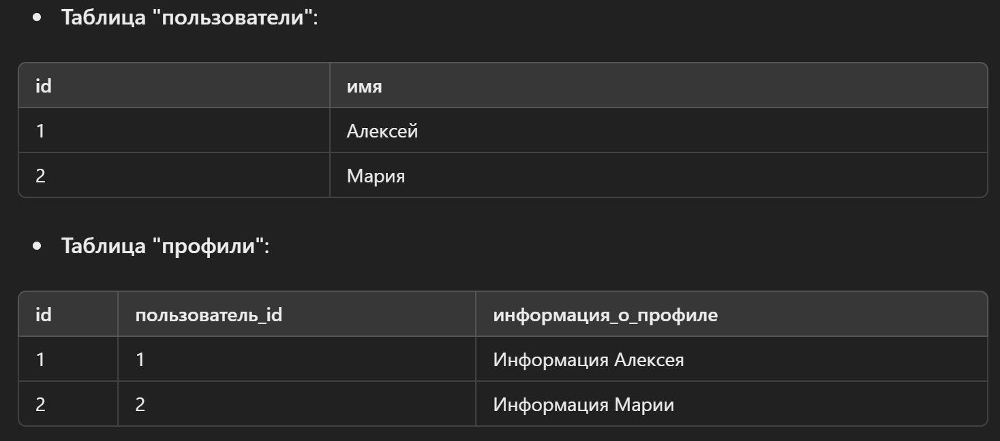

Как реализовать:
- Эта взаимосвязь реализуется с помощью внешнего ключа, который ссылается на первичный ключ другой таблицы. При этом обычно одну из таблиц можно объединить с другой, но разделение на две таблицы может потребоваться для логической организации данных.

#### One-to-Many
Взаимосвязь "один ко многим" означает, что одной записи в одной таблице может соответствовать **много** записей в другой таблице. Однако, каждой записи в другой таблице соответствует только **одна** запись в первой таблице.

Таблица `клиенты` и таблица `заказы`. Один клиент может сделать несколько заказов, но каждый заказ принадлежит только одному клиенту. 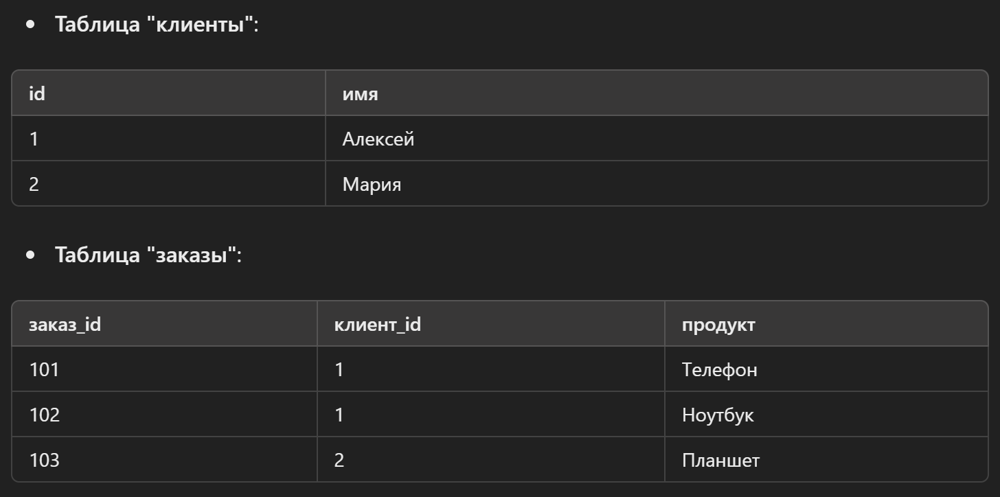

Как реализовать:
- Эта связь также устанавливается с помощью внешнего ключа, который ссылается на первичный ключ в другой таблице.

#### Many-to-Many
Взаимосвязь "многие ко многим" означает, что одной записи в одной таблице может соответствовать много записей в другой таблице, и наоборот.

Таблица `студенты` и таблица `курсы`. Один студент может записаться на несколько курсов, и один курс может быть посещён многими студентами. 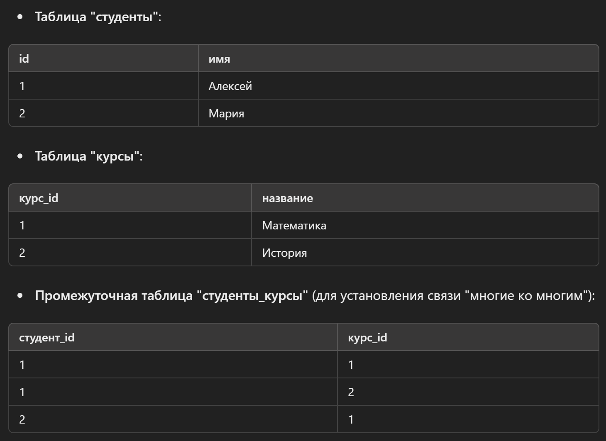

Как реализовать:
- Эта связь реализуется с помощью промежуточной таблицы (также называемой связующей таблицей), которая содержит внешние ключи обеих связанных таблиц.

#### Когда использовать каждый тип связи:
- **Один к одному**: Когда сущности логически разделены на две таблицы, но каждая запись одной таблицы строго соответствует одной записи другой таблицы (например, пользователи и профили).
- **Один ко многим**: Самый распространённый тип связи, когда одна сущность может быть связана с несколькими другими сущностями (например, клиенты и заказы).
- **Многие ко многим**: Когда необходимо организовать сложные связи между сущностями, которые могут взаимодействовать друг с другом множественно (например, студенты и курсы).

### <span style="color: lime">Что такое схема в БД?</span>
**`Схема в базе данных`** — это логическая структура, которая определяет организацию данных в базе. Она описывает, как данные хранятся, какие таблицы существуют, какие связи между ними установлены, какие ограничения действуют, и какие объекты (такие как индексы, представления, процедуры) используются для работы с данными.

#### Что включает схема базы данных?:
- **Таблицы**: Основные объекты, в которых хранятся данные. Каждая таблица имеет строки и столбцы, где строки представляют записи, а столбцы — свойства (поля) этих записей.
- **Связи между таблицами**: Схема определяет, как таблицы связаны между собой. Это может быть связь типа "один к одному", "один ко многим" или "многие ко многим".
- Ключи:
	- **Первичный ключ (Primary Key)**: Уникальный идентификатор записи в таблице.
	- **Внешний ключ (Foreign Key)**: Поле в одной таблице, которое ссылается на первичный ключ другой таблицы для установления связи между ними.

- **Индексы**: Улучшают производительность поиска данных в таблицах. Индексы создаются на столбцах, по которым часто выполняются запросы.
- **Ограничения (Constraints)**: Правила, которые накладываются на данные, чтобы гарантировать их целостность и правильность.
	- Например, ограничение `NOT NULL` гарантирует, что поле не может оставаться пустым.
	- `UNIQUE` гарантирует, что все значения в столбце уникальны.

- **Представления (Views)**: Виртуальные таблицы, которые создаются на основе запросов к другим таблицам. Представления можно использовать для упрощения сложных запросов и предоставления абстрактного интерфейса для данных.
- **Хранимые процедуры (Stored Procedures)**: Программные функции, хранящиеся в базе данных и выполняющиеся на сервере. Они помогают автоматизировать задачи и управлять логикой обработки данных.
- **Триггеры (Triggers)**: Механизмы автоматического выполнения определённых действий в ответ на изменения в таблице (например, добавление, обновление или удаление записи).

### <span style="color: lime">Что такое нормализация?</span>
**Нормализация** — это процесс организации данных в реляционной базе данных таким образом, чтобы минимизировать дублирование данных и избежать проблем с обновлением, удалением и вставкой данных. Главная цель нормализации — улучшить целостность данных и оптимизировать хранение данных.

Нормализация происходит в несколько шагов, называемых **нормальными формами** (NF). Каждая следующая нормальная форма решает более сложные проблемы, возникающие в базе данных. Рассмотрим основные нормальные формы:
- **Первая нормальная форма (1NF)**: Требует, чтобы данные в каждой колонке были **атомарными**, то есть каждая колонка должна содержать только одно значение, и все строки в таблице должны быть уникальными. 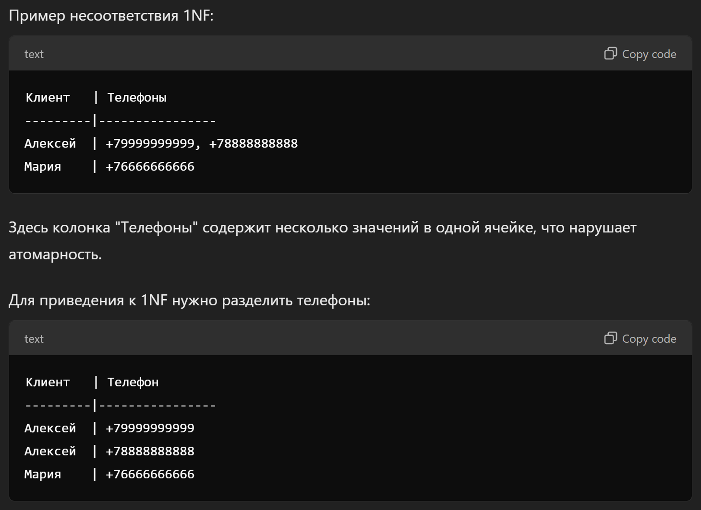

- **Вторая нормальная форма (2NF)**: Для того чтобы таблица соответствовала 2NF, она должна:
	- Соответствовать 1NF.
	- Все неключевые столбцы должны зависеть от **первичного ключа** целиком, а не от его части.
- 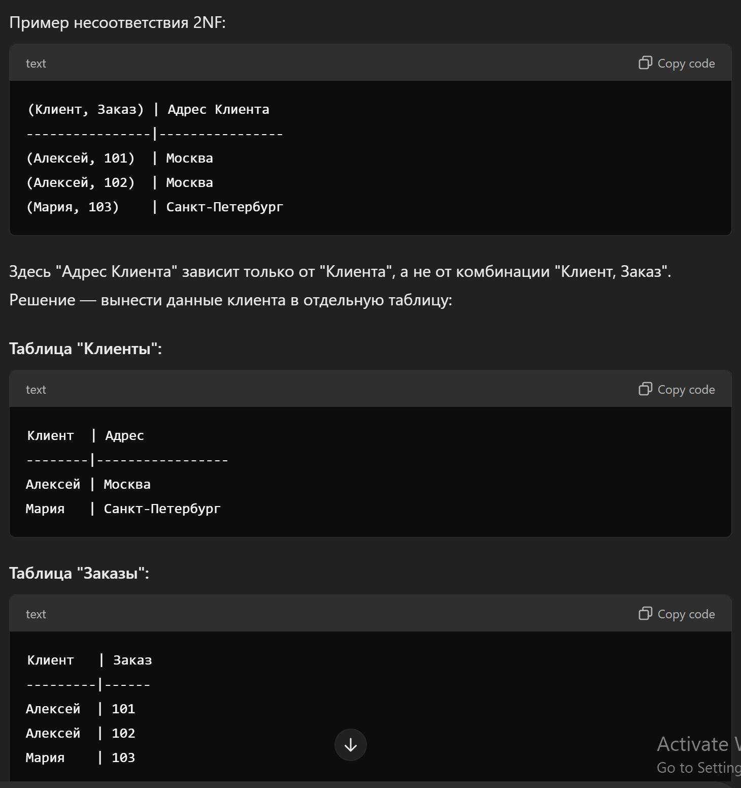

- **Третья нормальная форма (3NF)**: Требует:
	- Соответствия 2NF.
	- У всех неключевых атрибутов не должно быть **транзитивной зависимости** от первичного ключа.
- 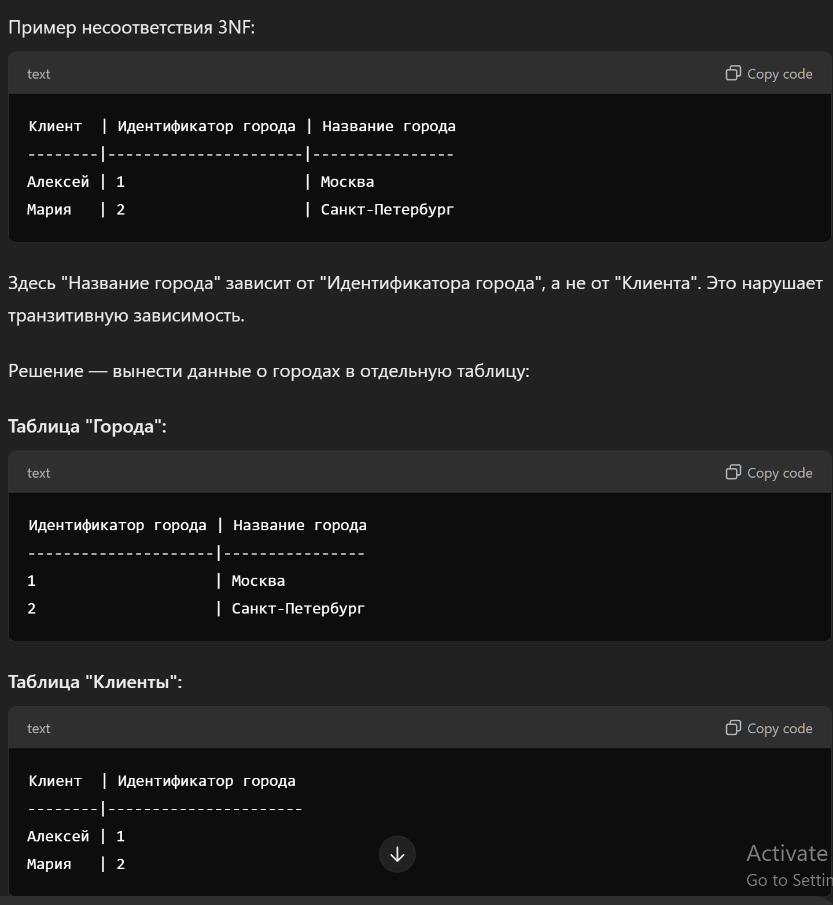

**Транзитивная зависимость** — это когда одно свойство зависит от другого через промежуточное свойство, а не напрямую. В базе данных транзитивная зависимость возникает, если один столбец таблицы зависит от другого через третий столбец.

#### Пример из жизни:
Представь, что у тебя есть информация о сотрудниках и их офисах. Ты знаешь, что каждый сотрудник работает в определённом здании, и каждое здание находится в определённом городе.

Сотрудники:
- Иван работает в офисе 101.
- Мария работает в офисе 202.

Офисы:
- Офис 101 находится в Москве.
- Офис 202 находится в Санкт-Петербурге.

В этом случае:
- Иван связан с Москвой через офис 101.
- Мария связана с Санкт-Петербургом через офис 202.

### <span style="color: lime">Как реализовать взаимосвязь таблиц M2M (many-to-many)?</span>
Чтобы реализовать взаимосвязь **`многие ко многим (Many-to-Many, или M2M)`** между двумя таблицами в базе данных, нужно использовать **промежуточную таблицу** (иногда её называют связующей таблицей). Эта таблица соединяет записи из двух других таблиц, создавая связь, при которой одна запись из первой таблицы может быть связана с несколькими записями из второй таблицы, и наоборот.

### <span style="color: lime">Зачем нужен SELECT DISTINCT?</span>
**`SELECT DISTINCT`** — это команда в SQL, которая используется для удаления повторяющихся значений из результата запроса. Она позволяет вернуть **только уникальные строки** по выбранным столбцам, даже если в таблице есть дублирующиеся записи.

Представим, что у нас есть таблица с заказами в интернет-магазине. В таблице может быть несколько заказов от одного и того же клиента. 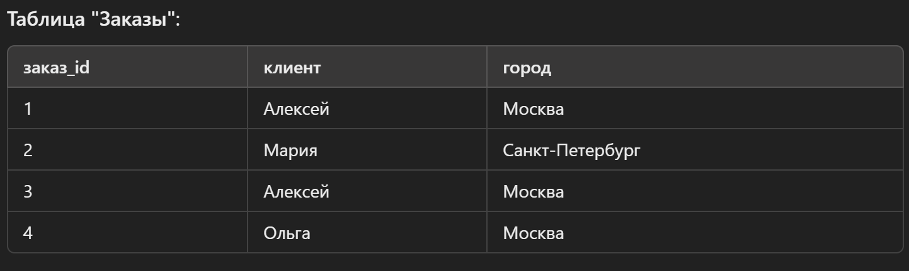
Если ты хочешь узнать, в каких городах находятся клиенты, ты можешь использовать простой запрос:
```sql
select город from заказы;
-- result 👇👇👇
-- Здесь город "Москва" повторяется несколько раз, потому что несколько клиентов живут в этом городе.
```
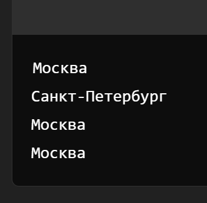
Чтобы вывести **уникальные города** (без повторений), нужно использовать `SELECT DISTINCT`:
```sql
select distinct город from заказы;
-- result 👇👇👇
```
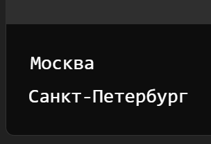

#### Зачем использовать DISTINCT?
- **Удаление дубликатов**: Убирает повторяющиеся строки, что полезно при анализе данных.
- **Чистота данных**: Когда нужно получить список уникальных значений, например, список всех уникальных городов, клиентов, продуктов и т.д.
- **Повышение точности результатов**: Если повторяющиеся данные искажают анализ, `DISTINCT` помогает избавиться от этих искажений.

### <span style="color: lime">Что такое SELECT ... GROUP BY?</span>
**`SELECT ... GROUP BY`** — это команда в SQL, которая используется для **группировки строк** на основе значений одного или нескольких столбцов. Она часто используется вместе с агрегатными функциями (такими как `COUNT`, `SUM`, `AVG`, `MIN`, `MAX`), чтобы выполнять вычисления для каждой группы данных.

Представь, что ты управляешь кафе, и у тебя есть таблица с заказами, в которой записаны имена клиентов и стоимость их заказов. 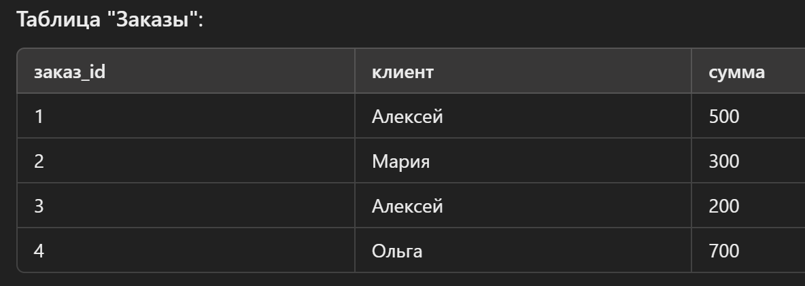
Ты хочешь узнать, **сколько денег каждый клиент потратил** в твоём кафе. Для этого можно сгруппировать заказы по именам клиентов и сложить их суммы.
```sql
select клиент, sum(сумма) as общая_сумма from заказы group by клиент;
-- result 👇👇👇
-- Здесь `GROUP BY клиент` означает, что мы группируем строки по каждому клиенту, а функция `SUM(сумма)` вычисляет общую сумму заказов для каждого клиента.
```


**Подсчёт количества заказов для каждого клиента**: Если ты хочешь узнать, сколько заказов сделал каждый клиент, можно использовать `COUNT()`:
```sql
select клиент, count(заказ_id) as кол_во_заказов from заказы group by клиент;
-- result 👇👇👇
```


**Средняя сумма заказа для каждого клиента**: Если тебе нужно узнать среднюю сумму заказа для каждого клиента, можно использовать `AVG()`:
```sql
select клиент, avg(сумма) as средняя_сумма from заказы group by клиент;
-- result 👇👇👇
```
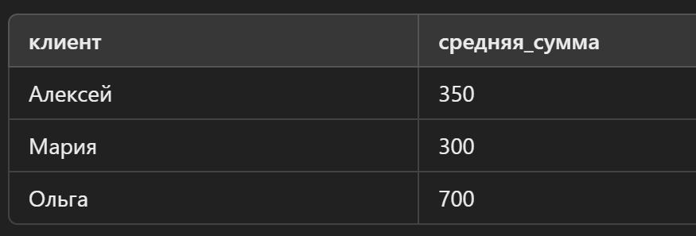

#### Когда использовать GROUP BY?
- Когда тебе нужно сгруппировать данные по определённому признаку (например, по клиентам, товарам, городам) и выполнить подсчёты для каждой группы.
- Когда ты хочешь получить статистику по категориям данных (например, средние, минимальные или максимальные значения для каждой группы).

### <span style="color: lime">Что такое триггер в БД?</span>
**`Триггер`** в базе данных — это специальный механизм, который автоматически выполняет определённые действия в ответ на изменения данных в таблице. Триггер срабатывает, когда происходят события, такие как добавление, обновление или удаление записей в таблице.

Представь, что у тебя есть склад с товарами, и ты хочешь автоматически вести учёт того, когда и кто обновил количество товаров. Вместо того чтобы каждый раз вручную записывать эту информацию, можно создать триггер, который автоматически добавляет запись в журнал изменений всякий раз, когда кто-то обновляет количество товаров.

Триггер срабатывает автоматически при возникновении определённого события. Вот основные моменты:
- **Событие, которое запускает триггер**: Триггер может срабатывать на одно из трёх событий:
	- **INSERT** — при добавлении новой записи.
	- **UPDATE** — при обновлении существующей записи.
	- **DELETE** — при удалении записи.
- **Момент срабатывания триггера**: Триггер может срабатывать:
	- **BEFORE** — до выполнения операции (например, перед обновлением записи).
	- **AFTER** — после выполнения операции (например, после удаления записи).
- **Действия триггера**: Когда срабатывает триггер, база данных выполняет определённые действия, указанные в триггере, например, обновление другой таблицы, запись в лог, проверка условий и т.д.

Допустим, у тебя есть таблица "Товары", и ты хочешь, чтобы при обновлении информации о товаре автоматически добавлялась запись в таблицу "История_изменений", чтобы отслеживать все изменения. 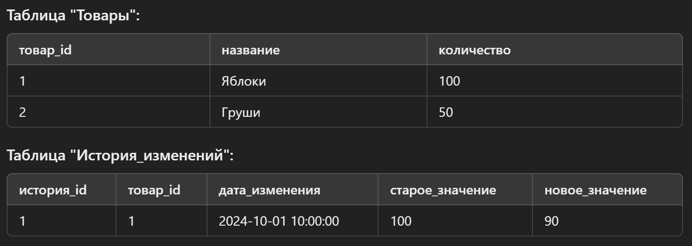
```sql
create trigger лог_обновлений_товаров
after update on Товары
for each row
begin
	insert into История_изменений(товар_id, дата_изменения, старое_значение, новое_значение) values(NEW.товар_id, NOW(), OLD.количество, NEW.количество);
end;
```

#### Пояснение:
- **AFTER UPDATE** — триггер срабатывает после обновления записи в таблице "Товары".
- **FOR EACH ROW** — триггер выполняется для каждой строки, которая обновляется.
- **OLD.количество** — это значение до обновления.
- **NEW.количество** — это новое значение после обновления.
- Триггер добавляет запись в таблицу "История_изменений" с информацией о том, как изменилось количество товара.

#### Когда использовать триггеры?
- **Поддержание целостности данных**: Триггеры могут автоматически проверять или изменять данные, чтобы избежать ошибок. Например, если удаляется запись, триггер может автоматически удалять связанные записи в других таблицах.
- **Аудит и логирование**: Триггеры могут автоматически записывать изменения данных в журнал для аудита. Это полезно, если нужно отслеживать, кто и когда вносил изменения.
- **Автоматизация задач**: Триггеры могут автоматически выполнять задачи, такие как пересчёт статистики, обновление связанных таблиц или выполнение проверок.

### <span style="color: lime">Как отличаются команды DELETE FROM table; и TRUNCATE TABLE;?</span>
Команды **`DELETE FROM table`** и **`TRUNCATE TABLE`** в SQL используются для удаления данных из таблицы, но между ними есть важные различия в том, **как** и **что именно** удаляется, а также в их влиянии на производительность и структуру таблицы.

#### **`DELETE FROM table`**:
- **Удаление строк**: Команда `DELETE` удаляет данные **построчно**. То есть она удаляет каждую строку отдельно, что может занимать много времени, если таблица большая.
- **Может использовать условие**: С помощью `WHERE` можно удалить только те строки, которые соответствуют определённым условиям. Например, можно удалить записи только с определённым значением столбца.
```sql
delete from some_table_name where age > 30;
-- удалить все строки, где возраст больше 30
```
- **Триггеры и логи**: При использовании `DELETE` срабатывают триггеры, если они есть, и все изменения записываются в журналы транзакций, что помогает восстановить данные в случае ошибки.
- **Возвращает место**: Пространство, которое занимали удалённые строки, освобождается для последующего использования, но сама таблица не изменяет своей структуры.
- **Автоинкремент**: Значение автоинкрементных полей (например, `id`, если используется автоинкремент) **не сбрасывается**, то есть новые строки будут продолжать получать следующий номер, даже если предыдущие строки удалены.

#### **`TRUNCATE TABLE`**:
- **Удаление всех строк**: Команда `TRUNCATE` полностью удаляет **все строки** из таблицы, **без возможности указать условия**. То есть, это эквивалент удаления всех данных, но выполняется гораздо быстрее, чем `DELETE`, поскольку не удаляет строки по отдельности.
```sql
truncate table some_table_name;
-- удалить все строки из таблицы some_table_name
```
- **Не срабатывают триггеры**: Триггеры не активируются при выполнении `TRUNCATE`, а операции не записываются в журнал транзакций для каждой строки. Это делает команду значительно быстрее, особенно для больших таблиц.
- **Возвращает место**: Освобождается всё место, которое занимали данные, что может быть полезно для управления дисковым пространством.
- **Автоинкремент сбрасывается**: Если в таблице есть автоинкрементное поле (например, `id`), то после `TRUNCATE` его значение **сбрасывается**. Это значит, что при добавлении новых данных нумерация начнётся заново с 1.
- **Не удаляет структуру**: Структура таблицы (её колонки и индексы) остаётся неизменной. Только данные внутри таблицы удаляются.

#### Основные отличия: 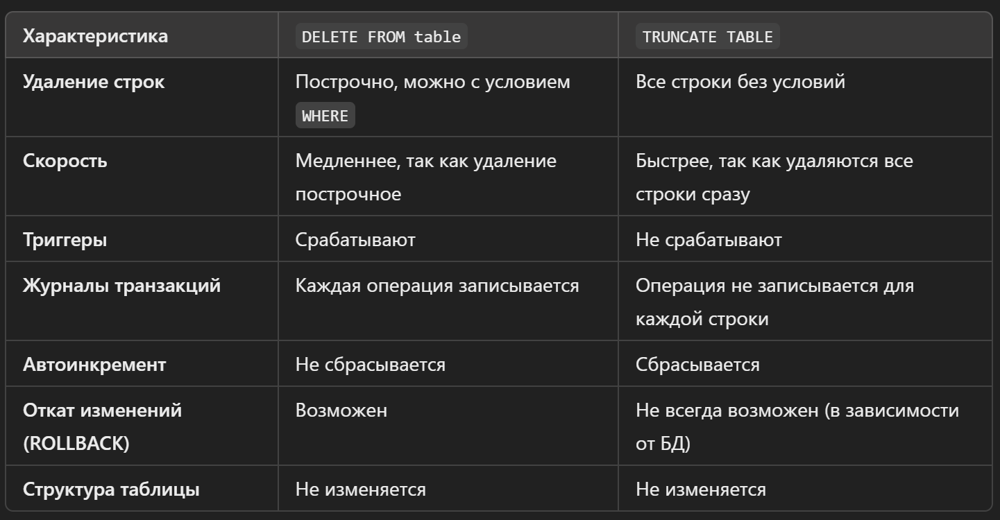

### <span style="color: lime">Зачем необходима команда EXPLAIN? Как она отличается от команды EXPLAIN ANALYZE?</span>
Команда **`EXPLAIN`** используется в SQL для анализа и оптимизации запросов. Она позволяет понять, **как именно** база данных будет выполнять запрос: какие индексы будут использоваться, в каком порядке будут обрабатываться таблицы, какие методы объединения будут применены и так далее. Это очень полезно для выявления потенциальных проблем с производительностью и улучшения работы запросов.

#### Зачем нужна команда `EXPLAIN`?
- **Понять план выполнения запроса**: Команда показывает план, который база данных собирается использовать для выполнения SQL-запроса. Это может включать выбор индексов, стратегию объединения таблиц и порядок выполнения операций.
- **Оптимизировать запросы**: Если запрос выполняется медленно, `EXPLAIN` может показать, в каком месте можно улучшить его, например, добавить индексы или переписать запрос.
- **Изучить производительность**: Это ключевой инструмент для анализа запросов с большими объёмами данных или сложными операциями.

#### Что показывает `EXPLAIN`:
- **Типы соединений**: Например, `NESTED LOOP` или `HASH JOIN`, что означает, как таблицы будут соединяться между собой.
- **Использование индексов**: Показывает, будет ли база данных использовать индекс для поиска строк.
- **Ожидаемое количество строк**: Оценка того, сколько строк будет обработано на каждом этапе.
- **Оценка стоимости**: Показывает оценочную "стоимость" выполнения каждого шага запроса.

Команда **`EXPLAIN ANALYZE`** похожа на `EXPLAIN`, но с важным отличием: она **выполняет сам запрос**, а затем возвращает фактические данные о его выполнении:
- **`EXPLAIN`** показывает план выполнения **без выполнения самого запроса**.
- **`EXPLAIN ANALYZE`** не только показывает план, но и **выполняет запрос**, затем возвращает реальное время выполнения, количество обработанных строк и другие фактические показатели. Это полезно, чтобы увидеть, сколько времени действительно заняла каждая операция.

#### Основные отличия между `EXPLAIN` и `EXPLAIN ANALYZE`: 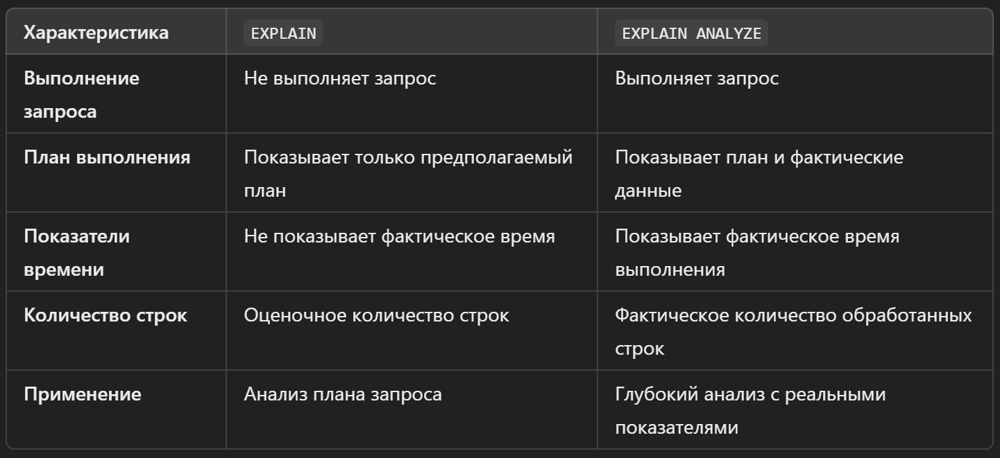

### <span style="color: lime">Что такое view в БД?</span>
**View** (представление) в базе данных — это виртуальная таблица, которая формируется на основе запроса SQL. Она не хранит данные самостоятельно, а представляет результат выполнения запроса, как будто это была таблица. **View** создаётся для упрощения доступа к данным, облегчения чтения и поддержки безопасности.

#### Основные характеристики view?
- **Виртуальность**: Представление — это не физическая таблица, в ней не хранятся данные. Она создаётся каждый раз при выполнении запроса к ней, отображая данные из одной или нескольких таблиц.
- **Динамическое обновление**: Так как **view** основана на запросе к таблицам, все изменения в исходных данных немедленно отражаются в представлении. То есть если обновить данные в таблицах, изменятся и данные в представлении.
- **Простота использования**: Представления позволяют скрыть сложные SQL-запросы за более простыми интерфейсами. Это особенно полезно, когда необходимо часто выполнять один и тот же сложный запрос. Вместо того чтобы повторять его, можно создать **view** и обращаться к ней, как к обычной таблице.
- **Безопасность**: Представления могут использоваться для ограничения доступа к определённым столбцам или строкам. Вместо предоставления доступа ко всей таблице, можно создать представление, которое включает только нужные столбцы или строки.
```sql
create view view_name as
select name, product, price from orders;
-- imagine we have an address column in our orders table and we don't want other to see this column, so we can create a view; it's like getter function
```

### <span style="color: lime">Зачем необходима команда VACUUM?</span>
Команда **`VACUUM`** в базах данных, таких как **PostgreSQL**, используется для **очистки и оптимизации** базы данных, особенно после удаления или обновления данных. Она помогает поддерживать эффективную работу базы данных, предотвращать её разрастание и сохранять место на диске.

Когда данные удаляются или обновляются в базе данных, на физическом уровне записи не сразу удаляются с диска. Вместо этого записи становятся "мёртвыми" или устаревшими, но продолжают занимать место. Это может замедлять работу базы данных и увеличивать её размер на диске.

#### Виды VACUUM:
- **Обычный `VACUUM`**: Просто освобождает место, но не блокирует таблицы для чтения и записи. Это значит, что таблицы можно использовать параллельно с выполнением команды `VACUUM`, но она не возвращает освобождённое место обратно операционной системе (оно остаётся внутри базы данных).
- **`VACUUM FULL`**: Более глубокая очистка. Этот вариант блокирует таблицы для использования, но освобождает больше места и возвращает его операционной системе, уменьшив физический размер базы данных на диске.

#### Когда нужно использовать команду **`VACUUM`**?
- **После массового удаления данных**: Если ты удалил много строк из таблицы, база данных будет содержать множество "мёртвых" записей. `VACUUM` поможет освободить это пространство.
- **После обновлений большого количества строк**: Обновления в некоторых базах данных, таких как PostgreSQL, создают новые версии строк, а старые версии становятся неактуальными. `VACUUM` удаляет эти старые версии.
- **Регулярное обслуживание**: Для баз данных с интенсивными операциями вставки, обновления и удаления данных рекомендуется выполнять `VACUUM` периодически для поддержания их в оптимальном состоянии.

#### Различия между VACUUM и VACUUM FULL:
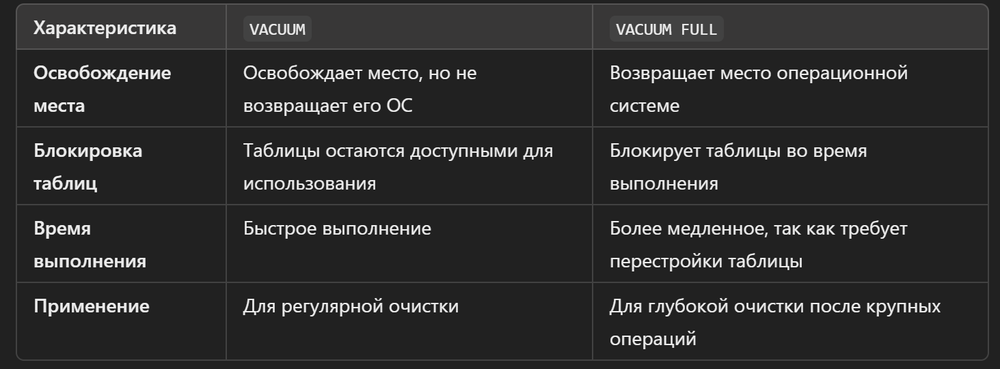

### <span style="color: lime">Что такое индексация данных?</span>
**`Индексация данных`** — это способ оптимизации запросов к базе данных, который ускоряет поиск нужных данных в таблицах. Индексы создаются для столбцов таблиц, чтобы упростить и ускорить операции поиска, сортировки и фильтрации данных. Индекс в базе данных можно сравнить с оглавлением книги, которое помогает быстро найти нужную информацию, не просматривая все страницы по порядку.

Когда в таблице базы данных создаётся индекс на определённый столбец (или столбцы), база данных строит специальную структуру данных — обычно это **дерево B-дерево (B-tree)** или **хеш-таблица**. Эта структура хранит ссылки на строки таблицы, упорядоченные по значению индексируемого столбца. Благодаря этому база данных может быстрее находить нужные строки, не просматривая всю таблицу целиком.

Допустим, у тебя есть таблица **Пользователи**, которая содержит следующие столбцы:
- **id**
- **имя**
- **электронная почта**
Если ты часто выполняешь запросы, которые ищут пользователя по электронной почте, то можно создать индекс на столбце **электронная почта**, чтобы ускорить эти запросы.
```sql
create index idx_email on Пользователи(электронная почта);
```

#### Виды индексов:
- **Обычные индексы**: Это самые распространённые индексы, которые упрощают поиск и сортировку данных по одному или нескольким столбцам.
- **Уникальные индексы**: Они не только ускоряют поиск, но и обеспечивают уникальность значений в столбце. Например, индекс на столбце с номерами телефонов может гарантировать, что два пользователя не смогут иметь один и тот же номер телефона.
- **Полнотекстовые индексы**: Используются для поиска по текстовым полям, например, когда необходимо найти определённое слово в большом тексте.
- **Индексы на несколько столбцов**: Индекс может быть создан сразу на нескольких столбцах, что помогает ускорить запросы, которые фильтруют данные по комбинации значений нескольких полей.

#### Преимущества индексации:
- **Ускорение запросов**: Индексы позволяют базе данных быстрее находить данные, что особенно важно при больших объёмах данных.
- **Оптимизация сортировки**: Если ты выполняешь запросы с сортировкой (`ORDER BY`), индексы могут ускорить выполнение таких операций.
- **Повышение производительности при фильтрации**: Запросы с условиями (`WHERE`) выполняются значительно быстрее, если на поля, по которым фильтруются данные, созданы индексы.

#### Недостатки индексации:
- **Затраты на хранение**: Индексы занимают дополнительное место на диске. Если слишком много индексов, это может увеличить размер базы данных.
- **Замедление операций вставки, обновления и удаления**: При каждой вставке, обновлении или удалении данных, индексы тоже должны обновляться, что может замедлить выполнение этих операций. Чем больше индексов на таблице, тем больше времени потребуется для обновления каждого из них.
- **Избыточность**: Создание индексов на слишком многих столбцах может привести к избыточности и замедлению работы базы данных. Важно индексировать только те столбцы, которые часто используются в запросах.

### <span style="color: lime">Если индексы - это такой мощный инструмент, почему бы не создавать индексы для всех столбцов в таблице?</span>
#### Почему **не стоит** создавать индексы на все столбцы:
- перечисленные недостатки индексации данных.
- Неправильный выбор индекса может не дать выгоды:
	- Не все столбцы подходят для индексации. Например, индексация столбцов с очень низкой уникальностью данных (например, булевы значения: `true/false`, или столбец с одинаковыми значениями для большинства строк) не даёт большого прироста в производительности.
- Маленькие таблицы не нуждаются в индексации:
	- В небольших таблицах (с несколькими сотнями или тысячами строк) база данных может быстрее просканировать всю таблицу, чем использовать индекс. Индексация здесь не принесёт пользы, а лишь усложнит операции обновления.
- Индексы не ускоряют все типы запросов:
	- Если запрос использует сложные арифметические операции или агрегаты, такие как `SUM` или `AVG`, индекс может не помочь, так как база данных всё равно должна пройтись по всем строкам для вычисления результата.

#### Когда стоит создавать индексы?:
- Часто используются в условиях фильтрации (`WHERE`).
- Часто участвуют в соединениях таблиц (`JOIN`).
- Используются в сортировке (`ORDER BY`).
- Используются в группировках (`GROUP BY`).

### <span style="color: lime">Что такое UNIQUE индекс?</span>
**`UNIQUE индекс`** — это особый тип индекса в базе данных, который гарантирует, что значения в столбце (или комбинации столбцов) будут **уникальными**. Это значит, что никакие два значения в проиндексированном столбце не могут быть одинаковыми. Если при вставке данных в таблицу обнаруживается дублирующее значение, операция вставки или обновления не будет выполнена, и база данных вернёт ошибку.

#### Основные особенности UNIQUE индекса:
- **Гарантия уникальности**
- **Создание уникальности на уровне базы данных**
- **Можно создать на нескольких столбцах**

Допустим, у тебя есть таблица **Пользователи**, и ты хочешь гарантировать, что у каждого пользователя будет уникальный адрес электронной почты. Для этого можно создать UNIQUE индекс:
```sql
create unique index idx_unique_email on Пользователи(электронная_почта);
-- Теперь, если кто-то попытается добавить пользователя с уже существующей электронной почтой, база данных вернёт ошибку.
```

### <span style="color: lime">Когда создается PK или FK, следует ли дополнительно создавать для него индекс?</span>
#### PRIMARY KEY (Первичный ключ):
- Автоматическое создание индекса:
	- **Когда создаётся PRIMARY KEY**, база данных **автоматически создаёт уникальный индекс** на этом столбце (или столбцах). Это происходит во всех популярных системах управления базами данных (СУБД), таких как MySQL, PostgreSQL, SQL Server и другие.
	- **Причина**: Первичный ключ должен быть **уникальным** и должен обеспечивать **быстрый поиск** данных. Чтобы поддерживать эти свойства, база данных автоматически создаёт индекс, который помогает обеспечить уникальность значений и ускоряет поиск по первичному ключу.

#### FOREIGN KEY (Внешний ключ):
- Автоматическое создание индекса:
	- **Для внешнего ключа (FOREIGN KEY)** база данных **не создаёт индекс автоматически**. Это значит, что если ты хочешь ускорить операции, связанные с внешним ключом (например, соединение таблиц или удаление записей), то **индекс на внешнем ключе нужно создать вручную**.
- Индекс на внешнем ключе особенно полезен в следующих случаях:
	- **Запросы с JOIN**: Если внешние ключи часто используются в операциях соединения (`JOIN`), индекс помогает базе данных быстрее находить соответствующие строки в связанных таблицах.
	- **Операции удаления или обновления**: Если выполняются команды `DELETE` или `UPDATE`, затрагивающие внешние ключи, наличие индекса ускоряет проверку связей между таблицами.

#### Заключение:
- **Для PRIMARY KEY**: Индекс создаётся автоматически, и **не нужно** создавать дополнительный индекс на этот столбец.
- **Для FOREIGN KEY**: Индекс **не создаётся автоматически**, и **рекомендуется** создавать его вручную, если внешние ключи часто участвуют в операциях соединения или проверке связей при удалении/обновлении.

### <span style="color: lime">Что такое compound index?</span>
**`Compound index`** (составной индекс) — это индекс, созданный на **нескольких столбцах** таблицы одновременно. Он используется для ускорения выполнения запросов, которые фильтруются или сортируются сразу по нескольким столбцам. Такой индекс может значительно улучшить производительность запросов, когда фильтрация или сортировка данных происходит по этим столбцам в определённом порядке.
```sql
create index index_name on table_name(column1,..., columnN);
-- it creates compound index in multiple columns
```

#### Как работает составной индекс?:
- **Порядок столбцов имеет значение**: Важно, что составной индекс работает эффективно, если запросы фильтруют данные по столбцам **в порядке, указанном при создании индекса**. Например, если индекс был создан по столбцам `genre` и `publication_year`, то запрос, который фильтрует сначала по `genre`, а потом по `publication_year`, будет использовать индекс эффективно.
- Если запрос фильтрует только по **первому столбцу** (например, только по `genre`), индекс всё равно будет работать. Однако, если запрос фильтрует только по **второму столбцу** (например, только по `publication_year`), этот индекс уже не будет использоваться эффективно.

#### Преимущества:
- - **Ускорение сложных запросов**: Запросы, которые фильтруют или сортируют данные по нескольким столбцам, будут выполняться быстрее.
- **Меньше индексов**: Вместо того чтобы создавать отдельные индексы на каждый столбец, составной индекс позволяет охватить несколько столбцов сразу, снижая потребность в избыточных индексах.

#### Недостатки:
- **Порядок столбцов**: Если запросы не используют столбцы в том же порядке, что и в индексе, его эффективность падает.
- **Затраты на обновление**: Как и любой индекс, составной индекс нужно обновлять при вставке, изменении или удалении данных, что может замедлять эти операции.

### <span style="color: lime">Какое отличие compound index на две колонки от двух single indexes, созданных на каждую из колонок в таблице?</span>
#### Compound Index
```sql
create index idx_column1_column2 on table_name(column1, column2);
```

Как он работает?:
- **Приоритет порядка**: Составной индекс эффективен, когда запросы используют фильтрацию или сортировку в том порядке, в котором столбцы перечислены в индексе.
	- Если запрос использует оба столбца (`column1` и `column2`), индекс будет работать эффективно.
	- Если запрос использует только **первый столбец** (`column1`), индекс всё ещё будет эффективен.
	- Если запрос использует **только второй столбец** (`column2`), то индекс не будет эффективен, так как составной индекс ищет данные, начиная с первого столбца.

```sql
select * from table_name where column1='value1' and column2='value2';
-- запрос будет эффективно использовать составной индекс

select * from table_name where column1='value1';
-- запрос также будет использовать индекс, так как фильтрация начинается с первого столбца в индексе

select * from table_name where column2='value2';
-- запрос не будет использовать составной индекс, потому что фильтрация начинается с "column2", который идёт вторым в индексе
```

#### Single Indexes (два отдельных индекса на каждую колонку)
```sql
create index idx_column1 on table_name(column1);
create index idx_column2 on table_name(column2);
```

Как они работают?:
- **Каждый индекс используется независимо**: Одиночные индексы будут работать, когда запрос фильтрует или сортирует данные по каждому столбцу отдельно.
	- Если запрос фильтрует только по `column1`, будет использован индекс на `column1`.
	- Если запрос фильтрует только по `column2`, будет использован индекс на `column2`.
	- Если запрос фильтрует по **обоим столбцам**, оба индекса могут быть использованы для ускорения поиска, но это не всегда будет так эффективно, как составной индекс.

```sql
select * from table_name where column1='value1';
-- запрос использует одиночный индекс на `column1`

select * from table_name where column2='value2';
-- запрос использует одиночный индекс на `column2`

select * from table_name where column1='value1' and column2='value2';
-- запрос может использовать оба индекса, но эффективность может быть ниже, чем у составного индекса, потому что запросы будут обрабатываться по каждому столбцу отдельно
```

#### Сравнение **Compound Index** и **Single Indexes**:
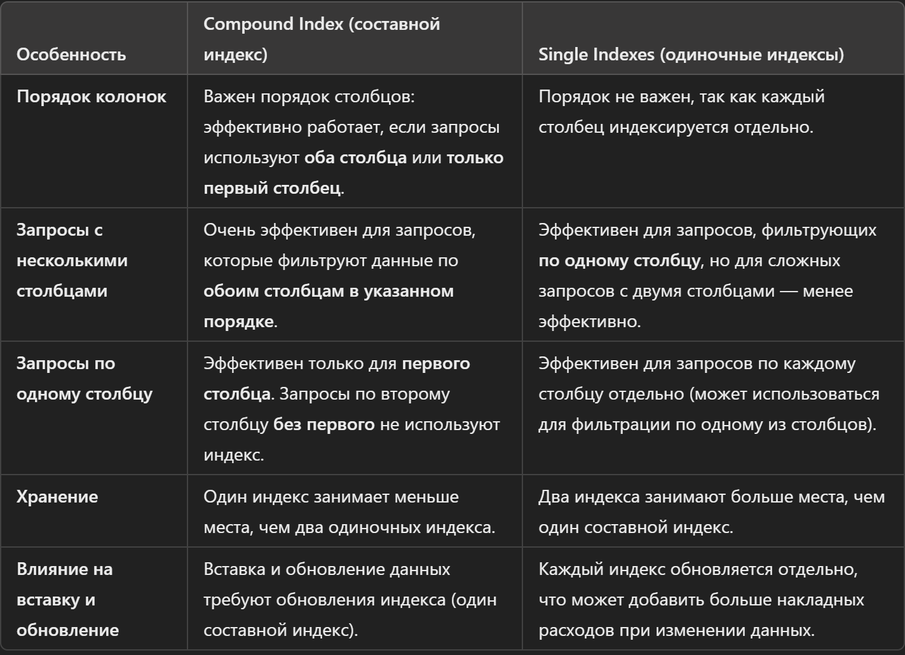

### <span style="color: lime">В каких случаях нерелевантно использовать индексы?</span>
Есть ситуации, когда использование индексов **нерелевантно** или даже может ухудшить производительность:
- `Небольшие таблицы`: Если таблица содержит **малое количество строк** (например, несколько десятков или сотен записей), создание индексов не даёт значимого прироста в производительности. В таких случаях база данных может быстрее просканировать всю таблицу (полный обход) без индексов, чем затрачивать ресурсы на их использование.

- `Таблицы с частыми изменениями данных`: Таблицы, в которых часто происходят **операции вставки (`INSERT`), обновления (`UPDATE`) и удаления (`DELETE`)**, могут испытывать значительное снижение производительности из-за индексов. Это связано с тем, что каждый раз, когда данные изменяются, индекс тоже должен быть обновлён, что приводит к дополнительным затратам ресурсов.

- `Колонки с низкой уникальностью (мало разнообразных значений)`: Индексы малоэффективны для колонок, которые содержат **мало уникальных значений** или имеют **высокую повторяемость** значений (например, столбцы с булевыми значениями `true/false` или столбцы с несколькими повторяющимися категориями, как "мужской/женский"). В таких случаях индекс не помогает базе данных быстро находить нужные строки, потому что много строк содержат одно и то же значение.

- `Запросы, которые выбирают большое количество данных`: Если запрос выбирает **большую часть** таблицы (например, более 30-40% строк), индекс не будет полезен. В таких ситуациях базе данных проще выполнить **полный скан таблицы**, чем обращаться к индексу, а затем вытаскивать строки из таблицы.
```sql
select * from orders where status='completed';
-- Если большинство заказов в таблице имеют статус `completed`, индекс не ускорит запрос, и полное сканирование таблицы будет более эффективным.
```

- `Очень частое использование индексов на всех столбцах`: Создание индексов на **каждом столбце** может привести к существенным накладным расходам на хранение и поддержание этих индексов. Кроме того, индексы будут замедлять вставку, обновление и удаление данных, так как каждый индекс должен обновляться при изменении данных.

- `Запросы с операциями на всём диапазоне значений (например, LIKE '%value%')`: Запросы с условиями, которые используют **wildcard-символы** (например, `LIKE '%value%'`), плохо работают с индексами. Это связано с тем, что такие условия не могут использовать индексы для поиска, так как база данных вынуждена сканировать все строки, чтобы найти соответствия.
```sql
select * from products where name like '%apple%';
-- Запрос с использованием `LIKE '%apple%'` не сможет использовать индекс, так как поиск начинается с произвольной позиции строки.
```

#### Заключение:
- Небольшие таблицы.
- Таблицы с частыми изменениями данных.
- Колонки с низкой уникальностью значений.
- Запросы, которые выбирают значительную часть данных.
- Чрезмерное количество индексов.
- Запросы с wildcard-символами в середине или начале строки.

### <span style="color: lime">Что такое CREATE INDEX CONCURRENTLY?</span>
**`CREATE INDEX CONCURRENTLY`** — это команда в PostgreSQL, которая создаёт индекс на таблице **без блокировки операций записи**. Эта функция особенно полезна в системах, где важна высокая доступность, и вы не можете себе позволить блокировать таблицу на время создания индекса.

Когда вы создаёте индекс с помощью обычной команды `CREATE INDEX`, таблица становится **недоступной для операций записи** (например, `INSERT`, `UPDATE`, `DELETE`) на время создания индекса. Это может быть проблемой, если таблица активно используется, потому что блокировка может существенно повлиять на производительность приложения.
```sql
create index idx_column on table_name(column);
-- Чтение данных из таблицы всё ещё возможно.
-- Запись (вставка, обновление и удаление данных) временно блокируется.

create index concurrently idx_column on table(column);
-- команда позволяет таблице продолжать принимать изменения (вставки, обновления, удаления) во время создания индекса.
```

#### Как это работает?:
- **Параллельное создание индекса**: PostgreSQL выполняет создание индекса параллельно с другими операциями (вставками, обновлениями, удалениями).
- **Без блокировки записи**: Таблица остаётся доступной для операций записи.
- **Блокировка только при завершении**: На финальной стадии создания индекса происходит кратковременная блокировка для синхронизации данных, но она значительно короче по времени, чем полная блокировка при обычном `CREATE INDEX`.

#### Ограничения и недостатки:
- **Создание дольше**: Индекс создаётся медленнее, чем с обычным `CREATE INDEX`, потому что PostgreSQL должен учитывать параллельные изменения данных.
- **Не поддерживается в транзакциях**: Нельзя использовать `CREATE INDEX CONCURRENTLY` внутри транзакции. Если нужно создать индекс в транзакции, придётся использовать обычную команду `CREATE INDEX`.
- **Потребление ресурсов**: `CREATE INDEX CONCURRENTLY` может потреблять больше системных ресурсов, так как одновременно выполняется индексирование и обновления данных.
- **Повторное выполнение при ошибке**: Если операция прервётся (например, из-за сбоев), PostgreSQL не откатит изменения, и индекс может быть не завершён. Его придётся удалить и создать заново.

### <span style="color: lime">Что такое Partial индекс?</span>
**`Partial индекс`** (частичный индекс) — это индекс, который создаётся только для **части строк** в таблице, на основе определённого условия. Это позволяет снизить объём данных, которые нужно индексировать, и тем самым улучшить производительность запросов и сэкономить место на диске.

Допустим, у нас есть таблица **`Orders`**, в которой хранятся заказы. Большинство заказов уже завершены, но нас интересуют только активные заказы, то есть те, у которых статус **`active`**. Мы можем создать частичный индекс, который будет включать только такие строки.
```sql
create index idx_active_orders on Orders(order_date) where status='active';
```

#### Как это работает?:
- **Условие `WHERE`** в индексе ограничивает его применение только к строкам, где **`status = 'active'`**.
- Теперь индекс будет использоваться только для запросов, которые фильтруют строки по этому условию.
- Запросы, не затрагивающие строки со статусом `active`, не будут использовать индекс.

#### Преимущества:
- **Экономия места на диске**: Индекс включает только часть данных таблицы, что уменьшает объём хранимых данных по сравнению с полным индексом.
- **Повышение производительности**: Запросы, которые часто работают с определённым подмножеством данных (например, только активные заказы), могут работать быстрее, так как индекс содержит только необходимые строки.
- **Меньшая нагрузка на обновления**: Когда данные изменяются, обновлять нужно только те индексы, которые затрагивают изменённые строки. В случае частичного индекса обновление будет происходить только для строк, удовлетворяющих условиям индекса.

### <span style="color: lime">Что такое GIN, GIST индексы?</span>
**GIN** и **GiST** индексы — это два типа индексов, которые используются в PostgreSQL для более сложных запросов, чем те, которые могут обрабатывать обычные индексы типа B-Tree. Оба типа индексов позволяют эффективно искать данные, которые имеют более сложную структуру (например, массивы, текстовые документы, геометрические данные и т.д.).

#### GIN (Generalized Inverted Index)
**GIN (обобщённый инвертированный индекс)** используется для индексирования данных, которые могут содержать множество элементов в одном поле (например, массивы, JSON, текстовые документы). GIN позволяет быстро искать строки, которые содержат один или несколько элементов из набора данных. Чаще всего его используют для полнотекстового поиска и работы с массивами.

Пример использования:
- **Массивы**: Если у вас есть поле, которое хранит массив значений, и вы хотите эффективно искать по отдельным элементам массива.
- **Полнотекстовый поиск**: Для поиска слов в текстовых документах или строках.
- **JSON и JSONB**: Для эффективного поиска по ключам или значениям в JSON-структурах.

Преимущества GIN:
- Эффективен для поиска по полям, которые содержат несколько значений (массивы, списки).
- Быстро работает для полнотекстового поиска (поиск слов в документах).

Недостатки GIN:
- Медленная вставка и обновление данных, потому что GIN индекс создаётся на основе инвертированных данных, что требует дополнительных вычислений.
- Индекс может занимать много места на диске, особенно для больших текстов или массивов.

ПРИМЕР:
Предположим, у нас есть таблица **`Articles`**, где каждая статья имеет несколько тегов. Теги хранятся в виде массива, и наша цель — искать статьи по конкретным тегам. Например, мы хотим найти все статьи, которые содержат тег **"PostgreSQL"**.
```sql
create table Articles (
id serial primary key,
title text,
tags text[]
);

-- id — уникальный идентификатор статьи.
-- title — заголовок статьи.
-- tags — массив тегов для каждой статьи.
```

Мы можем создать **GIN индекс** на колонке `tags`, чтобы ускорить поиск по отдельным элементам массива.
```sql
create index idx_gin_tags on Articles using GIN(tags);
```
Пример запроса
```sql
select * from Articles where tags @> array['PostgreSQL'];

-- оператор @> проверяет, содержит ли массив `tags` элемент 'PostgreSQL'
-- Благодаря индексу GIN, PostgreSQL может эффективно находить строки, не просматривая каждую статью вручную.
```

Как это работает:
- **GIN индекс** работает как инвертированный индекс: он хранит для каждого уникального элемента (в данном случае тегов) список строк, где этот элемент встречается.
- Когда выполняется запрос, индекс сразу находит все статьи, у которых есть нужный тег, и пропускает остальные строки.

#### GiST (Generalized Search Tree)
**GiST (обобщённое дерево поиска)** — это более гибкий тип индекса, который может использоваться для самых разных типов данных. Он поддерживает сложные запросы, которые не могут быть решены с помощью обычных B-Tree индексов. GiST часто используется для работы с **геометрическими данными**, **поиском по ближайшему соседу**, **поиском диапазонов**, а также для индексации данных, которые имеют иерархическую структуру.

Пример использования:
- **Геометрические данные**: Например, если вы храните координаты объектов (точки, полигоны) и хотите искать по ним (например, нахождение ближайших точек).
- **Поиск по ближайшему соседу**: Поиск записей, которые находятся ближе всего к заданной точке.
- **Диапазоны**: Индексация столбцов с диапазонами значений (например, временные интервалы).

Преимущества GiST:
- Гибкость: может использоваться для разных типов данных и различных запросов (географические данные, иерархии, ближайшие соседи).
- Поддержка сложных пространственных операций и диапазонов значений.

Недостатки GiST:
- Может быть менее эффективен для простых запросов, где можно использовать B-Tree индекс.
- Более сложная структура, что может немного увеличить время создания индекса и его обновления.

ПРИМЕР:
Представим, что у нас есть таблица **`Places`**, которая хранит географические координаты различных мест (например, магазинов, парков, зданий). Мы хотим искать ближайшие места от заданной точки на карте, например, в радиусе 1000 метров от пользователя.
```sql
create table Places (
id serial primary key,
name text,
location geometry(Point, 4326)
);

-- id - уникальный идентификатор места.
-- name - название места (например, магазин, парк).
-- location - геометрическое поле, которое хранит координаты места в виде точки (широта и долгота).
```

Мы можем создать **GiST индекс** на колонке `location`, чтобы ускорить поиск ближайших точек.
```sql
create index idx_gist_location on Places using gist(location);

```
Пример запроса:
```sql
select * from Places where st_dwithin(location, st_makepoint(10, 20), 1000);

-- Функция ST_DWithin проверяет, находятся ли места в пределах указанного расстояния (1000 метров) от заданной точки ST_MakePoint(10, 20).
```

Как это работает:
- **GiST индекс** создаёт дерево, которое позволяет быстро находить точки, близкие друг к другу. Он эффективно разбивает пространство на области и ускоряет операции, связанные с расстояниями или пересечениями.
- Вместо того чтобы проверять расстояние до каждой точки вручную, индекс сразу находит места, которые находятся в пределах указанного радиуса.

Сравнение **GIN** и **GiST**: 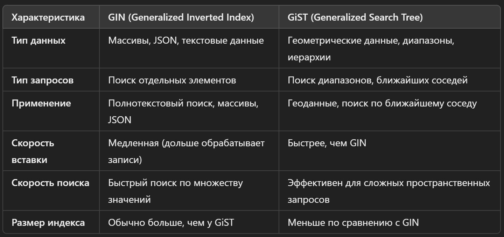

#### Когда использовать GIN или GiST?:
- **GIN** индекс лучше подходит, когда нужно искать по множеству значений в одном столбце (массивы, списки, JSON) или для полнотекстового поиска.
- **GiST** индекс используется для сложных запросов, которые требуют работы с пространственными данными, диапазонами или иерархическими структурами.

### <span style="color: lime">Что такое RUM индекс?</span>
**RUM индекс** (Reverse unstructured data Mapping) — это расширение индекса GIN, которое улучшает возможности работы с полнотекстовым поиском в PostgreSQL и делает его более эффективным. RUM расширяет возможности стандартного **GIN индекса** для того, чтобы лучше обрабатывать запросы, связанные с ранжированием результатов поиска (например, сортировка по релевантности), а также для поддержки дополнительных операций с полнотекстовым поиском.

**GIN** индекс прекрасно подходит для работы с полнотекстовым поиском и массивами, но у него есть свои ограничения:
- **Отсутствие сортировки по релевантности**. Стандартный GIN индекс не позволяет эффективно сортировать результаты поиска по релевантности или другим критериям.
- **Медленная обработка некоторых типов операций**. Операции вроде сортировки результатов поиска по весу (релевантности) или объединение с другими условиями могут быть менее эффективными с GIN индексами.

#### Основные особенности RUM индекса:
- **Ранжирование результатов поиска**:
	- Одним из главных преимуществ RUM является возможность сортировки результатов поиска по релевантности на уровне индекса. Это позволяет находить наиболее подходящие документы быстрее, чем при использовании стандартного GIN индекса.
- **Поддержка операций на уровне индекса**:
	- RUM позволяет выполнять операции над полнотекстовыми данными прямо на уровне индекса. Например, можно сразу получать позиции вхождений слов в тексте, а не вызывать отдельные функции для этого.
- **Поддержка полнотекстового поиска**:
	- С RUM индексами можно использовать полнотекстовый поиск и при этом получать гораздо лучшие результаты по производительности и сортировке, чем при использовании только GIN индексов.
- **Эффективная сортировка**:
	- В отличие от GIN индексов, которые не умеют быстро сортировать данные, RUM индекс поддерживает сортировку по различным параметрам, таким как вес, время или позиция слова в тексте.

Предположим, у нас есть таблица **`Documents`**, в которой хранятся тексты статей, и мы хотим реализовать полнотекстовый поиск по этим статьям с возможностью сортировки по релевантности.
```sql
create table Documents (
id serial primary key,
content text,
tsv_content tsvector
);

-- content - текст статьи
-- tsv_content - поле типа TSVECTOR, которое используется для полнотекстового поиска. Оно содержит нормализованную версию текста статьи (например, удаление стоп-слов и приведение слов к базовой форме).
```

Проблема:
- Нам нужно искать статьи по ключевым словам и сортировать результаты по релевантности. Использование обычного GIN индекса может быть неэффективным для сортировки и ранжирования.
Решение:
- Создаём RUM индекс на поле `tsv_content` для поддержки эффективного поиска и сортировки по релевантности.
```sql
create index idx_rum_content on Documents using rum(tsv_content, rum_tsvector_ops);

-- Здесь мы указываем, что для поля **`tsv_content`** будет использоваться "rum_tsvector_ops", которая даёт возможность поиска и сортировки по релевантности.
```
Запрос
```sql
-- поиск с сортировкой по релевантеости
select id, content from Documents
where tsv_content @@ to_tsquery('postgresql')
order by tsv_content <=> to_tsquery('postgresql');

-- @@ — оператор полнотекстового поиска, который проверяет, содержится ли слово **"postgresql"** в тексте.
-- <=> - оператор для сортировки по релевантности (чем меньше результат, тем выше релевантность).
```

#### Недостатки RUM индекса:
- **Больше места на диске**: RUM индекс может занимать больше места, чем GIN индекс, из-за дополнительных данных для сортировки и обработки запросов.
- **Ограниченное использование**: RUM индекс не используется для всех типов данных, он в основном применяется для полнотекстового поиска и работы с текстом.

#### Когда использовать RUM?:
- **Полнотекстовый поиск**: Если нужно искать слова в текстовых документах и важно сортировать результаты по релевантности (например, в поисковых системах).
- **Требуется сортировка результатов**: Если в запросах необходимо быстро и эффективно сортировать данные (по весу слов, позиции вхождений и т.д.).
- **Большие объёмы данных**: Если ваша система работает с большими текстовыми массивами, и запросы без индекса требуют слишком много времени на выполнение.

### <span style="color: lime">Как реализуются индексы внутри? (базовое понимание)</span>
#### B-Tree индекс (дерево поиска)
**`B-Tree`** — это самый распространённый тип индекса, который используется по умолчанию в большинстве баз данных, таких как PostgreSQL и MySQL.

Как работает B-Tree:
- **B-Tree** — это структура данных, похожая на дерево. В ней хранятся ключи (значения из столбца) отсортированными по возрастанию. Ключи организованы таким образом, что каждая операция поиска может пропустить большую часть данных, делая поиск быстрым.
- Например, если у нас есть отсортированный список значений в дереве, поиск может начаться с середины, и база данных уже знает, в какую сторону двигаться — влево или вправо — чтобы найти нужные данные. Это называется **логарифмическим поиском**, который значительно быстрее полного сканирования таблицы.

#### Hash индекс
**Hash** индекс используется для точного поиска значений. Он создаёт хэш-коды для значений из столбца и затем использует их для быстрого поиска.

Как работает Hash:
- Для каждого значения в столбце база данных создаёт **хэш-код** — это уникальная комбинация символов, которая представляет значение.
- Эти хэш-коды хранятся в специальной структуре данных (хэш-таблице), которая позволяет быстро находить данные с помощью хэш-функции.
- Поиск по хэш-индексу обычно выполняется за **O(1)** (постоянное время), что очень быстро для точных совпадений.

### <span style="color: lime">Существует ли индексация данных только в реляционных БД?</span>
Индексы — это универсальный инструмент, используемый для ускорения поиска данных в различных системах управления базами данных (СУБД), независимо от их модели данных.

#### NoSQL базы данных:
- Документо-ориентированные базы данных:
	- В таких базах данных, как **MongoDB**, данные хранятся в виде документов (JSON-подобные структуры). Здесь индексы создаются на определённых полях внутри документов для ускорения поиска и сортировки.
- Ключ-значение базы данных:
	- В базах данных ключ-значение, таких как **Redis** или **DynamoDB**, данные индексируются по ключам. Хотя такие базы данных обычно обеспечивают быстрый доступ к значениям по ключу, некоторые из них (например, DynamoDB) позволяют создавать **вторичные индексы** для поиска по другим атрибутам, кроме основного ключа.
- Графовые базы данных:
	- В графовых базах данных, таких как **Neo4j**, индексы используются для ускорения поиска узлов и рёбер по атрибутам (например, именам, тегам или меткам). Индексы позволяют быстрее находить узлы или связи, которые соответствуют определённым критериям.
- Колонко-ориентированные базы данных:
	- В **колонко-ориентированных** базах данных, таких как **Apache Cassandra**, индексы могут быть созданы для ускорения поиска по колонкам, кроме основной ключевой колонки. В отличие от реляционных БД, здесь индексы могут быть менее эффективными для больших наборов данных, так как они рассчитаны на другие модели данных.

#### Поисковые системы:
- **Поисковые системы**, такие как **Elasticsearch** или **Apache Solr**, тоже используют индексы для поиска по большому количеству текстовых данных. Эти системы оптимизированы для полнотекстового поиска и используют сложные структуры индексов для работы с текстом, включая инвертированные индексы, которые помогают находить документы по ключевым словам.

#### NewSQL базы данных:
- **NewSQL** базы данных, такие как **CockroachDB** или **Google Spanner**, сочетают в себе реляционную модель данных с масштабируемостью, присущей NoSQL решениям. Эти базы данных тоже используют индексы (например, B-Tree или Hash), чтобы обеспечить быстрый доступ к данным.

### <span style="color: lime">Что такое package в БД?</span>
В базах данных **package** (пакет) — это группа логических объектов, таких как **процедуры**, **функции**, **переменные**, и **константы**, которые объединены в один модуль для облегчения управления и повторного использования кода. Пакеты обычно используются в СУБД, таких как **Oracle** и **PL/SQL**, и помогают организовать код, улучшая его читаемость, поддержку и повторное использование.

#### Основные элементы пакета:
- **Процедуры и функции**: Эти объекты содержат программный код, который выполняет определённые задачи. Процедуры и функции можно вызывать для выполнения операций над данными, например, расчётов или модификации записей в таблицах.
	- **Процедура** выполняет определённое действие, но не возвращает значение.
	- **Функция** также выполняет действие, но обязательно возвращает значение.
- **Переменные и константы**: В пакете можно объявлять глобальные переменные и константы, которые могут использоваться внутри процедур и функций.
- **Типы данных**: Можно создавать собственные типы данных, которые будут использоваться в рамках пакета.

#### Пакет состоит из двух частей:
- **Спецификация пакета** (package specification): это "интерфейс" пакета, который определяет, какие процедуры, функции и переменные доступны за пределами пакета (то есть для внешнего вызова).
- **Тело пакета** (package body): содержит реализацию всех процедур, функций и других объектов, объявленных в спецификации.

#### ПРИМЕР
Представим, что у нас есть база данных для управления заказами, и мы создаём пакет для работы с заказами:
- Спецификация пакета:
```sql
CREATE OR REPLACE PACKAGE order_pkg AS
	-- Объявление процедуры для создания заказа
	PROCEDURE create_order(customerID NUMBER, productID NUMBER, quantity NUMBER);

	-- Объявление функции для расчёта общей стоимости заказа
	FUNCTION calculate_total(orderID NUMBER) RETURN NUMBER;
END order_pkg;
```

- Тело пакета:
```sql
CREATE OR REPLACE PACKAGE BODY order_pkg AS
	-- Реализация процедуры создания заказа
	PROCEDURE create_order(customerID NUMBER, productID NUMBER, quantity NUMBER) IS
	BEGIN
		-- Логика вставки данных в таблицу заказов
		INSERT INTO orders(customer_id, product_id, quantity, order_date)
		VALUES(customerID, productID, quantity, SYSDATE);
	END create_order;

	-- Реализация функции для расчёта общей стоимости заказа
	FUNCTION calculate_total(orderID NUMBER) RETURN NUMBER IS
		total NUMBER; -- создание переменной total
	BEGIN
		SELECT SUM(price * quantity) INTO total FROM order_items
		WHERE order_id = orderID;
		RETURN total;
	END calculate_total;
END order_pkg;
```

#### Преимущества использования пакетов:
- **Модульность**: Пакеты позволяют организовать код в логические группы, что делает его более структурированным и управляемым.
- **Повторное использование кода**: Процедуры и функции, определённые в пакете, можно вызывать из разных мест программы.
- **Инкапсуляция**: Внутренние реализации могут быть скрыты от внешнего кода. В спецификации пакета мы объявляем только интерфейс (то, что должно быть видно извне), а реализация находится в теле пакета.
- **Повышение производительности**: Когда пакет загружается в память, все его процедуры и функции тоже загружаются, что ускоряет доступ к ним.
- **Управляемость**: Изменение внутренней логики пакета не требует переписывания кода, который вызывает процедуры или функции из этого пакета.

### <span style="color: lime">Что такое Heterogeneous calls?</span>
**`Heterogeneous calls`** (гетерогенные вызовы) в контексте баз данных — это возможность базы данных взаимодействовать с другими базами данных или системами, которые могут использовать разные типы баз данных, технологии или платформы. Это позволяет выполнять запросы или обмениваться данными между различными базами данных, даже если они построены на разных архитектурах.

Гетерогенные вызовы особенно важны, когда предприятия работают с несколькими системами управления базами данных (СУБД), такими как **Oracle**, **MySQL**, **SQL Server**, **MongoDB**, или даже не-СУБД системами (например, файловыми системами или веб-сервисами), и нужно, чтобы эти системы могли обмениваться данными друг с другом.

#### Основные особенности гетерогенных вызовов:
- **Работа с разными типами СУБД**: Возможность вызывать запросы и обмениваться данными между реляционными (например, Oracle, PostgreSQL) и нереляционными базами данных (например, MongoDB).
- **Поддержка разных протоколов и технологий**: Использование гетерогенных вызовов может требовать специальных шлюзов, коннекторов, или API, которые обеспечивают совместимость между различными системами баз данных.
- **Мост между системами**: Для выполнения гетерогенных вызовов часто используются специализированные **шлюзы** или **коннекторы**. Эти программы выступают в роли моста между системами, позволяя отправлять SQL-запросы или выполнять другие операции с базами данных, которые работают на разных платформах.

#### Пример архитектуры гетерогенных вызовов:
- **Приложение** выполняет запрос, который предназначен для **Oracle Database**.
- **Oracle Database** видит, что запрос касается другой базы данных (например, **SQL Server**) и направляет запрос через **Oracle Database Gateway**.
- **Gateway** переводит SQL-запрос в формат, понятный SQL Server, и отправляет его на выполнение.
- SQL Server выполняет запрос и возвращает результаты через тот же шлюз обратно в Oracle.
- Oracle возвращает результаты клиентскому приложению.

#### Поддержка гетерогенных вызовов в СУБД:
- **Oracle** предлагает технологию **Oracle Database Gateway**, которая позволяет отправлять запросы в другие базы данных, такие как SQL Server, DB2, или Sybase.
- **PostgreSQL** поддерживает **Foreign Data Wrappers (FDW)** — расширение, которое позволяет работать с внешними данными и базами данных (например, с MySQL, Oracle, или другими PostgreSQL серверами).
- В **SQL Server** существует поддержка так называемых **Linked Servers**, которые позволяют SQL Server взаимодействовать с другими базами данных.

### <span style="color: lime">Что такое Virtual Table?</span>
**`Virtual Table (виртуальная таблица)`** — это концепция в базах данных, которая представляет собой таблицу, данные в которой не хранятся физически в базе данных, как это происходит с обычными таблицами. Виртуальная таблица предоставляет интерфейс для работы с данными, которые могут поступать из других источников или вычисляться динамически, когда запрашиваются. Виртуальная таблица может основываться на запросах, внешних данных, или алгоритмах.

#### Основные виды виртуальных таблиц:
- **View (представление)**: Самая распространённая форма виртуальной таблицы. Это результат заранее определённого SQL-запроса. Представления (views) не содержат данных, а лишь описывают, как эти данные могут быть получены из одной или нескольких таблиц при запросе. Когда вы обращаетесь к представлению, база данных выполняет запрос и возвращает результат, как если бы это была обычная таблица.
```sql
create view active_employees as
select * from employees where status='active';

-- Здесь виртуальная таблица `active_employees` будет динамически возвращать только тех сотрудников, у которых статус активен, на основе содержимого таблицы `employees`.
```

- **Foreign Tables (внешние таблицы)**: Это тип виртуальных таблиц, которые предоставляют доступ к данным, находящимся в других системах или базах данных. Например, в PostgreSQL с использованием модуля **Foreign Data Wrapper (FDW)** можно подключить внешние источники данных (например, другую базу данных или файл) и работать с ними как с обычной таблицей.
```sql
create foreign table external_employees (
	id int,
	name text,
	salary numeric
) server my_foreign_server options (table 'external_table');

-- В этом случае виртуальная таблица `external_employees` предоставляет данные из внешней базы данных, подключённой через сервер `my_foreign_server`.
```

- **Temporary Tables (временные таблицы)**: Хотя временные таблицы не всегда считаются виртуальными, они имеют схожие характеристики. Временные таблицы создаются на время текущей сессии и существуют только в её рамках. Данные во временных таблицах исчезают, как только сессия закрывается.
```sql
create temporary table temp_sales as
select * from sales where sales_date > '2024-01-01';
```

- **Механизмы полнотекстового поиска**: Например, в SQLite есть виртуальные таблицы для полнотекстового поиска (FTS, Full-Text Search), такие как `FTS5`. Эти таблицы специально предназначены для индексирования текста и быстрого выполнения поиска по нему.
```sql
-- sqlite
create virtual table docs using fts5(content);
insert into docs(content) values('This is a test document');
select * from docs where docs match 'test';
```

#### Преимущества виртуальных таблиц:
- **Динамическое получение данных**: Виртуальные таблицы обеспечивают получение данных в реальном времени. Это может быть удобно, когда данные постоянно изменяются.
- **Упрощённый доступ к сложным запросам**: Представления позволяют скрывать сложные запросы за простым интерфейсом, облегчая взаимодействие с базой данных.
- **Объединение данных из разных источников**: Внешние таблицы позволяют обращаться к данным из разных баз данных или внешних источников, как будто они являются частью текущей базы.

#### Ограничения:
- **Производительность**: Поскольку виртуальные таблицы не содержат данных физически, каждый раз при обращении к ним база данных должна выполнять запросы или извлекать данные из внешних источников, что может замедлить операции.
- **Ограниченные операции**: Некоторые виртуальные таблицы (например, представления) могут быть только для чтения, и операции записи в них могут быть запрещены или ограничены.

### <span style="color: lime">Зачем необходима конструкция WITH ... AS?</span>
Конструкция **`WITH ... AS`** (также известная как **Common Table Expression (CTE)**) в SQL используется для того, чтобы облегчить чтение и организацию сложных запросов. Она позволяет определить временные результаты или "временные таблицы", которые можно использовать в основном запросе. Это делает код более читаемым, структурированным и позволяет избегать повторяющихся подзапросов.

#### Основные цели и преимущества использования **`WITH ... AS`**:
- **Упрощение сложных запросов**: Когда в SQL запросах используются подзапросы, они могут становиться сложными для понимания. Использование конструкции **`WITH`** позволяет вынести подзапросы в отдельные блоки, что делает основной запрос проще и логичнее.
- **Переиспользование подзапросов**: Иногда в одном запросе приходится использовать один и тот же подзапрос несколько раз. Вместо того чтобы дублировать его каждый раз, можно один раз определить этот подзапрос в **`WITH ... AS`** и использовать его несколько раз в основном запросе.
- **Логическая организация кода**: Запросы, использующие **`WITH ... AS`**, более структурированы и читаемы, особенно если запросы сложные, с вложенными подзапросами и объединениями (JOIN).

```sql
with cte_name as (
	select ...
	from ...
	where ...
)

select ... from cte_name;

-- cte_name - название временной таблицы, которая будет в основном запросе
```

#### Пример использования CTE:
Допустим, у нас есть таблица с заказами (**`orders`**) и таблица с деталями заказов (**`order_items`**). Мы хотим найти всех клиентов, которые сделали заказы на сумму более 1000 долларов.

Запрос без CTE:
```sql
select customer_id from (
	select customer_id, sum(price * quantity) as total_spent from orders
	join order_items on orders.order_id = order_items.order_id
	group by customer_id
) as order_totals where total_spent > 1000;
```

С использованием конструкции **`WITH ... AS`**:
```sql
with order_totals as (
	select customer_id, sum(price * quantity) as total_spent from orders
	join order_items on orders.order_id = order_items.order_id
	group by customer_id
)

select customer_id from order_totals where total_spent > 1000; 
```

### <span style="color: lime">Зачем необходимы Window functions в SQL?</span>
**Window functions** в SQL (оконные функции) используются для выполнения вычислений по набору строк, связанных с каждой строкой в результате запроса, без группировки данных. Это значит, что они позволяют анализировать данные, сохраняя при этом каждую строку в результатах. Оконные функции особенно полезны для сложных аналитических задач, таких как подсчёт кумулятивных сумм, ранжирование строк, вычисление скользящих средних и работы с временными рядами.

#### Зачем нужны оконные функции?:
- **Анализ данных без группировки**:
	- В отличие от агрегатных функций (например, `SUM`, `COUNT`, `AVG`), которые уменьшают набор данных до одного результата на группу, оконные функции позволяют сохранить исходные строки и добавить результат вычисления для каждой строки. Это важно, когда нужно, например, посчитать суммарные продажи по каждому клиенту, но сохранить информацию о каждом заказе.
- **Поддержка аналитических задач**:
	- Оконные функции облегчают выполнение аналитики, такой как вычисление кумулятивных сумм, рангов, процентилей и других метрик, которые сложнее было бы выполнить с обычными запросами.
- **Работа с временными рядами**:
	- Они отлично подходят для анализа временных данных, например, расчёта скользящих средних, изменений во времени, расчёта нарастающих итогов.
- **Ранжирование и распределение данных**:
	- С помощью оконных функций можно присваивать каждой строке ранг, вычислять процентиль или определять её позицию относительно других строк.

#### Синтаксис оконных функций:
```sql
<function>() over ([partition by <columns>] [order by <columns>])

-- <function>() - сама функция, которая выполняется по набору строк (например SUM(), ROW_NUMBER(), RANK()).
-- partition by - разделяет строки на группы, внутри которых будут выполняться вычисления.
-- order by - задаёт порядок, по которому строки будут сортироваться внутри каждой группы перед применением оконной функции.
```

#### Пример из реальной жизни:
Представьте, что вы хотите проанализировать продажи компании и вам нужно для каждого заказа указать:
- Общую сумму заказов для данного клиента.
- Номер заказа в списке заказов этого клиента по дате (например, первый, второй и т.д.).
- Кумулятивную сумму продаж для клиента (нарастающий итог).
У нас есть таблица с заказами под названием **`orders`**, и она содержит следующие данные:
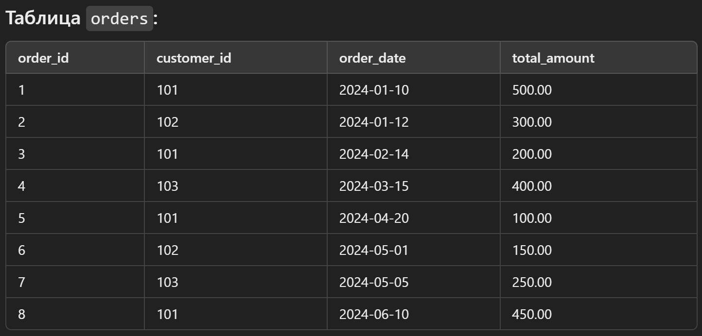

- Общая сумма заказов для каждого клиента:
```sql
select customer_id, order_id, total_amount,
	sum(total_amount) over (partition by customer_id) as total_for_customer
from orders;

-- Здесь SUM() суммирует все заказы каждого клиента, и результат виден для каждой строки.
```
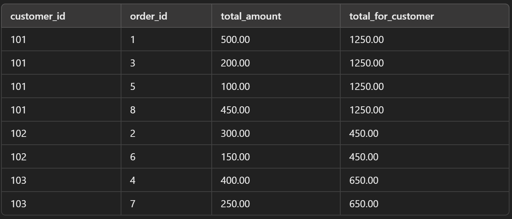

- Номер заказа клиента в хронологическом порядке:
```sql
select customer_id, order_id, order_date,
	row_number() over (partition by customer_id order by order_date) as order_rank
from orders;

-- Мы видим, что каждый заказ клиента пронумерован в хронологическом порядке по дате заказа.
```
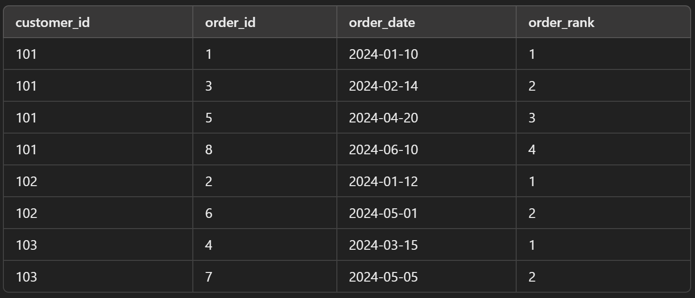

- Кумулятивная сумма продаж для клиента (нарастающий итог):
```sql
select customer_id, order_id, order_date, total_amount,
		sum(total_amount) over (partition by customer_id order by order_date) as running_total
from orders;

-- Кумулятивная сумма (или нарастающий итог) показывает, сколько клиент потратил по мере добавления каждого нового заказа.
```
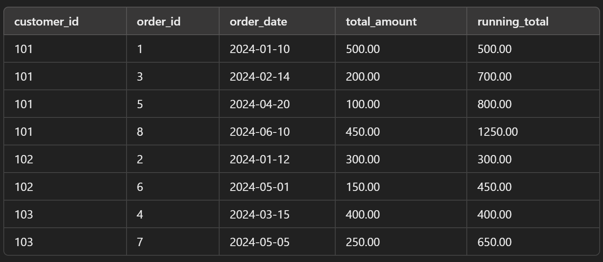

### <span style="color: lime">SELECT COUNT * FROM table; - дорогостоящая ли операция в PostgreSQL?</span>
В PostgreSQL команда **`SELECT COUNT(*) FROM table;`** может быть дорогостоящей операцией, особенно для больших таблиц. Причина в том, что PostgreSQL должен выполнить полное сканирование таблицы для подсчёта всех строк. Это связано с архитектурой системы, которая не хранит в готовом виде количество строк таблицы.

#### Почему **`COUNT(*)`** дорогостоящая операция?:
- **Отсутствие счётчика строк**:
	- В отличие от некоторых других баз данных, PostgreSQL не поддерживает постоянный счётчик строк. Каждая операция **`COUNT(*)`** требует прохода по всей таблице и проверки видимости каждой строки с учётом транзакций (из-за модели многоверсионности данных — MVCC). Это делает операцию вычисления медленной, особенно если таблица большая.
- **MVCC (многоверсионность)**:
	- В PostgreSQL используется MVCC, что означает, что в таблице могут храниться «старые» версии строк, которые должны быть отфильтрованы в зависимости от видимости их для текущей транзакции. Это добавляет дополнительную нагрузку на операцию **`COUNT(*)`**, поскольку для каждой строки нужно проверить её актуальность.

#### Если нужно часто выполнять **`COUNT(*)`** или подобные запросы, есть несколько способов ускорить это:
- **Материализованные представления**:
	- Можно создать материализованное представление, которое будет хранить заранее вычисленный результат. Это полезно для данных, которые не часто меняются.
- **Промежуточные таблицы для хранения количества строк**:
	- Иногда для очень больших таблиц создают отдельные таблицы, которые хранят информацию о количестве строк. Эти таблицы обновляются триггерами при изменении данных.

### <span style="color: lime">Какие есть альтернативные, более производительные способы получения количества всех записей в таблице?</span>
Чтобы получить количество всех записей в таблице более производительным способом, чем использование **`SELECT COUNT(*)`** в PostgreSQL, есть несколько альтернативных методов. Эти методы, хотя и менее точные или требуют дополнительных шагов, могут быть гораздо быстрее при работе с большими таблицами.

#### Использование системных таблиц PostgreSQL (`pg_class`):
- PostgreSQL хранит статистику по каждой таблице в системной таблице **`pg_class`**, где есть приблизительная оценка количества строк. Эта информация обновляется после выполнения операций **`ANALYZE`** или **`VACUUM`**, и она может быть использована для получения быстрого (но не точного) значения.
```sql
select reltuples::bigint as estimate from pg_class where relname='orders';

-- Результат покажет приблизительное количество строк в таблице `orders`. Значение `reltuples` обновляется после выполнения `ANALYZE` и может быть неточным, если данные в таблице сильно изменились с последнего обновления статистики.
```

- **Плюсы**:
	- Очень быстрый способ.
	- Подходит для случаев, когда высокая точность не критична.
- Минусы:
	- Значение приближённое и может отклоняться от фактического количества строк.

#### Использование триггеров и счётчиков:
- Можно создать таблицу-счётчик для хранения актуального количества строк и обновлять её при каждом изменении данных с помощью триггеров. Это метод, который даёт точное количество строк, но требует дополнительных настроек.

- Создаём таблицу для хранения количества строк:
```sql
create table row_counts (
	table_name text primary key,
	row_count bigint
);
```

- Добавляем запись для таблицы **`orders`**:
```sql
insert into row_counts (table_name, row_count) values ('orders', 0);
```

- Создаём триггеры для увеличения/уменьшения счётчика при вставке и удалении данных:
```sql
create or replace function update_row_count() returns trigger as $$
begin
	if tg_op = 'insert' then
		update row_counts set row_count = row_count + 1 where table_name='orders';
	else_if tg_op = 'delete' then
		update row_counts set row_count = row_count - 1 where table_name='orders';
	end if;
	return new;
end;
$$ language plpgsql;

create trigger orders_row_count_trigger
after insert or delete on orders
for each row execute function update_row_count();
```
Пример запроса:
```sql
select row_count from row_counts where table_name='orders';
```

- Плюсы:
	- Точное значение без необходимости полного сканирования таблицы.
	- Высокая производительность для получения результата.

- Минусы:
	- Требует настройки триггеров.
	- Дополнительные накладные расходы на обновление счётчика при изменении данных.

#### Материализованное представление:
- Если таблица редко меняется, можно создать материализованное представление с заранее подсчитанным количеством строк. Это полезно, если данные не обновляются часто.
- **Плюсы**:
	- Быстрый доступ к заранее подсчитанным данным.
	- Полезно для больших таблиц, где данные не часто меняются.
- **Минусы**:
	- Необходимость вручную обновлять представление через **`REFRESH`**.
	- Накладные расходы на создание и поддержание актуальности.

#### Прямое использование индексов:
- В некоторых случаях можно использовать индекс для подсчёта строк с определёнными условиями. Например, если нужен подсчёт не всех строк, а тех, что удовлетворяют условию **`WHERE`**, индекс может ускорить запрос.
```sql
select count(*) from orders where total_amount > 200;

-- Если на колонке `total_amount` есть индекс, то запрос будет быстрее, так как PostgreSQL будет использовать индекс для поиска нужных строк, а не сканировать всю таблицу.
```

#### Использование параллельных запросов:
- Если таблица большая, но важно точное значение, можно использовать параллельное выполнение запроса для увеличения скорости:
```sql
set max_parallel_workers_per_gather = 4;
select count(*) from orders;

-- Этот метод не уменьшит объём работы, но может ускорить выполнение за счёт параллелизации.
```

### <span style="color: lime">Что такое Hypertable?</span>
**`Hypertable`** — это ключевая концепция в расширении **TimescaleDB**, которая представляет собой оптимизированное расширение PostgreSQL для работы с временными рядами данных (time-series data). Hypertable выглядит и ведёт себя как обычная таблица в PostgreSQL, но она создана специально для эффективного хранения и обработки больших объёмов данных, связанных с временными метками.

Обычные таблицы PostgreSQL могут быстро увеличиваться в размерах при работе с временными рядами, что приводит к проблемам с производительностью, так как каждое добавление новых данных увеличивает нагрузку на базу данных. Hypertable решает эту проблему с помощью автоматического «разбиения» данных на меньшие, более управляемые куски, называемые **chunks**.

Hypertable использует внутреннее горизонтальное **шардинг** (разбиение) данных по времени или по какому-либо другому столбцу. Когда данные вставляются в Hypertable, TimescaleDB автоматически разбивает их на меньшие части (chunks) на основе временных интервалов или дополнительных критериев (например, географических данных, если они присутствуют). Это позволяет эффективно управлять и индексировать данные в каждом "куске", что улучшает производительность при запросах, чтении и записи данных.

#### Основные характеристики Hypertable:
- **Автоматическое разбиение данных на chunks**:
	- TimescaleDB автоматически разбивает данные на более мелкие сегменты, называемые **chunks**, что делает управление большими объёмами данных проще и быстрее.
- **Прозрачность для пользователя**:
	- Несмотря на внутренние оптимизации, пользователи взаимодействуют с Hypertable как с обычной таблицей. Запросы типа **`SELECT`**, **`INSERT`**, **`UPDATE`** и **`DELETE`** работают как обычно.
- **Оптимизация временных рядов**:
	- Hypertable специально разработан для хранения и управления временными рядами данных, что позволяет эффективно обрабатывать большие объёмы данных, которые записываются с течением времени (например, метрики IoT, логи, финансовые данные, данные сенсоров).

Предположим, что у нас есть таблица для хранения данных о температуре, которая записывается каждые 10 минут.
```sql
create table temperature_readings (
time timestampz not null,
location_id int,
temperature double precision,
primary key (time, location_id)
);

-- превращаем обычную таблицу в Hypertable
select create_hypertable('temperature_readings', 'time');
```

#### Основные преимущества Hypertable:
- Масштабируемость:
	- Hypertable способен обрабатывать миллиарды строк, разбивая их на chunks, что делает работу с большими объёмами данных более эффективной.
- **Высокая производительность**:
	- Благодаря разбиению на chunks, запросы, связанные с определёнными временными интервалами, выполняются быстрее, так как запросы могут быть ограничены только нужными chunks.
- **Поддержка сжатия данных**:
	- TimescaleDB предлагает встроенные возможности для сжатия данных в Hypertable, что экономит место на диске и ускоряет запросы для больших архивных данных.
- **Простота использования**:
	- Hypertable предоставляет все привычные для пользователей PostgreSQL операции, но с оптимизацией под временные ряды, что делает его использование интуитивно понятным.

### <span id="transaction" style="color: lime">Что такое транзакция в БД?</span>
**Транзакция** в базе данных — это набор операций, которые выполняются как единое целое. Все операции внутри транзакции должны быть:
	- выполнены успешно, или,
	- если произошла ошибка, все изменения должны быть отменены,
чтобы база данных вернулась к исходному состоянию. Транзакции обеспечивают целостность данных и позволяют избежать частичных изменений, которые могут возникнуть в случае сбоев или ошибок во время выполнения операций.

#### Основные свойства транзакций: ACID
- **Atomicity (Атомарность)**:
	- Транзакция либо выполняется полностью, либо не выполняется вообще. Если какая-либо часть транзакции не удаётся, все изменения отменяются.
	- Пример из жизни: Представьте, что вы переводите деньги между банковскими счетами. Либо сумма снимается с одного счёта и добавляется на другой полностью, либо, если что-то пошло не так, операция отменяется, и никакие изменения не сохраняются.
- **Consistency (Согласованность)**:
	- Транзакция переводит базу данных из одного согласованного состояния в другое. Все правила целостности данных сохраняются, и данные остаются корректными.
	- Пример: Если в базе данных установлен ограничитель, что у клиента не может быть отрицательного баланса, то транзакция должна либо успешно завершиться с соблюдением этого правила, либо откатиться.
- **Isolation (Изолированность)**:
	- Каждая транзакция выполняется независимо от других. Изменения, произведённые одной транзакцией, не видны другим, пока транзакция не завершится. Это предотвращает ситуации, когда одна транзакция может повлиять на другую.
	- Пример: Если два человека одновременно пытаются снять деньги с одного счёта, каждый запрос обрабатывается независимо. Один из них не увидит частичные изменения от другого.
- **Durability (Надёжность)**:
	- После успешного завершения транзакции все изменения должны быть сохранены в базе данных и гарантированно сохранены, даже если произойдёт сбой системы.
	- Пример: Если транзакция по переводу денег завершена успешно, запись о переводе сохраняется в базе данных, и даже при отключении электроэнергии данные останутся неизменными.

#### Пример работы с транзакцией в SQL:
SQL-запрос без транзакции:
```sql
update accounts set balance = balance - 1000 where account_id = 1;
update accounts set balance = balance + 1000 where account_id = 2;
insert into transactions(from_acc, to_acc, amount) values(1, 2, 1000);

-- Что, если произойдёт сбой после первого запроса? Деньги снимутся с одного счёта, но не поступят на другой — это приведёт к несогласованности данных.
```

SQL-запрос с транзакцией:
```sql
begin;

update accounts set balance = balance - 1000 where account_id = 1;
update accounts set balance = balance + 1000 where account_id = 2;
insert into transactions(from_acc, to_acc, amount) values(1, 2, 1000);

commit;

-- begin - начинает транзакцию.
-- commit - завершает транзакцию, и все изменения фиксируются в базе данных.
-- Если произойдёт ошибка между **`BEGIN`** и **`COMMIT`**, можно использовать команду `ROLLBACK`, чтобы отменить все изменения, сделанные в рамках транзакции.
```

#### Важные команды для работы с транзакциями:
- **`BEGIN`**: начинает новую транзакцию.
- **`COMMIT`**: завершает транзакцию и фиксирует изменения.
- **`ROLLBACK`**: отменяет все изменения, сделанные в рамках текущей транзакции.
- **`SAVEPOINT`**: создаёт точку сохранения внутри транзакции, к которой можно вернуться с помощью команды **`ROLLBACK TO SAVEPOINT`**, не отменяя всю транзакцию.
- **`RELEASE SAVEPOINT`**: удаление точки сохранения. После её выполнения больше нельзя будет откатиться к этой точке с помощью **`ROLLBACK TO SAVEPOINT`**.
- **`SET TRANSACTION`**: настройка параметров транзакции. Команда используется для установки параметров текущей транзакции, таких как уровень изоляции транзакции или режимы чтения/записи. Эти параметры позволяют контролировать, как транзакция будет взаимодействовать с другими транзакциями.

Предположим, вы хотите перевести 1000 единиц с одного счёта на другой, и если баланс второго счёта превышает 10,000 единиц, откатиться к промежуточной точке.
```sql
begin;
	update accs set balance = balance - 1000 where acc_id = 1;
	savepoint sp1;

	update accs set balance = balance + 1000 where acc_id = 2;
	-- проверяем баланс на втором счете
	select balance into @new_balance from accs where acc_id = 2;

	if @new_balance > 10000 then
		rollback to savepoint sp1; -- Откатываемся к savepoint
	end if;

commit;
```

### <span style="color: lime">Когда мы выполняем команду без явного указания транзакции, создается ли какая-то транзакция? (на примере любой SQL БД)</span>
Да, когда вы выполняете команду в SQL базе данных **без явного указания транзакции**, база данных **всё равно создаёт транзакцию автоматически**. Этот процесс называется **автоматической транзакцией** (или **неявной транзакцией**). Каждая команда, такая как **`INSERT`**, **`UPDATE`**, **`DELETE`**, выполняется в контексте транзакции, даже если вы явно её не начинаете с **`BEGIN`**.

Важное замечание:
- Автоматические транзакции применяются для **одиночных запросов**. Но если у вас есть серия связанных запросов, и вы хотите гарантировать, что все они выполнены как одно целое (атомарно), тогда нужно явно использовать транзакцию с командами **`BEGIN`**, **`COMMIT`** и, при необходимости, **`ROLLBACK`**.


### <span style="color: lime">Как обеспечивается Durability из ACID?</span>
Методы:
- **Журнал транзакций (Transaction Log или Write-Ahead Log, WAL)**:
	- Одним из ключевых методов обеспечения Durability является использование **журнала транзакций**. Этот журнал представляет собой специальный файл, в котором записываются все операции, выполняемые в рамках транзакции, до того, как эти операции фактически применяются к основным данным.
	- **Как это работает**: Когда транзакция начинает выполняться, все изменения записываются в журнал транзакций. Только после того, как журнал успешно записан на диск, транзакция фиксируется (выполняется **`COMMIT`**). Даже если система выйдет из строя сразу после записи журнала, база данных сможет восстановить данные, проиграв журнал транзакций после перезапуска.
- **Фиксация изменений на диск**:
	- - Для того чтобы гарантировать, что данные не будут потеряны, база данных фиксирует изменения не только в оперативной памяти, но и записывает их на **жесткий диск** или другой постоянный носитель данных. Это делает данные устойчивыми к сбоям.
	- В некоторых случаях базы данных используют механизм **синхронизации с диском** (например, с помощью команды **`fsync`**), чтобы гарантировать, что данные физически записаны на диск, а не находятся в кэше системы.
- **Периодические бэкапы (резервное копирование)**:
	- Помимо журналирования транзакций, базы данных регулярно делают **резервные копии** (бэкапы) данных. Это дополнительный механизм, который позволяет восстановить данные в случае серьёзных сбоев системы. Частота и полнота таких копий может зависеть от настроек базы данных и политики компании.
- **Механизмы восстановления после сбоев (Crash Recovery)**:
	- В случае сбоя система баз данных использует журнал транзакций для **восстановления состояния** данных. Процесс восстановления включает два этапа:
		- - **Откат** незавершённых транзакций: Все незавершённые транзакции откатываются до момента сбоя.
		- **Применение** завершённых транзакций: Все транзакции, которые были зафиксированы, но не применены к данным, будут повторно выполнены на основе журнала транзакций.

### <span style="color: lime">Что такое locking таблиц?</span>
**Локирование (блокировка) таблиц** в базах данных — это механизм, который используется для управления доступом к данным при одновременной работе нескольких пользователей или процессов. Цель локирования — избежать конфликтов и обеспечить целостность данных в условиях конкуренции за ресурсы.

Когда несколько транзакций одновременно обращаются к одной таблице или даже к одним и тем же данным, могут возникать ситуации, которые приводят к несогласованным или некорректным данным. Чтобы этого избежать, база данных использует блокировки, которые ограничивают доступ к данным или к целым таблицам для других транзакций, пока текущая транзакция не завершит свои действия.

#### Типы блокировок:
- **Блокировка на уровне строки (Row-Level Locking)**:
	- Этот тип блокировки ограничивает доступ только к конкретным строкам, которые затрагиваются запросом или транзакцией.
    - **Пример**: Если одна транзакция обновляет строку в таблице, другие транзакции могут читать или изменять другие строки, но не ту, которая заблокирована.
    - Преимущество: Увеличивает параллелизм, так как другие строки остаются доступными.
- **Блокировка на уровне страницы (Page-Level Locking)**:
	- При этой блокировке блокируется целая "страница" данных (блок памяти), на которой находятся строки. Это средний уровень между блокировкой строки и всей таблицы.
    - Используется в некоторых базах данных для оптимизации при работе с большими наборами данных.
- **Блокировка на уровне таблицы (Table-Level Locking)**:
	- Этот тип блокировки ограничивает доступ ко всей таблице. Он гарантирует, что пока одна транзакция работает с таблицей, другие транзакции не могут изменять или читать данные в этой таблице (в зависимости от типа блокировки).
	- **Пример**: Если транзакция вставляет новые строки в таблицу, другая транзакция может быть заблокирована до завершения первой транзакции.
	- Преимущество: Это простой способ обеспечить целостность данных.
	- Недостаток: Снижает параллелизм, так как вся таблица становится недоступной для других транзакций.

#### Типы блокировок в зависимости от доступа:
- **Эксклюзивная блокировка (Exclusive Lock, X-Lock)**:
	- Такая блокировка блокирует доступ к данным для всех других транзакций. Только одна транзакция может изменять данные, и другие транзакции не могут даже читать данные до завершения текущей транзакции.
	- **Пример**: Когда транзакция обновляет или удаляет данные, она получает эксклюзивную блокировку на эти данные.
```sql
begin;
	update accounts set balance = balance - 1000 where acc_id = 1;
	-- Этот запрос блокирует строку с account_id = 1 
	-- Другие транзакции не смогут изменить или даже прочитать эту строку до COMMIT/ROLLBACK
commit;
```

- **Совместная блокировка (Shared Lock, S-Lock)**:
	- Такая блокировка позволяет нескольким транзакциям читать данные одновременно, но блокирует их от изменения этих данных.
	- **Пример**: Когда транзакция выполняет **`SELECT`**, она может получить совместную блокировку. Другие транзакции могут также читать те же данные, но не могут их изменять.
```sql
begin;
	select balance from accounts where acc_id = 1;
	-- Этот запрос позволяет другим транзакциям читать те же данные, -- но запрещает их изменять до завершения текущей транзакции
commit;
```

#### Как избегать проблем с блокировкой:
- **Уровни изоляции**: Можно установить различные уровни изоляции транзакций, чтобы контролировать, как одна транзакция видит изменения, сделанные другими транзакциями. Например, уровень **`READ COMMITTED`** позволяет избежать чтения незавершённых данных.
- **Оптимизация запросов**: Построение более эффективных запросов может сократить время удержания блокировок и уменьшить вероятность блокировок.
- **Использование индексов**: Индексы могут уменьшить количество строк, к которым применяются блокировки, и ускорить выполнение операций.

### <span style="color: lime">Оптимистическая и пессимистическая блокировки в SQL</span>
**`Оптимистическая`** и **`пессимистическая блокировки`** — это две стратегии управления конкурентным доступом к данным в базе данных, которые помогают предотвратить конфликты при параллельной работе нескольких транзакций.

#### Пессимистическая блокировка
- Пессимистическая блокировка основывается на предположении, что конфликт при одновременной работе с данными **возможен** и для предотвращения этого конфликта следует заранее заблокировать данные на время выполнения транзакции. Это предотвращает другие транзакции от одновременного доступа к тем же данным, которые изменяются.
- Как работает пессимистическая блокировка:
	- Когда транзакция хочет прочитать или изменить данные, она **устанавливает блокировку** на эти данные (строку, таблицу и т. д.).
	- Другие транзакции не могут получить доступ к этим данным до тех пор, пока блокировка не будет снята (обычно после завершения транзакции — commit или rollback).
	- Пессимистическая блокировка может использоваться как для чтения (shared lock), так и для записи (exclusive lock).
```sql
begin;
	select * from accounts where id = 1 for update;
	update accounts set balance = balance - 100 where id = 1;
commit;

-- Здесь строка с `id = 1` блокируется для других транзакций на время её чтения и изменения. Если другая транзакция попытается изменить эту строку в то же время, она будет заблокирована до завершения первой транзакции.
```

- Преимущества:
	- Надёжно предотвращает конфликты, так как данные блокируются на этапе начала работы с ними.
	- Подходит для систем, где параллельные конфликты очень вероятны.
- **Недостатки**:
	- Может снижать производительность из-за длительного удержания блокировок, особенно если транзакции выполняются медленно.
	- В долгосрочной перспективе может приводить к проблемам блокировки (например, взаимоблокировки — deadlocks), если несколько транзакций пытаются заблокировать одни и те же ресурсы.

#### Оптимистическая блокировка
- Оптимистическая блокировка основывается на предположении, что конфликты при параллельных изменениях данных случаются **редко**, поэтому транзакции могут работать с данными параллельно, без блокировки на этапе чтения. Конфликты проверяются только на этапе фиксации изменений.
- Как работает оптимистическая блокировка:
	- Транзакция читает данные и **не устанавливает блокировку**. Предполагается, что конфликт маловероятен.
	- При попытке сохранить изменения транзакция проверяет, **не изменились ли данные** другими транзакциями с момента чтения.
	- Если изменения были внесены другой транзакцией, текущая транзакция должна быть откатана или повторена.
	- Оптимистическая блокировка часто реализуется с помощью версии данных (например, с помощью контрольного столбца с версией строки).
```sql
-- Обычно в базе данных для этого добавляют специальное поле, которое отслеживает версию записи. Например, в таблице есть столбец `version`, который увеличивается при каждом изменении строки.

select id, balance, version from acoounts where id = 1;

-- Обновление данных, если версия не изменилась
update accounts set balance = balance - 100, version = version + 1
where id = 1 and version = 5;

-- Если версия строки изменилась (то есть другая транзакция успела обновить данные), запрос не выполнится, и программа должна повторить транзакцию с новыми данными.
```

- **Преимущества**:
	- Не требует блокировки данных во время чтения, что значительно улучшает производительность в системах с высокой параллельностью.
	- Эффективна, если конфликты между транзакциями редки.
- Недостатки:
	- Если конфликты случаются часто, транзакции будут откатываться и повторяться, что может привести к снижению производительности.
		- Реализация может быть сложнее, так как требует дополнительной логики для обработки откатов и проверки версий данных.

### <span style="color: lime">Что такое row-level locking?</span>
**Блокировка на уровне строки (Row-Level Locking)**:
- Этот тип блокировки ограничивает доступ только к конкретным строкам, которые затрагиваются запросом или транзакцией.
- **Пример**: Если одна транзакция обновляет строку в таблице, другие транзакции могут читать или изменять другие строки, но не ту, которая заблокирована.
- Преимущество: Увеличивает параллелизм, так как другие строки остаются доступными.

### <span style="color: lime">Как прочитать все строки из таблицы, и при этом не "заблокироваться" на тех строках, которые сейчас находятся под lock'ом?</span>
Чтобы прочитать все строки из таблицы, **не блокируясь** на тех строках, которые в данный момент заблокированы другими транзакциями, можно использовать специальные механизмы, доступные в некоторых СУБД (системах управления базами данных). Эти механизмы позволяют читать данные без ожидания освобождения блокировок, избегая блокировки на строках, которые уже заняты другими транзакциями.

#### Использование уровня изоляции `READ UNCOMMITTED` (для минимального уровня изоляции):
- В большинстве реляционных баз данных, таких как **PostgreSQL**, **MySQL**, и **SQL Server**, существуют уровни изоляции транзакций. Один из таких уровней — **`READ UNCOMMITTED`**, позволяет читать строки, даже если они находятся под блокировкой или не завершены (незакомиченные).
- **Плюс**: Можно читать все строки без блокировок.
- **Минус**: Есть риск получить несогласованные или временные данные, которые могут быть откатаны или изменены.
```sql
set transaction isolation level read uncommitted;
select * from your_table;
```

#### Использование ключевого слова `NOLOCK` в SQL Server:
- В **Microsoft SQL Server** можно использовать специальную подсказку **`WITH (NOLOCK)`**, чтобы читать строки, не ожидая снятия блокировок. Это позволяет транзакции читать данные без блокировки, аналогично уровню изоляции `READ UNCOMMITTED`.
- Те же плюсы и минусы.
```sql
select * from your_table with(nolock);
```

#### Уровень изоляции `READ COMMITTED SNAPSHOT` (для PostgreSQL):
- В **PostgreSQL** и других базах данных с механизмом **MVCC (Multi-Version Concurrency Control)**, например, **Oracle**, можно использовать уровень изоляции **`READ COMMITTED`**, который является стандартным. При этом уровне изоляции читаются только данные, которые **были зафиксированы** (committed) на момент начала транзакции.
- **PostgreSQL** использует **MVCC** для того, чтобы предоставлять версию данных, которая была актуальной в момент начала транзакции. Это позволяет читать данные без блокировки даже тех строк, которые обновляются другими транзакциями.
- **Плюс**: Можно читать только зафиксированные данные, избегая "грязных данных".
- **Минус**: Вы не увидите изменения, сделанные другими транзакциями до их завершения.
```sql
begin;
	set transaction isolation level read committed;
	select * from your_table;
commit;
```

#### Использование `NOWAIT` в Oracle и PostgreSQL:
- В некоторых базах данных, таких как **Oracle** и **PostgreSQL**, можно добавить специальную подсказку **`NOWAIT`** или **`SKIP LOCKED`**, чтобы читать строки и **пропускать** те, которые заблокированы другими транзакциями.
- **`NOWAIT`**: Сообщает, что если строка заблокирована, то транзакция не должна ждать, а сразу завершится с ошибкой.
- **`SKIP LOCKED`**: Пропускает заблокированные строки и продолжает читать остальные строки.
- **Плюс**: Пропускаются заблокированные строки, и запрос продолжает выполнение без ожидания.
- **Минус**: Вы не увидите заблокированные строки, что может привести к пропуску важных данных, которые позже будут обновлены.

#### Пример использования `SKIP LOCKED` в PostgreSQL:
Представьте, что вы хотите выбрать задачи для обработки из таблицы **tasks**, и при этом не блокироваться на задачах, которые обрабатываются другими транзакциями:
```sql
begin;
	-- Попробуем выбрать 10 задач для обработки, пропуская заблокированные другими транзакциями
	select * from tasks where status='pending'
	for update skip locked limit 10;
commit;

-- Этот запрос заблокирует только строки, которые выбрал сам, и пропустит задачи, которые уже заблокированы другими транзакциями.
```

### <span style="color: lime">Какие существуют уровни транзакций?</span>
В реляционных базах данных транзакции могут выполняться на различных **`уровнях изоляции`**, которые определяют, как одна транзакция взаимодействует с другими параллельными транзакциями, особенно в отношении чтения и изменения данных. Уровни изоляции контролируют, какие изменения, сделанные в одной транзакции, видны для других транзакций до их завершения (фиксации).

Существует четыре стандартных уровня изоляции транзакций, описанных в спецификации SQL (SQL стандарт), и каждый уровень предлагает разный баланс между производительностью и безопасностью данных.

#### Read Uncommitted (Чтение незавершённых данных):
- Это самый низкий уровень изоляции, при котором транзакция может читать **грязные данные** (dirty reads) — то есть данные, которые ещё не были зафиксированы (committed) другими транзакциями. Это может привести к чтению данных, которые будут изменены или откатаны в будущем.
- Проблемы:
	- **Dirty Reads**: Транзакция может прочитать данные, которые ещё не зафиксированы и могут быть откатаны.
- **Пример:** Если транзакция A изменяет значение записи, но ещё не сделала COMMIT, а транзакция B уже прочитала это изменение, и затем транзакция A откатила изменения, транзакция B будет работать с "грязными" данными.
- **Использование**: Этот уровень изоляции редко используется, так как предоставляет минимальные гарантии целостности данных.

#### Read Committed (Чтение зафиксированных данных):
- Это уровень изоляции, при котором транзакция может читать только те данные, которые были зафиксированы другими транзакциями. Незавершённые изменения (данные в процессе транзакций) не видны.
- **Проблемы**:
	- **Non-Repeatable Reads**: Если в рамках одной транзакции вы делаете несколько чтений одной и той же строки, результат может отличаться. Например, если другая транзакция изменит данные между вашими запросами, вы получите разные результаты на разные запросы.
- **Пример:** Транзакция A читает значение строки, затем другая транзакция B изменяет это значение и фиксирует его. Если транзакция A снова читает эту строку, она увидит новое значение, которое было изменено между запросами.
- **Использование**: Это самый распространённый уровень изоляции в большинстве баз данных, так как обеспечивает баланс между целостностью данных и производительностью.

#### Repeatable Read (Повторяемое чтение):
- Этот уровень изоляции гарантирует, что если транзакция прочитала строку данных, последующие запросы на чтение этой строки будут возвращать то же самое значение, даже если другая транзакция изменит его и зафиксирует. Однако, могут возникнуть **phantom reads** — когда новая строка добавляется в набор данных другой транзакцией, что может привести к изменению результатов запросов.
- Проблемы:
	- **Phantom Reads**: Если другая транзакция добавляет новые строки, которые соответствуют условиям вашего запроса, последующий запрос в рамках той же транзакции может вернуть новые строки.
- **Пример:** Транзакция A делает выборку строк из таблицы по условию `WHERE age > 30`. Пока транзакция открыта, другая транзакция B добавляет новую строку с `age = 35` и фиксирует изменения. Когда транзакция A выполнит выборку снова, она может увидеть новую строку.
- **Использование**: Уровень Repeatable Read полезен, когда важна консистентность данных в пределах одной транзакции для всех её чтений.

#### Serializable (Сериализуемый):
- Это самый высокий уровень изоляции, при котором транзакции выполняются так, как если бы они выполнялись последовательно, одна за другой, а не параллельно. Он предотвращает все типы аномалий, такие как **dirty reads**, **non-repeatable reads**, и **phantom reads**, гарантируя полную изоляцию транзакций. Это достигается за счёт блокировок и контроля конкурентного доступа.
- Проблемы:
	- **Производительность**: Это наиболее ресурсоёмкий уровень, поскольку он требует большого количества блокировок, что снижает производительность при параллельном доступе к данным.
- **Пример:** Если транзакция A читает набор данных, другая транзакция B не может изменять или вставлять данные в этот набор до завершения транзакции A.
- **Использование**: Используется в случаях, когда важна максимальная целостность данных и нужна защита от всех типов аномалий, например, в финансовых системах.

#### Таблица сравнения уровней изоляции:
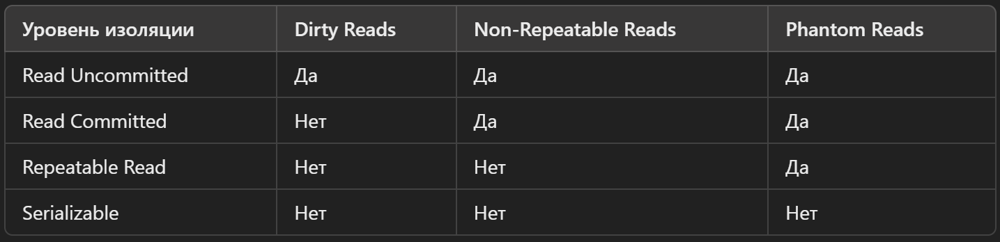

### <span style="color: lime">Какие феномены могут возникнуть при использовании различных уровней транзакции?</span>
При использовании различных **уровней изоляции транзакций** могут возникать так называемые **феномены** — это аномалии, которые возникают при параллельной работе нескольких транзакций. Эти феномены могут приводить к некорректным результатам при чтении и обновлении данных.

#### Dirty Read (Грязное чтение)
- Этот феномен возникает, когда одна транзакция читает данные, которые были изменены, но **ещё не зафиксированы** (committed) другой транзакцией. Если та транзакция, которая изменила данные, сделает **rollback** (откат изменений), то первая транзакция будет работать с **несуществующими данными**, что приведёт к ошибкам.
- **Уровни изоляции, где возможно**: **`Read Uncommitted`**.

#### Non-Repeatable Read (Неповторяемое чтение)
- Этот феномен происходит, когда одна транзакция дважды читает одну и ту же строку, и в промежутке между этими чтениями **другая транзакция изменяет или удаляет** эту строку и фиксирует изменения. В результате, одно и то же чтение возвращает **разные результаты**.
- **Уровни изоляции, где возможно**: **`Read Uncommitted`**, **`Read Committed`**.

#### Phantom Read (Фантомное чтение)
- Фантомное чтение происходит, когда одна транзакция читает набор строк, соответствующих определённому условию, а затем другая транзакция **вставляет или удаляет** строки, которые удовлетворяют этому условию. При повторном чтении в первой транзакции появляются (или исчезают) новые строки, которых не было в первом запросе.
- **Уровни изоляции, где возможно**: - **`Read Uncommitted`**, **`Read Committed`**, **`Repeatable Read`**.

#### Lost Update (Потерянное обновление)
- Этот феномен возникает, когда две транзакции одновременно читают одни и те же данные, затем обе пытаются обновить их. Результаты первой транзакции могут быть **перезаписаны** второй транзакцией без учета того, что данные были изменены.
- **Уровни изоляции, где возможно**: **`Read Uncommitted`**, **`Read Committed`**, **`Repeatable Read`**.

#### Как предотвращаются феномены на разных уровнях изоляции:
- **Read Uncommitted** допускает все феномены, поскольку транзакции могут читать незавершённые данные и не заботятся о фиксации изменений.
- **Read Committed** устраняет грязные чтения, но все еще допускает неповторяемые и фантомные чтения.
- **Repeatable Read** предотвращает грязные и неповторяемые чтения, но фантомные чтения возможны.
- **Serializable** полностью исключает все феномены, поскольку транзакции выполняются последовательно, как если бы они не пересекались во времени.

### <span style="color: lime">Что такое distributed transactions?</span>
**`Distributed transactions`** — это транзакции, которые затрагивают данные, расположенные на нескольких независимых ресурсах или базах данных. Это сложные транзакции, которые управляются в распределённых системах, где данные могут находиться на разных серверах, в разных базах данных или даже в разных географических зонах. Цель таких транзакций — обеспечить согласованность данных на всех задействованных узлах, даже если они находятся в разных местах и работают независимо друг от друга.

Представьте, что вы покупаете товар в интернет-магазине. Ваша покупка может затронуть несколько систем:
- Система оплаты (банковская транзакция).
- Складская система (резервирование товара).
- Система доставки (создание заказа на доставку).
Для обеспечения целостности, все эти системы должны завершить свои операции успешно. Если что-то пойдёт не так на любом этапе (например, банк не подтвердил оплату), транзакция должна быть откатана во всех системах (товар вернётся на склад, доставка отменится). Это и есть пример распределённой транзакции.

#### Проблемы и сложности:
- **Сбои узлов**: Если один из узлов выйдет из строя, то транзакция может зависнуть в состоянии неопределённости.
- **Задержки сети**: Высокая задержка или временные ошибки сети могут привести к долгой фиксации транзакции.
- **Распределённые блокировки**: Для обеспечения целостности транзакций могут использоваться распределённые блокировки, что может снизить производительность.
- **Трудность масштабирования**: Чем больше узлов, тем сложнее координировать транзакции и управлять отказами.

### <span style="color: lime">Сравнение 2-Phase Commit, 3-Phase Commit подходов для организации distributed transactions</span>
**2-Phase Commit (2PC)** и **3-Phase Commit (3PC)** — это протоколы, используемые для координации распределённых транзакций и обеспечения согласованности данных между несколькими системами. Оба протокола помогают добиться того, чтобы транзакция была либо полностью зафиксирована (committed), либо полностью отменена (rolled back) на всех узлах, несмотря на возможные сбои в системе.

#### Основные отличия 2PC и 3PC:


#### 2-Phase Commit (2PC):
- **2PC** — это двухфазный протокол, который разделён на две фазы:
	- **Phase 1: Подготовка (Prepare)**:
		- Координатор (обычно ведущий узел транзакции) отправляет запрос на подготовку всем участникам (узлам).
		- Участники выполняют предварительные действия, необходимые для фиксации транзакции, и отправляют ответ координатору о готовности: либо «готов» (ready), либо «отказ» (abort).
	- **Phase 2: Фиксация или Откат (Commit/Rollback)**:
		- Если все участники прислали ответ «готов», координатор отправляет всем команду на фиксацию (commit).
		- Если хотя бы один узел ответил «отказ», координатор отправляет команду на откат (rollback) всем узлам.
- Проблемы с 2PC:
	- **Проблема блокировки**: Если координатор выходит из строя после отправки команды на фиксацию или подготовку, участники могут зависнуть, так как они ждут ответа и не могут завершить транзакцию.
	- **Проблемы с сетевой задержкой**: Зависание может произойти, если ответ от какого-то узла потеряется или будет задержан.

#### 3-Phase Commit (3PC):
- **3PC** — это улучшенная версия 2PC, добавляющая дополнительную фазу между подготовкой и фиксацией для повышения устойчивости к сбоям. Он разработан для решения проблем зависания и блокировок, которые могут возникнуть в 2PC.
	- **Phase 1: Подготовка (Prepare)**:
		- Координатор запрашивает готовность участников (как в 2PC). Участники проверяют возможность фиксации и отправляют ответ координатору.
	- **Phase 2: Пре-коммит (Pre-Commit)**:
		- Если все участники готовы, координатор отправляет сигнал всем участникам «готовьтесь к фиксации», но не фиксирует данные. Участники фиксируют промежуточное состояние и отправляют подтверждение «готов».
		- На этом этапе участники гарантированно могут завершить транзакцию, даже если координатор потеряет связь.
	- **Phase 3: Фиксация или Откат (Commit/Rollback)**:
		- Координатор отправляет команду на окончательную фиксацию, и участники завершают транзакцию. Если что-то пошло не так, координатор может отправить команду на откат.
- Преимущества 3PC:
	- **Избежание блокировок**: Благодаря фазе пре-коммита, если координатор выйдет из строя, участники могут самостоятельно завершить транзакцию, основываясь на текущем состоянии.
	- **Тайм-ауты**: Протокол 3PC использует тайм-ауты для предотвращения зависания узлов. Если какой-то узел не отвечает вовремя, транзакция будет автоматически откатана или завершена.
	- **Лучше справляется с сетевыми сбоями**: 3PC более устойчив к временным задержкам сети или недоступности узлов.

#### Вывод:
- **2PC** проще и быстрее, но может зависнуть, если возникнут проблемы с сетью или участники не смогут завершить транзакцию.
- **3PC** более устойчив к сбоям, добавляет дополнительную фазу для избежания блокировок, но более медленный и сложный в реализации.

### <span style="color: lime">Что такое SAGA в разрезе темы distributed transactions?</span>
**SAGA** — это один из подходов для управления **распределёнными транзакциями** в микросервисных или распределённых системах. В отличие от традиционных протоколов, таких как **2PC** или **3PC**, SAGA делает акцент на **разбиение транзакции на несколько независимых шагов**, каждый из которых можно выполнить асинхронно. Если какая-либо часть транзакции не удается, SAGA откатывает всю операцию через **`компенсирующие действия`**.

SAGA состоит из последовательности независимых шагов, где каждый шаг — это локальная транзакция, которая выполняется в одной системе (микросервисе, базе данных и т. д.). Если один из шагов не удается, SAGA начинает выполнять **компенсирующие транзакции**, которые откатывают уже выполненные шаги.

#### Основные принципы SAGA:
- **Разделение транзакций на шаги**: Каждая транзакция в SAGA разбивается на множество локальных транзакций, каждая из которых выполняется на отдельном узле или микросервисе.
- **Компенсирующие транзакции**: Если одна из локальных транзакций не удалась, для всех предыдущих шагов запускаются компенсирующие транзакции, которые возвращают систему в исходное состояние.

#### Типы SAGA:
- **Оркестрированная SAGA (Orchestrated SAGA)**:
	- Имеется центральный компонент, называемый **оркестратором**, который координирует все шаги транзакции.
	- Оркестратор управляет последовательностью выполнения операций и, при необходимости, запускает компенсирующие транзакции, если какой-то шаг не удался.
- **Хореографированная SAGA (Choreographed SAGA)**:
	- Каждый сервис самостоятельно выполняет свои действия и запускает следующую операцию через событие (event-driven).
	- В этом случае нет центрального компонента, и сервисы взаимодействуют через события. Если одна транзакция не удалась, каждый сервис выполняет свои компенсирующие действия самостоятельно, основываясь на поступающих событиях.

#### Преимущества SAGA:
- **Гибкость**: Транзакции разделяются на независимые шаги, которые можно выполнять асинхронно, что делает систему более гибкой и подходящей для микросервисной архитектуры.
- **Отказоустойчивость**: Если что-то идёт не так, SAGA использует компенсирующие транзакции, которые откатывают изменения без необходимости блокировать системы.
- **Масштабируемость**: Поскольку SAGA работает без глобальной блокировки, она более масштабируема по сравнению с 2PC/3PC.

#### Недостатки SAGA:
- **Сложность реализации**: Каждая локальная транзакция требует разработки компенсирующей транзакции, что увеличивает сложность системы.
- **Асинхронность**: Поскольку шаги выполняются последовательно, но асинхронно, данные могут быть временно неконсистентными (например, деньги списаны, но товар ещё не зарезервирован).
- **Отсутствие жёстких гарантий**: В отличие от 2PC и 3PC, где система гарантирует консистентность данных, в SAGA нет полной изоляции (isolation), и временные несоответствия могут быть видимы.

#### Сравнение SAGA с 2PC/3PC:
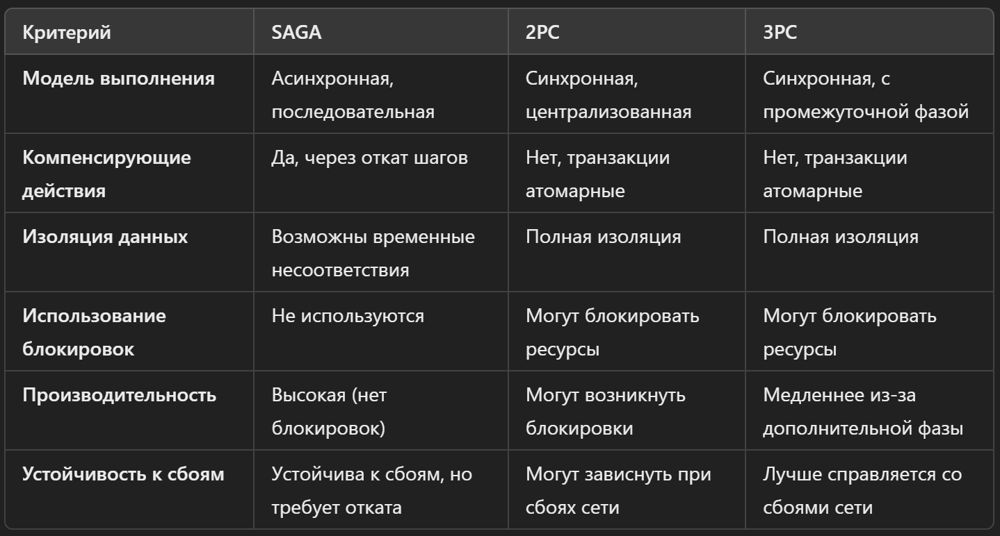

### <span style="color: lime">Какие существуют Lock Modes для таблиц? (на примере любой SQL БД)</span>
В SQL-базах данных, таких как PostgreSQL, существуют различные **Lock Modes** (режимы блокировок), которые используются для управления конкурентным доступом к таблицам и строкам. Эти режимы блокировок помогают избежать конфликтов между транзакциями и гарантируют целостность данных.

#### ACCESS SHARE (Разделяемый доступ):
- **Описание**: Это самый слабый уровень блокировки, который позволяет читать данные, но не изменять их.
- **Используется при**: `SELECT` запросах.
- **Разрешён параллельный доступ**: Да, несколько транзакций могут одновременно читать данные, не блокируя друг друга.
```sql
select * from products;

-- запрос заблокирует таблицу в режиме `ACCESS SHARE`, что позволит другим транзакциям также читать таблицу, но блокирует возможность её изменения.
```

#### ROW SHARE (Строковый разделяемый доступ):
- **Описание**: Этот уровень блокировки блокирует строки для изменения, но позволяет другим транзакциям читать данные. Используется, когда необходимо модифицировать конкретные строки.
- **Используется при**: Операциях, таких как `SELECT ... FOR UPDATE`.
- **Разрешён параллельный доступ к другим строкам**: Да.
```sql
select * from products where id = 1 for update;
```

#### ROW EXCLUSIVE (Строковый эксклюзивный доступ):
- **Описание**: Этот режим блокирует только модификацию строк, но позволяет другим транзакциям читать данные. Используется при вставке, обновлении или удалении строк.
- **Используется при**: `INSERT`, `UPDATE`, `DELETE`.
- Блокирует только изменения в строках, но не чтение.
```sql
insert into products(name, stock) values('New product', 100);
```

#### SHARE UPDATE EXCLUSIVE:
- **Описание**: Позволяет читать данные и изменять их, но блокирует параллельные операции, такие как добавление новых индексов. Это промежуточная блокировка, которая блокирует более серьёзные изменения.
- **Используется при**: Добавлении индексов или изменении структуры таблиц.
- **Разрешён параллельный доступ к строкам для чтения и записи, но без структурных изменений**.
```sql
create index concurrently idx_products_stock on products(stock);
```

#### SHARE (Разделяемый доступ):
- **Описание**: Блокирует вставку, обновление или удаление строк, но позволяет другим транзакциям выполнять чтение.
- **Используется при**: Операциях, связанных с таблицами и данными, которые не затрагивают изменения строк напрямую.
```sql
LOCK TABLE products IN SHARE MODE;
```

#### SHARE ROW EXCLUSIVE:
- **Описание**: Блокирует не только изменение строк, но и структурные изменения таблицы. Используется для операций, которые требуют блокировки как строк, так и таблицы в целом.
- **Используется при**: Операциях, таких как добавление новых столбцов или выполнение некоторых форм массовых изменений данных.
```sql
ALTER TABLE products ADD COLUMN price DECIMAL;
```

#### EXCLUSIVE (Эксклюзивный доступ):
- **Описание**: Полная блокировка на чтение и запись таблицы. Не позволяет другим транзакциям выполнять операции с этой таблицей, кроме чтения.
- **Используется при**: Операциях, которые изменяют большое количество данных или требуют изоляции от других транзакций.
```sql
LOCK TABLE products IN EXCLUSIVE MODE;
```

#### ACCESS EXCLUSIVE (Эксклюзивный доступ с блокировкой доступа):
- **Описание**: Самый высокий уровень блокировки. Полностью блокирует любую операцию, включая чтение, на время выполнения транзакции. Этот уровень блокировки необходим для структурных изменений в таблице, таких как добавление или удаление столбцов.
- **Используется при**: Операциях, таких как `DROP TABLE`, `ALTER TABLE`.
- **Блокирует любые другие транзакции, включая чтение данных из таблицы**.
```sql
ALTER TABLE products DROP COLUMN stock;
```

#### Как выбрать нужный Lock Mode?:
- Для простого чтения данных чаще всего используется `ACCESS SHARE`, так как он позволяет другим транзакциям параллельно читать данные.
- Если необходимо заблокировать строки для изменений (например, при `SELECT ... FOR UPDATE`), используется `ROW SHARE`.
- Для операций вставки, обновления и удаления строк используется `ROW EXCLUSIVE`, который блокирует только модификацию, но не чтение.
- Для массовых изменений данных или структуры таблицы необходимы более строгие блокировки, такие как `SHARE ROW EXCLUSIVE` или `EXCLUSIVE`.

### <span style="color: lime">Что такое replication?</span>
**`Репликация (replication)`** в базах данных — это процесс копирования данных с одной базы данных на другую, чтобы обеспечить их синхронизацию и доступность. Основная цель репликации — повысить **доступность данных**, **устойчивость к отказам**, а также **увеличить производительность** системы за счёт распределения нагрузки на чтение по нескольким серверам.

#### Зачем нужна репликация?
- **Повышение отказоустойчивости**: Если основной сервер выходит из строя, система может автоматически переключиться на реплицированный сервер без значительных простоев.
- **Улучшение производительности**: Разделение нагрузки, особенно на чтение данных, позволяет многим пользователям одновременно получать доступ к данным на разных серверах.
- **Резервирование данных**: Репликация помогает создавать резервные копии данных в реальном времени.
- **Географическое распределение данных**: Репликация данных на сервера, находящиеся в разных регионах, может сократить задержки доступа к данным для пользователей, которые находятся далеко от основного сервера.

#### Полнотабличная репликация:
- Метод репликации данных, при котором **вся таблица или весь набор данных** копируется с одного узла (основной базы данных) на другой узел (реплицированная или резервная база данных). Этот тип репликации обеспечивает наличие полной копии данных на реплицируемом узле. Полнотабличная репликация обычно используется в случаях, когда необходимо иметь **точную копию всей таблицы** на нескольких серверах или базах данных для повышения доступности, масштабируемости или обеспечения отказоустойчивости системы. Полнотабличная репликация обычно используется в случаях, когда необходимо иметь **точную копию всей таблицы** на нескольких серверах или базах данных для повышения доступности, масштабируемости или обеспечения отказоустойчивости системы.
- Принципы полнотабличной репликации:
	- **Полная копия данных**:
		- При каждом обновлении репликации данные одной или нескольких таблиц полностью копируются на целевую базу данных, заменяя старые данные новой полной копией.
		- Это отличается от инкрементальной репликации, где копируются только изменения (например, только новые, измененные или удалённые строки).
	- **Частота обновления**:
		- Полнотабличная репликация может происходить по расписанию (периодически) или при наступлении определённого события (например, по требованию).
		- В зависимости от настроек, она может быть более или менее частой, что влияет на нагрузку на систему.
	- **Типы систем**:
		- Может использоваться как в однонаправленных системах (данные копируются только в одном направлении, от мастера к репликам), так и в двунаправленных системах (данные синхронизируются в обе стороны).
- Преимущества:
	- **Простота реализации**:
		- Полнотабличная репликация проще в реализации по сравнению с инкрементальной репликацией, так как не нужно отслеживать отдельные изменения (вставки, удаления, обновления строк).
	- **Точность данных**:
		- На реплицируемом сервере всегда будет полная копия таблицы, что гарантирует точность и согласованность данных при выполнении каждой репликации.
	- **Отказоустойчивость и доступность**:
		- Полная копия данных позволяет обеспечить высокую доступность и защиту от сбоев, так как при отказе основной базы данных резервная база может продолжить работу.
	- **Удобство для чтения**:
		- Полные реплики можно использовать для масштабирования операций чтения, разгружая основной сервер базы данных, перенаправляя запросы на чтение на реплицируемые узлы.
- Недостатки:
	- **Высокие накладные расходы**:
		- Полнотабличная репликация требует значительных ресурсов, особенно для больших таблиц, так как каждый раз необходимо передавать и обрабатывать весь объем данных.
		- Это может вызвать перегрузку сети и серверов, особенно если данные часто обновляются.
	- **Большие задержки**:
		- Полнотабличная репликация может быть медленной, особенно для больших таблиц, так как передача и запись всех данных занимает много времени.
		- Это может привести к задержкам в актуальности данных на репликах (задержка между основным узлом и репликой).
	- **Неэффективность при малых изменениях**:
		- Даже если изменилось только несколько строк данных, в процессе полнотабличной репликации копируется вся таблица, что может быть неэффективным.
- Пример использования:
	- Допустим, в вашей системе есть таблица с продуктами, которая редко изменяется, но к ней часто обращаются для получения данных. Вы можете настроить полнотабличную репликацию, чтобы передавать полную копию этой таблицы на другой сервер (например, для обеспечения отказоустойчивости или распределения нагрузки на чтение).

#### Инкрементная репликация на основе ключей:
- Метод репликации данных, при котором копируются только те изменения, которые произошли с последнего сеанса репликации. Вместо того чтобы копировать всю таблицу целиком (как при полнотабличной репликации), система передает только новые, измененные или удаленные строки на основе определенных ключей, обычно это первичные или уникальные ключи таблицы.
- Основные этапы инкрементной репликации на основе ключей:
	- **Отслеживание изменений**:
		- Система отслеживает изменения в данных, такие как вставки, обновления и удаления строк.
		- Это можно сделать с помощью столбцов, которые фиксируют, когда данные были в последний раз обновлены (например, `updated_at`), или с помощью счетчика версий (`version`).
	- **Определение измененных данных**:
		- В процессе репликации система выбирает только те строки, которые были изменены с момента последней репликации. Это можно сделать с помощью запроса на выборку строк, где, например, `updated_at > время последней репликации`.
	- **Копирование изменений**:
		- Затем измененные данные (строки) передаются на целевой узел (реплику). Каждая запись передается вместе с её уникальным ключом, который позволяет однозначно идентифицировать строку в целевой таблице.
	- **Применение изменений**:
		- На стороне реплики данные обновляются на основе ключей. Если строка с данным ключом уже существует, она обновляется; если её нет — создается новая запись. В случае удаления строк реплика должна поддерживать механизм удаления на основе ключей.
- Преимущества:
	- Эффективность:
		- Инкрементная репликация копирует только изменённые данные, что значительно снижает объём данных, передаваемых по сети, особенно если изменения редки.
		- Это снижает нагрузку на сеть и серверы, особенно при работе с большими таблицами.
	- Быстрота обновления:
		- Так как передаются только изменения, процесс репликации выполняется быстрее по сравнению с полнотабличной репликацией, где нужно копировать все данные целиком.
	- Точность:
		- Данные на реплике всегда синхронизированы с основными данными и отражают только актуальные изменения.
- Недостатки:
	- Сложность реализации:
		- Требуется настройка системы для отслеживания изменений в данных. Это может потребовать изменения структуры таблиц (например, добавление полей для отслеживания времени или версий данных).
		- Необходима логика для обработки конфликтов и удаления данных, что может усложнить архитектуру системы.
	- Проблемы с удалением данных:
		- При инкрементной репликации необходимо предусмотреть механизм для обработки удалённых записей. Например, можно использовать специальные флаги "удалено" или отслеживать удаления с помощью триггеров или журналов.
	- Зависимость от точности метаданных:
		- Если данные для отслеживания изменений (например, `updated_at`) по какой-то причине окажутся неточными или будут нарушены, это может привести к пропуску изменений или повторному копированию одних и тех же строк.

#### Репликация на основе журналов:
- Метод репликации данных в базах данных, который использует **журналы транзакций** (или **журналы изменений**) для отслеживания и передачи изменений между основным сервером и репликами. Вместо того чтобы передавать данные напрямую из таблиц, база данных отслеживает все операции (вставки, обновления, удаления) и записывает их в журнал. Репликация выполняется на основе этих записей, что позволяет синхронизировать только изменённые данные.

#### Репликация снимков:
- Метод репликации данных, при котором создается и передается **полная копия состояния** базы данных или отдельных её таблиц в конкретный момент времени. Этот процесс называется **снимком (snapshot)**, поскольку он фиксирует текущее состояние данных на момент создания, и затем эта копия передается на реплику.
- Репликация снимков используется для создания точной копии данных без необходимости передавать каждую отдельную транзакцию или изменение в реальном времени. После передачи снимка на реплику, данные могут быть синхронизированы до следующего снимка.
- Принцип работы репликации снимков:
	- Создание снимка:
		- База данных делает "снимок" — полную копию данных или части данных (например, отдельных таблиц) на момент времени. Важно, что данные на момент создания снимка остаются неизменными, даже если транзакции продолжаются в основной базе данных.
	- Передача снимка на реплику:
		- Снимок передается на реплицируемый сервер (реплику), где его содержимое записывается в соответствующие таблицы.
	- Обновление данных:
		- В зависимости от настроек, снимки могут обновляться периодически (например, раз в день, раз в час и т.д.) или по запросу.
		- После каждого обновления реплика получает новую полную копию данных.
	- Чтение данных с реплики:
		- На реплике обычно можно выполнять операции чтения данных, но не записи, чтобы избежать конфликтов между реплицируемыми данными и изменениями на стороне реплики.

#### Транзакционная репликация:
- Метод репликации данных в системах баз данных, при котором изменения, происходящие в одной базе данных (мастере), транслируются и применяются на одной или нескольких репликах в реальном времени или с минимальной задержкой. При этом изменения передаются на уровне **транзакций**, что позволяет сохранять точную последовательность операций и поддерживать консистентность данных между основным сервером и репликами.
- Транзакционная репликация используется, когда важно гарантировать актуальность данных на репликах, особенно в системах с высокой частотой изменений и необходимостью минимальных задержек в обновлении данных.
- Принципы работы транзакционной репликации:
	- Запись транзакций на мастере:
		- Всякий раз, когда на основном сервере выполняется транзакция (например, вставка, обновление или удаление данных), эти изменения записываются в журнал транзакций (например, binlog в MySQL или журнал транзакций в SQL Server).
	- Передача изменений на реплики:
		- Записи из журнала транзакций передаются на сервер-реплику. Передаются только изменения данных, а не весь их объём, что делает транзакционную репликацию более эффективной, чем, например, репликация снимков.
	- Применение изменений на реплике:
		- Реплика получает транзакции и воспроизводит их в том же порядке, в котором они были выполнены на основном сервере, что гарантирует консистентность данных.
		- Реплика может находиться в режиме только чтения (read-only) или поддерживать частичные изменения данных (например, в двунаправленной репликации).

#### Репликация слиянием:
- Метод репликации данных, при котором изменения, произведенные на нескольких серверах (репликах), могут быть объединены (слиты) для поддержания согласованности данных на всех узлах. В отличие от других методов репликации (например, транзакционной или снимков), где изменения обычно происходят на одном основном сервере и передаются на реплики, репликация слиянием допускает выполнение изменений на **нескольких узлах**, а затем синхронизирует эти изменения, сливая их воедино.
- Принцип работы репликации слиянием:
	- Разрешение изменений на всех узлах:
		- Все узлы, участвующие в репликации слиянием, могут изменять данные. Каждый узел отслеживает, какие изменения были внесены, с помощью механизмов отслеживания изменений (например, с помощью триггеров или журналов транзакций).
	- Синхронизация данных между узлами:
		- Периодически (или по запросу) узлы обмениваются информацией об изменениях. Изменения, сделанные на одном узле, передаются на другие узлы, где они "сливаются" с локальными изменениями.
	- Конфликты и их разрешение:
		- Поскольку изменения могут вноситься одновременно на разных узлах, могут возникать **конфликты** (например, если одна и та же строка изменена на нескольких узлах одновременно). В таких случаях система должна уметь разрешить конфликты.
		- Для этого могут использоваться различные стратегии, такие как:
			- Последний выигравший (побеждает последнее изменение).
			- Приоритетный узел (например, изменения с одного узла могут иметь приоритет над другими).
			- Вмешательство пользователя (когда автоматическое разрешение невозможно, может потребоваться вмешательство администратора).

#### Одноранговая репликация:
- Метод репликации данных, при котором все участники (узлы) системы имеют равные права и могут как отправлять, так и получать данные. В этом подходе каждый узел в сети может функционировать как как основной, так и как реплика, что позволяет более гибко управлять данными и их синхронизацией.
- Принципы работы одноранговой репликации:
	- Равные узлы:
		- Все узлы в системе равны. Каждый из них может вносить изменения в свои локальные данные и реплицировать эти изменения на другие узлы. Это отличается от традиционных подходов, где существует один основной сервер, и все остальные узлы — только реплики.
	- Двусторонний обмен данными:
		- Узлы могут обмениваться данными в любом направлении. Если на одном узле произошли изменения, эти изменения могут быть отправлены на любой другой узел, который затем может объединить их со своими данными.
	- Конфликтное разрешение:
		- Поскольку изменения могут происходить одновременно на нескольких узлах, система должна иметь механизм для разрешения конфликтов, возникающих при одновременных изменениях одних и тех же данных на разных узлах.

#### Мастер-слейв (Master-Slave) репликация:
- **Описание**: Основной сервер (master) принимает все операции записи (INSERT, UPDATE, DELETE), а все изменения автоматически копируются на один или несколько серверов-реплик (slave), которые предназначены только для чтения.
- **Использование**: Когда нужно масштабировать чтение и снизить нагрузку на главный сервер.
- **Пример**: PostgreSQL поддерживает этот тип репликации через **streaming replication**.

#### Мастер-мастер (Master-Master) репликация:
- **Описание**: В этом типе репликации несколько серверов могут как читать, так и записывать данные. Это более сложный вариант, так как требуется решать проблемы синхронизации данных и разрешения конфликтов.
- **Использование**: В системах, где требуется записывать данные с нескольких географически распределённых серверов.
- **Пример**: MySQL поддерживает этот тип репликации с помощью **MySQL Group Replication** или **Galera Cluster**.

#### Асинхронная репликация:
- **Описание**: Изменения копируются на реплицированные серверы с задержкой. Это снижает нагрузку на основную базу данных, но может привести к временному рассогласованию данных между серверами.
- **Использование**: Когда важна производительность, и небольшая задержка обновления реплики допустима.

#### Синхронная репликация:
- **Описание**: Изменения записываются на основной сервер и сразу же на реплицированный сервер, прежде чем транзакция будет считаться завершённой. Это обеспечивает консистентность данных, но может снизить производительность из-за ожидания подтверждения от реплики.
- **Использование**: Когда нужна высокая консистентность данных, например в банковских системах.

#### Логическая репликация (Logical replication):
- **Описание**: В отличие от физической репликации, которая копирует все данные базы целиком, логическая репликация копирует только изменения на уровне данных (например, изменения строк). Можно реплицировать отдельные таблицы или подмножества данных.
- **Использование**: Когда нужно реплицировать только часть данных или использовать данные реплики для аналитики.
- **Пример**: PostgreSQL поддерживает логическую репликацию через команды `CREATE PUBLICATION` и `CREATE SUBSCRIPTION`.

### <span style="color: lime">Что такое partitioning?</span>
**`Партиционирование (partitioning)`** — это техника управления данными в базе данных, при которой большая таблица делится на несколько более мелких, логически связанных частей, называемых **партициями**. Партиционирование позволяет эффективнее управлять и обрабатывать большие объёмы данных, так как каждый запрос может обрабатываться только на нужных партициях, а не на всей таблице целиком.

#### Зачем нужно партиционирование?
- **Улучшение производительности**: При работе с большими таблицами запросы могут значительно замедляться. Партиционирование помогает ускорить запросы, так как уменьшает объём данных, с которыми нужно работать.
- **Упрощение управления данными**: Операции, такие как архивация, удаление или перемещение данных, могут выполняться быстрее и легче, когда данные распределены по партициям.
- **Улучшение масштабируемости**: Партиционирование позволяет легче управлять большими таблицами и распределять данные на разные серверы или диски.
- **Быстрая очистка устаревших данных**: Вместо удаления старых строк одной за другой, можно быстро удалить целую партицию.

Типы партиционирования:
#### Диапазонное партиционирование (Range Partitioning):
- **Описание**: Данные разбиваются на партиции на основе диапазона значений одного или нескольких столбцов. Например, партиционирование по дате.
- **Пример**: Если таблица хранит информацию о заказах, можно разделить данные на партиции по годам:
	- Заказы за 2021 год — одна партиция.
	- Заказы за 2022 год — другая партиция.
```sql
CREATE TABLE orders (
	id SERIAL,
	orders_date DATE,
	customer_id INT,
	amount NUMERIC
) PARTITION BY RANGE (order_date);

CREATE TABLE orders_2021 PARTITION OF orders
FOR VALUES FROM ('2021-01-01') TO (2021-12-31);

CREATE TABLE orders_2022 PARTITION OF orders
FOR VALUES FROM ('2022-01-01') TO ('2022-12-31');

```

#### Партиционирование по списку (List Partitioning):
- **Описание**: Данные разделяются на партиции в зависимости от конкретных значений одного или нескольких столбцов. Это полезно, когда значения чётко определены, например, список категорий.
- **Пример**: Партиционирование данных о продуктах по категориям:
	- Продукты категории «электроника» — одна партиция.
    - Продукты категории «одежда» — другая партиция.
```sql
CREATE TABLE products (
  id SERIAL,
  category VARCHAR(50),
  name VARCHAR(100),
  price NUMERIC
) PARTITION BY LIST (category);

CREATE TABLE electronics PARTITION OF products FOR VALUES IN ('electronics');
CREATE TABLE clothing PARTITION OF products FOR VALUES IN ('clothing');

```

#### Хэш-партиционирование (Hash Partitioning):
- **Описание**: Данные распределяются между партициями с помощью хэш-функции. Это полезно, когда нет очевидного диапазона или списка значений для разбиения данных.
- **Пример**: Разбивка данных о клиентах на несколько партиций по их идентификатору (ID).
```sql
CREATE TABLE customers (
  id SERIAL,
  name VARCHAR(100),
  city VARCHAR(50)
) PARTITION BY HASH (id);

CREATE TABLE customers_part1 PARTITION OF customers FOR VALUES WITH (MODULUS 4, REMAINDER 0);
CREATE TABLE customers_part2 PARTITION OF customers FOR VALUES WITH (MODULUS 4, REMAINDER 1);

```

#### Партиционирование по диапазону и хэшу (Range-Hash Partitioning):
- **Описание**: Это комбинированный подход, при котором сначала используется диапазонное партиционирование, а затем каждая партиция дополнительно разбивается с помощью хэш-функции. Подходит для работы с большими наборами данных, которые имеют диапазонные значения, но нуждаются в ещё более точной сегментации.
```sql
CREATE TABLE sales (
  id SERIAL,
  sale_date DATE,
  amount NUMERIC
) PARTITION BY RANGE (sale_date);

CREATE TABLE sales_2023 PARTITION OF sales FOR VALUES FROM ('2023-01-01') TO ('2023-12-31')
PARTITION BY HASH (id);

CREATE TABLE sales_2023_part1 PARTITION OF sales_2023 FOR VALUES WITH (MODULUS 4, REMAINDER 0);

```

### <span style="color: lime">Что такое sharding?</span>
**`Шардинг (sharding)`** — это метод распределения данных между несколькими серверами для улучшения масштабируемости и производительности базы данных. Основная цель шардинга — разделить большие объёмы данных на более мелкие, управляемые части, называемые **шардами** (shards), которые могут обрабатываться на разных серверах (нодах). Это позволяет распределить нагрузку и увеличить пропускную способность системы.

Партиционирование и шардинг имеют схожие цели, но различаются по масштабу и применению:
- **Партиционирование**: Данные разделяются внутри одной базы данных на одной машине.
- **Шардинг**: Данные распределяются между несколькими серверами (нодами), каждый из которых хранит часть данных.

#### Типы шардинга:
- **Горизонтальный шардинг** (Horizontal Sharding):
	- **Описание**: Данные делятся на шарды по строкам. Например, одна таблица пользователей может быть разделена так, что одни пользователи хранятся в одной шарде, другие — в другой.
	- **Пример**: В одной шарде хранятся пользователи с ID от 1 до 10000, в другой — с ID от 10001 до 20000.

- **Вертикальный шардинг** (Vertical Sharding):
	- **Описание**: Данные разделяются по столбцам. Например, одна шарда может хранить только информацию о профилях пользователей, другая — их финансовые данные.
	- **Пример**: В одной базе хранится только личная информация пользователей, а в другой — их заказы и транзакции.

#### Преимущества шардинга:
- **Масштабируемость**: Шардинг позволяет распределить данные на несколько серверов, что улучшает масштабируемость системы.
- **Увеличение производительности**: Запросы могут обрабатываться параллельно на нескольких серверах, что ускоряет выполнение операций.
- **Разгрузка центрального сервера**: Снижается нагрузка на один сервер, так как данные распределены между несколькими нодами.
- **Независимость шардов**: Каждая шарда может быть настроена, оптимизирована и поддерживаться отдельно, что улучшает гибкость системы.

#### Недостатки шардинга:
- **Сложность управления**: Шардинг требует сложной инфраструктуры, так как данные распределяются по нескольким серверам, и их нужно синхронизировать и поддерживать.
- **Операции на несколько шардов**: Некоторые запросы могут требовать данных из нескольких шардов одновременно, что усложняет выполнение операций и может замедлить их.
- **Трудности с изменениями структуры данных**: При изменении схемы данных (например, добавление новых столбцов) такие изменения необходимо синхронизировать на всех шардовых серверах.
- **Балансировка нагрузки**: Важно следить за тем, чтобы данные равномерно распределялись по шардовым серверам. Если одна шарда будет перегружена, это может привести к дисбалансу и снижению производительности.

#### Когда использовать шардинг?
- **Очень большие объёмы данных**: Когда таблицы становятся слишком большими, и один сервер не может эффективно обрабатывать все запросы.
- **Высокая нагрузка на чтение/запись**: Если множество пользователей одновременно пытаются читать или записывать данные, шардинг позволяет распределить нагрузку.
- **Необходимость высокой доступности**: Шардинг позволяет обеспечить доступность данных даже в случае выхода одного из серверов из строя.

### <span style="color: lime">Как отличаются horizontal scaling и vertical scaling?</span>
**`Горизонтальное масштабирование (horizontal scaling)`** и **`вертикальное масштабирование (vertical scaling)`** — это два разных подхода к увеличению производительности и способности системы обрабатывать возросшие нагрузки.

#### Горизонтальное масштабирование (Horizontal Scaling):
- Горизонтальное масштабирование, также называемое **масштабированием "вширь"**, заключается в добавлении дополнительных серверов в систему для обработки возросшей нагрузки. Вместо того чтобы улучшать характеристики одного сервера, вы увеличиваете количество серверов (нод) и распределяете данные и задачи между ними.
- Преимущества горизонтального масштабирования:
	- Легко добавлять новые серверы при необходимости (масштабируемость "на лету").
	- Нет жестких ограничений по ресурсам одного сервера.
	- В случае отказа одного сервера, другие могут продолжить работу (улучшение отказоустойчивости).
- Недостатки:
	- Более сложное управление системой, так как требуется координация между несколькими серверами.
	- Могут возникнуть проблемы с согласованностью данных, если не используются специальные механизмы, такие как распределённые транзакции.

#### Вертикальное масштабирование (Vertical Scaling):
- Вертикальное масштабирование, или **масштабирование "вглубь"**, заключается в увеличении производительности одного сервера за счёт добавления большего количества ресурсов, таких как процессорные ядра (CPU), оперативная память (RAM), дисковое пространство и т.д.
- Преимущества вертикального масштабирования:
	- Проще внедрить: не нужно менять архитектуру системы или управлять несколькими серверами.
	- Нет необходимости в распределении данных между разными серверами.
	- Меньше проблем с согласованностью данных, так как они находятся на одном сервере.
- Недостатки:
	- Ограничено возможностями одного сервера. Рано или поздно вы достигнете физического предела, когда дальнейшее увеличение мощности станет невозможным или нецелесообразным по цене.
	- Если сервер выходит из строя, вся система может перестать работать.

#### Сравнение
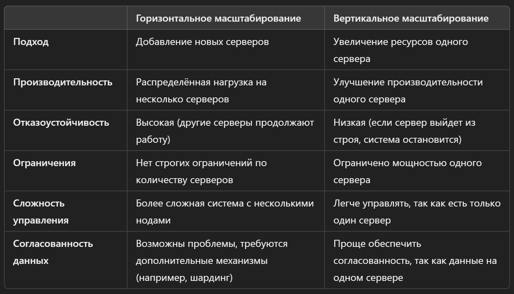

#### Когда использовать горизонтальное и вертикальное масштабирование?
- **Горизонтальное масштабирование** полезно, когда:
	- У вас есть большие объёмы данных и высокая нагрузка.
	- Требуется высокая отказоустойчивость.
	- Необходимо легко добавлять ресурсы по мере увеличения нагрузки.
- **Вертикальное масштабирование** подходит, когда:
	- Приложение не может быть легко распределено по нескольким серверам.
	- Вам нужно улучшить производительность в краткосрочной перспективе без кардинальных изменений системы.
	- Ваши текущие объёмы данных не слишком велики, и один сервер справляется с ними.

### <span style="color: lime">Какие требования могут применяться к ключу, по которому происходит партиционирование?</span>
При партиционировании таблиц в базе данных ключ, по которому происходит разделение данных на части, должен соответствовать определённым требованиям. Эти требования зависят от целей партиционирования и типа базы данных, но существуют несколько общих принципов, которые применяются к ключу партиционирования.

#### Уникальность и равномерное распределение данных:
- **Требование**: Ключ партиционирования должен обеспечивать равномерное распределение данных по всем разделам (партициям).
- **Почему это важно**: Если партиционирующий ключ выбирается так, что большая часть данных попадает в одну партицию, это создаёт дисбаланс нагрузки на систему. Например, при работе с временными данными часто используется дата или временная метка как ключ, чтобы распределить данные по диапазонам времени.
- Пример:
	- В системе заказов, где таблица партиционируется по дате создания заказа, если вся нагрузка приходится на заказы за последний месяц, партиции для этого месяца могут стать перегруженными.
	- В этом случае может потребоваться выбрать более "разнообразный" ключ, например, комбинацию даты и идентификатора пользователя, чтобы обеспечить лучшее распределение данных.

#### Использование ключа в запросах:
- **Требование**: Партиционирующий ключ должен часто использоваться в условиях запросов (`WHERE`).
- **Почему это важно**: Если ключ партиционирования редко упоминается в запросах, партиционирование может не приносить пользы. Оно позволяет базе данных быстро фильтровать и работать только с одной или несколькими партициями, а не со всей таблицей.
- Пример:
	- Если таблица с заказами партиционируется по `user_id`, а большинство запросов ищет данные по дате заказа, то такая структура неэффективна. В этом случае стоит выбрать ключ, который часто фигурирует в фильтрации запросов, например, дату создания заказа.

#### Стабильность ключа:
- **Требование**: Значение партиционирующего ключа не должно часто изменяться.
- **Почему это важно**: Когда значение ключа партиционирования изменяется, данные должны перемещаться между партициями. Это может значительно снизить производительность системы.
- Пример:
	- Если ключом партиционирования выбран идентификатор статуса заказа, и статусы часто меняются (например, из "новый" в "отправлен" или "доставлен"), это приведёт к частому перемещению записей между партициями, что создаст дополнительную нагрузку на систему.

#### Логическая связность данных:
- **Требование**: Ключ партиционирования должен отражать логику использования данных.
- **Почему это важно**: Партиции часто используются для хранения данных, которые логически связаны. Это может помочь в оптимизации запросов и сокращении времени выборки данных.
- Пример:
	- В системе логирования партиционирование по дате события имеет логический смысл, так как запросы часто основаны на временных диапазонах. Таким образом, партиционирование по времени упрощает работу с логами.

#### Тип данных ключа:
- **Требование**: Ключ партиционирования должен иметь подходящий тип данных.
- **Почему это важно**: В некоторых базах данных для ключа партиционирования могут быть ограничения по типам данных. Например, могут быть недоступны партиции по текстовым полям, а числовые или временные типы данных часто более предпочтительны.
- Пример:
	- Для большинства СУБД числовые, строковые или временные данные являются подходящими для ключей партиционирования, так как они хорошо работают при делении данных на диапазоны или сегменты.

#### Совместимость с требованиями индексов:
- **Требование**: Ключ партиционирования должен работать эффективно в комбинации с индексами.
- **Почему это важно**: Важно, чтобы партиционирование не мешало использованию индексов, которые оптимизируют запросы.
- Пример:
	- Если создаётся индекс на столбец, который часто используется в запросах, а этот столбец не совпадает с ключом партиционирования, то база данных может не использовать индекс эффективно. В идеале ключ партиционирования должен участвовать в индексировании, чтобы максимизировать производительность.

### <span style="color: lime">Первые 3 НФ (нормальных формы)</span>
[Что такое нормализация?](#что-такое-нормализация)

### <span style="color: lime">Какие виды JOIN существуют?</span>
[Что такое SELECT ... JOIN?](#что-такое-select-join)

### <span style="color: lime">Плюсы и минусы индексации данных</span>
[Преимущества индексации:](#что-такое-индексация-данных)

### <span style="color: lime">Какие основные операции можно производить с транзакцией?</span>
[Важные команды для работы с транзакциями:](#важные-команды-для-работы-с-транзакциями)

### <span style="color: lime">Какими особенностями должна обладать транзакция согласно акрониму ACID?</span>
[Основные свойства транзакций: ACID](#основные-свойства-транзакций-acid)

### <span style="color: lime">Какие бывают виды репликации в БД, и как они отличаются?</span>
[Типы репликации](#типы-репликации)
### <span style="color: lime">Что такое Master-Slave-репликация?</span>
[Мастер-слейв (Master-Slave) репликация:](#типы-репликации)

### <span style="color: lime">Что такое логическая репликация?</span>
[Логическая репликация (Logical replication):](#типы-репликации)

### <span style="color: lime">Сравнение различных подходов к шардированию</span>
[Типы шардинга:](#типы-шардинга)
