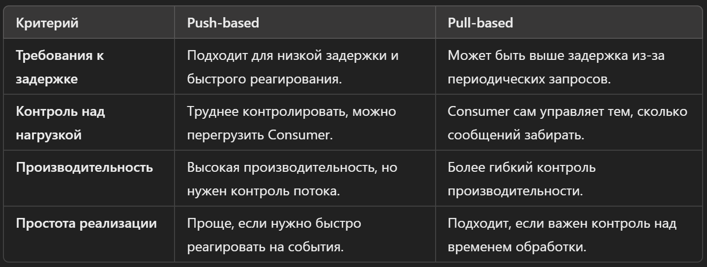
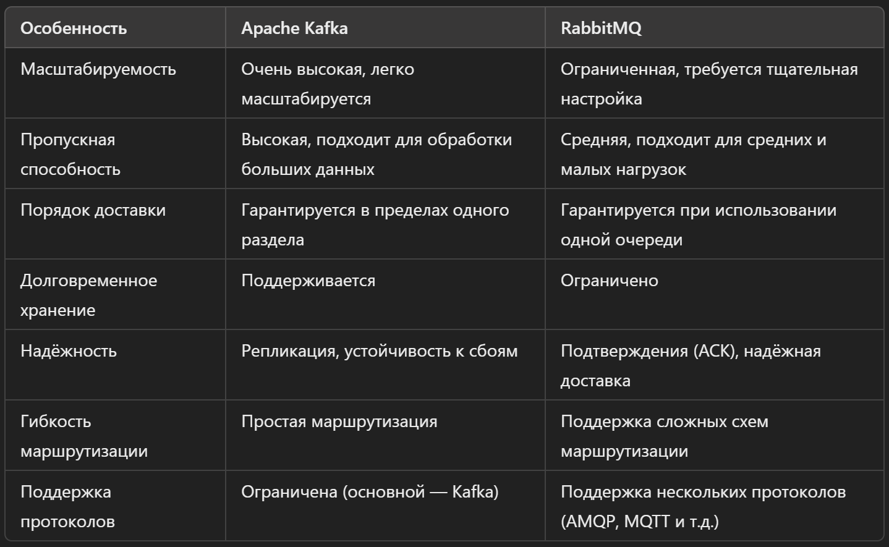
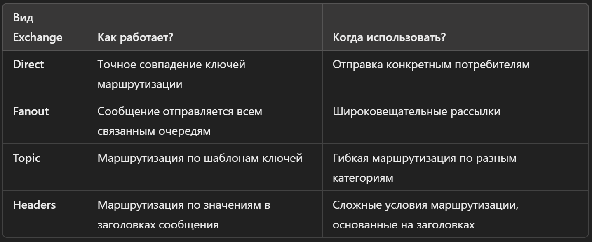

### Что такое Message Broker?
**`Message Broker (брокер сообщений)`** — это ПО, которое помогает передавать сообщения между различными приложениями или сервисами. Его основная задача — принимать сообщения от одной системы и безопасно доставлять их в другую, даже если они работают на разных языках, платформах или не подключены напрямую.

Представь, что у тебя есть два сервиса: один отправляет данные, а другой их получает. Без брокера сообщений эти сервисы должны будут напрямую соединяться друг с другом, и если что-то пойдёт не так (например, один из них временно выйдет из строя), система может перестать работать. Message Broker позволяет избежать этой проблемы, потому что он:
- **Получает сообщение** от отправителя (публикующего приложения).
- **Сохраняет его** и временно хранит, если получатель (подписчик) ещё не готов его принять.
- **Доставляет сообщение** подписчику, когда тот готов его принять.

#### Преимущества использования Message Broker:
- **Асинхронная передача данных**: Приложения могут обмениваться данными, не ожидая немедленного ответа. Это помогает разгрузить системы и улучшить производительность.
- **Надёжность**: Если получатель временно недоступен, брокер сообщений может сохранить данные и доставить их позже.
- **Гибкость и масштабируемость**: Системы могут быть легко добавлены или заменены без необходимости перестраивать всю инфраструктуру.

#### Примеры Message Broker:
- **RabbitMQ**: Открытый и надёжный брокер, который поддерживает различные протоколы.
- **Apache Kafka**: Подходит для больших потоков данных и часто используется для обработки событий в реальном времени.
- **ActiveMQ**: Поддерживает разные модели доставки сообщений и известен своей гибкостью.
- **Redis (с функцией Pub/Sub)**: Может использоваться как брокер сообщений, хотя и имеет другие основные задачи.

### Что такое Message Queue?
**`Message Queue (очередь сообщений)`** — это компонент или структура данных, которую используют Message Brokers для хранения сообщений. Очередь сообщений позволяет отправителям (производителям) добавлять сообщения в очередь, а получателям (потребителям) забирать эти сообщения, когда они готовы их обработать.

Представь себе очередь в магазине, где покупатели по очереди подходят к кассе. Точно так же в Message Queue сообщения выстраиваются в очередь и обрабатываются по принципу **FIFO (First In, First Out)**, то есть первым пришло сообщение — первым его и заберут.

#### Как работает Message Queue:
- **Отправитель (Producer)** добавляет сообщение в очередь.
- Сообщение хранится в очереди до тех пор, пока его не заберёт получатель.
- **Получатель (Consumer)** забирает сообщение из очереди и обрабатывает его.

#### Зачем нужна Message Queue:
- **Асинхронная обработка**: Отправитель не должен ждать, пока получатель обработает сообщение. Он может отправить сообщение и продолжать работать, что делает систему более эффективной.
- **Разделение задач**: Отправитель и получатель могут работать независимо друг от друга. Если один из них перестанет работать, сообщения не потеряются, а останутся в очереди до тех пор, пока система не восстановится.
- **Масштабируемость**: Можно добавить несколько получателей, чтобы обрабатывать сообщения параллельно и быстрее.

#### Примеры использования:
- **Обработка заказов**: Когда клиент делает заказ в интернет-магазине, информация об этом заказе отправляется в очередь. Другие системы (например, складская система, система оплаты) могут обрабатывать эти заказы независимо.
- **Отправка уведомлений**: Когда нужно отправить уведомление (например, email или SMS), сообщение можно добавить в очередь, а специальный сервис будет забирать их и отправлять получателям.
- **Поток данных в реальном времени**: Приложения могут отправлять данные в очередь, а аналитические системы забирать их и анализировать в режиме реального времени.

#### Примеры Message Queue:
- **RabbitMQ** и **ActiveMQ**: Классические брокеры сообщений, использующие очереди для асинхронной передачи данных.
- **Apache Kafka**: Использует очереди для обработки потоков данных в реальном времени.
- **Amazon SQS**: Облачная очередь сообщений, предоставляемая Amazon Web Services (AWS).

### Что такое Publisher?
**`Publisher (публикующий или отправляющий)`** — это компонент или приложение, которое создаёт и отправляет сообщения в систему Message Broker. Проще говоря, это тот, кто "публикует" сообщения, чтобы другие системы или приложения могли их получить и обработать.

Представь, что Publisher — это как автор письма, который кладёт письмо в почтовый ящик. Он не знает, кто и когда заберёт его, но уверен, что письмо попадёт к нужному адресату через почтовую службу. В случае Message Broker, именно он выполняет роль почтовой службы.

#### Как работает Publisher:
- **Формирует сообщение**: Создаёт данные, которые нужно передать. Это может быть текст, файл, или даже сложный объект с данными.
- **Отправляет сообщение** в Message Broker: Publisher передаёт сообщение в очередь, канал или другой механизм брокера. После этого его работа закончена — сообщение принято на обработку брокером.

#### Примеры Publisher:
- **Онлайн-магазин**: Когда клиент делает заказ, система магазина становится Publisher и отправляет сообщение с информацией о заказе в Message Broker.
- **Приложение для регистрации пользователей**: Когда пользователь регистрируется, приложение отправляет сообщение с данными о регистрации в брокер, чтобы другие системы могли обработать эту информацию (например, отправить приветственное письмо).
- **Система мониторинга**: Может отправлять сообщения о состоянии серверов и других системных компонентов в брокер сообщений, чтобы другие службы могли реагировать на эти события.

#### Почему важен Publisher:
- **Асинхронное взаимодействие**: Publisher не должен дожидаться ответа от конечного получателя. Он отправляет сообщение и продолжает работать, что улучшает производительность.
- **Масштабируемость и гибкость**: Поскольку Publisher передаёт сообщение брокеру, ему не нужно знать, сколько получателей будет обрабатывать это сообщение и кто они. Это позволяет легко добавлять новые компоненты в систему.

### Что такое Consumer?
**`Consumer (потребитель)`** — это компонент или приложение, которое получает и обрабатывает сообщения из Message Broker. Если Publisher (публикующий) отправляет сообщения, то Consumer — тот, кто их принимает и использует.

Представь себе, что Consumer — это как человек, который проверяет почтовый ящик и забирает из него письма. В случае Message Broker, он "забирает" сообщения из очереди или канала и выполняет с ними определённые действия.

#### Как работает Consumer:
- **Подключается к Message Broker**: Consumer подписывается на очередь, канал или другой механизм брокера, чтобы получать сообщения.
- **Забирает сообщение**: Когда сообщение попадает в очередь или канал, Consumer получает его и извлекает.
- **Обрабатывает сообщение**: Выполняет необходимые действия с полученной информацией (например, сохраняет данные в базу, отправляет ответ пользователю или выполняет другие операции).

#### Примеры Consumer:
- **Служба обработки заказов**: В интернет-магазине, когда поступает заказ, Consumer забирает сообщение с информацией о заказе и обрабатывает его (проверяет наличие товара на складе, оформляет доставку и т.д.).
- **Система уведомлений**: Consumer получает сообщения о событиях (например, о новых регистрациях пользователей) и отправляет уведомления по email или SMS.
- **Аналитическая система**: Забирает данные из потока сообщений и анализирует их в реальном времени, создавая отчёты или выявляя аномалии.

#### Почему важен Consumer:
- **Асинхронная обработка**: Consumer может обрабатывать сообщения, когда он готов, а не в момент их отправки. Это позволяет распределить нагрузку и избежать перегрузки системы.
- **Масштабируемость**: Можно добавить несколько Consumer, чтобы обрабатывать сообщения параллельно, что ускоряет обработку данных и делает систему более производительной.

### Плюсы и минусы использования Message Broker в сравнении с протоколом HTTP
#### Плюсы использования Message Broker:
- **Асинхронная коммуникация**:
	- Приложения могут отправлять сообщения, не дожидаясь немедленного ответа. Это делает взаимодействие менее зависимым от времени ответа, что улучшает производительность.
	- Например, система отправляет задание в очередь и может сразу продолжить работу, пока другое приложение обрабатывает это задание.
- **Надёжность и устойчивость к сбоям**:
	- Message Broker сохраняет сообщения, пока получатель не сможет их забрать. Даже если получатель временно недоступен, сообщения не потеряются.
	- В случае HTTP, если конечный сервис не отвечает, запрос может быть потерян или потребует повторных попыток отправки.
- **Масштабируемость**:
	- Можно легко добавлять новые Consumer для обработки сообщений параллельно. Это позволяет увеличить скорость обработки данных без изменения логики отправителя.
	- Брокеры сообщений, такие как Apache Kafka, могут обрабатывать огромные объёмы данных, что важно для систем с большим количеством трафика.
- **Гибкость**:
	- Publisher не должен знать, сколько Consumer обрабатывают сообщения. Это позволяет легко добавлять новые компоненты в систему без необходимости вносить изменения в код отправителя.
	- Message Broker может поддерживать различные типы взаимодействий (очереди, топики и т.д.), что позволяет настраивать маршрутизацию сообщений по-разному.

#### Минусы использования Message Broker:
- **Сложность настройки и эксплуатации**:
	- Message Brokers могут требовать сложной установки, настройки и мониторинга. Это добавляет затраты на обслуживание системы.
	- Появляются дополнительные зависимости и потребность в резервировании, если необходимо обеспечить высокую доступность.
- **Задержка в обработке (latency)**:
	- Поскольку сообщение должно пройти через брокер, это может добавить небольшую задержку по сравнению с прямым запросом по HTTP.
	- Это не критично для большинства случаев, но для некоторых приложений реального времени важно учитывать это.
- **Избыточность (overhead)**:
	- Использование Message Broker требует дополнительной инфраструктуры, что может быть неоправданно для простых задач, где можно обойтись прямыми HTTP-запросами.
	- В небольших системах, где взаимодействие между сервисами минимально, использование брокера может усложнить архитектуру без значительной выгоды.

#### Плюсы использования HTTP:
- **Простота**:
	- HTTP — это простой и широко распространённый протокол, с которым знакомы практически все разработчики. Использовать HTTP-запросы легко, и их легко тестировать.
	- Нет необходимости в дополнительной инфраструктуре, всё можно настроить с минимальными усилиями.
- **Синхронное взаимодействие**:
	- Если нужно сразу получить ответ на запрос, HTTP позволяет получить его немедленно. Это полезно, когда требуется быстрая и интерактивная связь между клиентом и сервером.
	- Для некоторых задач, например, при взаимодействии с API, этот подход более естественный и удобный.
- **Простая интеграция**:
	- Большинство веб-сервисов и API работают по HTTP. Это стандарт для интеграции различных систем, и его легко поддерживать и использовать.

#### Минусы использования HTTP:
- **Отсутствие асинхронности**:
	- HTTP-запросы требуют немедленного ответа, что может вызвать проблемы, если сервер перегружен или временно недоступен.
	- При взаимодействии в реальном времени через HTTP возможны временные сбои и потери данных, если запрос не дошёл до конечной точки.
- **Зависимость от доступности сервера**:
	- Если сервер, который принимает HTTP-запросы, не работает, взаимодействие между системами прерывается. Это снижает надёжность системы.
	- При этом необходимы дополнительные механизмы для обработки повторных попыток (retry) и отказоустойчивости.
- **Трудности с масштабированием**:
	- Масштабирование HTTP-системы может потребовать балансировки нагрузки и настройки нескольких серверов, что усложняет архитектуру при высоких нагрузках.
	- Каждый HTTP-запрос требует открытого соединения, что может стать проблемой при обработке большого числа запросов.

#### Когда выбирать Message Broker, а когда HTTP:
- **Выбирайте Message Broker**, если нужно асинхронное взаимодействие, высокая надёжность, обработка больших объёмов данных и возможность масштабирования. Например, для обработки событий в реальном времени, очередей заданий, микросервисных архитектур и обмена сообщениями между системами.
- **Выбирайте HTTP**, если нужно немедленное получение ответа, простота и стандартные интеграции. Подходит для вызовов REST API.

### Что такое Pub-Sub механизм?
**`Pub-Sub (Publish-Subscribe) механизм`** — это модель обмена сообщениями, при которой отправители сообщений (Publishers) и их получатели (Subscribers) работают независимо друг от друга. Это значит, что отправитель не отправляет сообщение напрямую конкретному получателю, а публикует его в **тему (topic)**, на которую подписаны один или несколько получателей.

#### Как работает Pub-Sub:
- **Publisher публикует сообщение** в определённую тему. При этом он не знает, кто и сколько подписчиков (Consumers) получат это сообщение.
- **Subscribers подписываются на темы** и получают все сообщения, которые туда публикуются. Если они подписаны на несколько тем, то будут получать сообщения из всех этих тем.

#### Пример для понимания:
- Представь себе радио-станцию (Publisher), которая вещает определённую радиостанцию (тему). Люди (Subscribers) могут настроить свои радиоприёмники на эту волну. Радиостанция вещает свои передачи, не зная, сколько людей слушает её и кто именно. Все, кто настроился на эту волну, слышат передачу.

#### Преимущества Pub-Sub:
- **Асинхронность**: Публикующий и подписчики работают независимо. Это значит, что Publisher может продолжать свою работу, даже если ни один подписчик не готов принять сообщение в данный момент.
- **Масштабируемость**: Можно легко добавлять новых подписчиков, не изменяя логику Publisher. Это позволяет масштабировать систему, добавляя новые сервисы, которые будут обрабатывать сообщения.
- **Гибкость**: Позволяет легко распределять информацию между множеством систем. Publisher не должен знать, сколько и какие сервисы обрабатывают сообщения, что упрощает разработку.

#### Примеры технологий с поддержкой Pub-Sub:
- **Apache Kafka**: Используется для обработки событий в реальном времени. Kafka может поддерживать большое количество подписчиков и справляться с большими потоками данных.
- **Redis (с функцией Pub/Sub)**: Лёгкое решение для передачи сообщений между сервисами.
- **Google Cloud Pub/Sub**: Облачный сервис, который позволяет публиковать и подписываться на сообщения в рамках облачной инфраструктуры.
- **RabbitMQ**: Может работать в режиме Pub-Sub через обменники (exchanges), которые распределяют сообщения по подписчикам.

#### Когда использовать Pub-Sub:
- Когда нужно доставлять одно и то же сообщение нескольким подписчикам (например, для уведомлений или потоков данных).
- Когда важна гибкость и возможность расширять систему, добавляя новых получателей данных.
- Когда необходимо асинхронное взаимодействие между компонентами, и они не должны быть напрямую связаны друг с другом.

### Сравнение Push-based и Pull-based подходы в MQ
**`Push-based** и Pull-based`** — это два разных подхода к тому, как сообщения доставляются из очереди сообщений (Message Queue) к получателям (Consumers). Они определяют, кто инициирует передачу сообщения: сам брокер или получатель.

#### Push-based подход:
- В **Push-based** модели Message Broker сам отправляет (или "толкает") сообщения Consumer-ам, как только они появляются в очереди. Это означает, что Consumer не нужно активно запрашивать сообщения; брокер сам инициирует передачу.
- Как это работает:
	- Consumer подписывается на очередь, и Message Broker автоматически отправляет ему новые сообщения по мере их поступления.
	- Сообщения передаются сразу же, как только они появляются в очереди.
- Преимущества:
	- **Низкая задержка (Low latency)**: Сообщения доставляются немедленно, как только становятся доступны, что делает этот подход полезным для систем, где важно быстрое реагирование на события (например, уведомления в реальном времени).
	- **Проще для настройки**: Consumer не нужно периодически опрашивать очередь; они просто ждут, пока брокер сам не отправит сообщение.
- Недостатки:
	- **Риск перегрузки Consumer**: Если сообщений слишком много и брокер быстро их отправляет, Consumer может не успевать обрабатывать их, что может привести к сбоям или переполнению буферов.
	- **Проблемы с контролем потока (Flow control)**: Нужно тщательно настраивать лимиты, чтобы избежать перегрузки. Брокер должен быть способен учитывать скорость обработки Consumer.

#### Pull-based подход:
- В **Pull-based** модели Consumer сам "запрашивает" (или "тянет") сообщения из очереди, когда он готов их обрабатывать. Брокер не отправляет сообщения автоматически, а ждёт, пока Consumer запросит их.
- Как это работает:
	- Consumer инициирует запросы к Message Broker, чтобы получить сообщения из очереди.
	- Брокер возвращает сообщения только тогда, когда Consumer сам их запросит.
- Преимущества:
	- **Контроль над нагрузкой (Backpressure control)**: Consumer сам определяет, когда и сколько сообщений он может обработать. Это помогает избежать ситуаций, когда система перегружена и не может справиться с большим количеством входящих данных.
	- **Гибкость**: Consumer может решать, как часто и в каком объёме забирать сообщения, что позволяет ему адаптироваться к текущей загрузке системы и другим задачам.
- Недостатки:
	- **Более высокая задержка (Higher latency)**: Поскольку Consumer должен сам запрашивать сообщения, между запросом и получением сообщения может возникать задержка. Это может быть проблемой для приложений, требующих быстрой реакции.
	- **Затраты на периодические запросы**: Consumer может часто опрашивать очередь, чтобы узнать, есть ли новые сообщения, что увеличивает сетевую нагрузку и потребление ресурсов.

#### Когда использовать Push-based и Pull-based подходы:

#### Примеры использования:
- **Push-based**: Уведомления о новых сообщениях в чат-приложении. Брокер сразу отправляет уведомление, чтобы пользователь увидел его мгновенно.
- **Pull-based**: Аналитические системы, которые собирают данные из очереди с определённой периодичностью, чтобы обработать их в свободное время.

#### Примеры технологий:
- **Push-based**: RabbitMQ позволяет настроить автоматическую доставку сообщений Consumer-ам (Push) через механизм "prefetch" для контроля потока.
- **Pull-based**: Apache Kafka в основном использует Pull-модель, где Consumer сам запрашивает сообщения и может контролировать скорость их обработки.

### Что означает понятие Broker Durability?
**`Broker Durability (устойчивость брокера)`** — это способность Message Broker сохранять сообщения и данные даже при сбоях системы, чтобы они не были утеряны. Это важная характеристика, которая определяет, как надёжно брокер может сохранять информацию и обеспечивать её доставку, даже если случаются сбои, перезагрузки или непредвиденные проблемы с сервером.

#### В чём суть Durability:
- Когда говорят о Durability, имеют в виду, что брокер гарантирует сохранение сообщений на диске или в другой постоянной памяти. Это значит, что если брокер внезапно отключится (например, из-за сбоя оборудования или перезапуска), все сохранённые сообщения останутся на месте и не будут потеряны. После восстановления работы брокер сможет продолжить обработку сообщений с того места, где он остановился.

#### Как работает Broker Durability:
- **Сохранение сообщений на диск**: При отправке сообщения, брокер может записывать его на диск (или в другое надёжное хранилище), прежде чем подтвердить получение отправителю. Это гарантирует, что сообщение не потеряется, если произойдёт сбой.
- **Устойчивость очередей и топиков**: Некоторые брокеры могут создавать "устойчивые" очереди или топики, которые сохраняются на диск вместе с сообщениями, чтобы данные не терялись при перезагрузке.
- **Журналирование (Log)**: Брокеры могут вести журналы транзакций, которые помогают восстановить состояние системы после перезапуска, используя данные из журналов для восстановления очередей и сообщений.

#### Преимущества Durability:
- **Надёжная доставка сообщений**: Даже при сбоях системы сообщения сохраняются и будут доставлены, когда система восстановится. Это важно для критичных приложений, где потеря данных недопустима (например, системы финансовых транзакций, системы мониторинга и оповещения).
- **Восстановление после сбоев**: Устойчивость позволяет брокеру автоматически восстановиться после перезапуска и продолжить работу с того места, где он остановился, не теряя данные.
- **Гарантия целостности данных**: В случае сбоя серверов или программных ошибок можно быть уверенным, что сообщения не будут утеряны и могут быть обработаны позже.

#### Примеры реализаций Durability в брокерах:
- **RabbitMQ**: Для обеспечения Durability в RabbitMQ можно создать устойчивые (durable) очереди и публиковать в них постоянные (persistent) сообщения. Это значит, что очереди и сообщения будут сохраняться на диск, и если брокер перезапустится, они не будут потеряны.
- **Apache Kafka**: Использует журналирование и сохранение сообщений на диск по умолчанию, чтобы обеспечить устойчивость. Сообщения остаются в логах и могут быть повторно обработаны даже после перезагрузки или сбоя.
- **Amazon SQS**: Это облачный сервис, который предлагает устойчивые очереди сообщений. Сообщения хранятся в распределённой системе хранения, обеспечивая высокую надёжность и устойчивость к сбоям.

#### Когда важна Broker Durability:
- **Критические системы**: В системах, где потеря сообщений недопустима, например, в финансовых приложениях, системах заказа и учёта, системах мониторинга и оповещения.
- **Системы с временными отключениями**: Если системы могут испытывать перебои в работе, важно, чтобы сообщения сохранялись и могли быть обработаны позже.
- **Масштабируемые распределённые системы**: В системах, где используются несколько брокеров и они могут выходить из строя или перезагружаться, Durability помогает избежать потери данных при переключении между брокерами.

#### Потенциальные недостатки:
- **Замедление работы**: Сохранение сообщений на диск может быть медленнее, чем просто хранение их в оперативной памяти. Это может снизить общую производительность системы, особенно если нужно обрабатывать большие объёмы данных с минимальными задержками.
- **Использование дискового пространства**: Сохранение больших объёмов данных требует значительного объёма дискового пространства, и необходимо следить за тем, чтобы оно не закончилось.

### Что такое Lazy Queue в RabbitMQ?
**`Lazy Queue`** в RabbitMQ — это тип очереди, предназначенный для эффективного хранения и обработки большого количества сообщений, которые редко или не сразу нужно доставить получателю. В отличие от обычных очередей, которые хранят сообщения в оперативной памяти (RAM), Lazy Queue сохраняет сообщения непосредственно на диск, чтобы снизить нагрузку на оперативную память.

#### Основная идея Lazy Queue:
- RabbitMQ изначально хранит сообщения в оперативной памяти для быстрой доставки. Однако если сообщений много и они долго остаются в очереди, это может привести к тому, что память быстро заполнится, что создаст проблемы с производительностью и стабильностью. **Lazy Queue** решает эту проблему, перемещая сообщения на диск и загружая их обратно в оперативную память только тогда, когда это необходимо для обработки.

#### Как работает Lazy Queue:
- **Сохранение на диск**: Сообщения записываются на диск сразу после поступления, а не хранятся в оперативной памяти. Это помогает освобождать RAM для других задач и позволяет брокеру обрабатывать большие объёмы данных.
- **Подгрузка сообщений при необходимости**: Сообщения загружаются обратно в оперативную память только тогда, когда их нужно доставить получателю (Consumer). Это позволяет экономить ресурсы системы и повышает устойчивость при обработке больших объёмов сообщений.
- **Эффективность обработки больших очередей**: Lazy Queue оптимизирована для работы с длинными очередями, где сообщения могут долго находиться в ожидании. Например, при накоплении данных для дальнейшей пакетной обработки или когда частота потребления сообщений ниже частоты их поступления.

#### Преимущества Lazy Queue:
- **Экономия оперативной памяти**: Сообщения сохраняются на диск, а не хранятся в RAM. Это позволяет брокеру обрабатывать очереди с миллионами сообщений, не потребляя всю оперативную память сервера.
- **Устойчивость и надёжность**: Сохранение сообщений на диск делает систему более устойчивой к сбоям и перезагрузкам, так как сообщения не потеряются даже при перегрузке памяти.
- **Стабильная работа при высоких нагрузках**: Lazy Queue может справляться с большими объёмами данных без значительного снижения производительности, что важно для приложений с непредсказуемыми всплесками нагрузки.

#### Недостатки Lazy Queue:
- **Повышенные задержки**: Поскольку сообщения сохраняются на диск, время доступа к ним выше, чем к сообщениям, находящимся в оперативной памяти. Это может приводить к задержкам в доставке сообщений, что не подходит для приложений, требующих минимальной задержки (low-latency).
- **Затраты на операции ввода-вывода (I/O)**: Постоянная запись на диск и чтение с него требует большего количества операций ввода-вывода, что может повлиять на производительность системы, особенно если диск медленный или ресурсы хранилища ограничены.
- **Увеличенные требования к хранилищу**: Хранение всех сообщений на диске означает, что необходимо больше дискового пространства, чем при хранении сообщений в RAM.

#### Когда использовать Lazy Queue:
- **Большие очереди с редкими потребителями**: Если у вас есть очередь, где сообщения могут накапливаться в большом количестве перед тем, как их начнут потреблять, Lazy Queue поможет снизить нагрузку на память.
- **Накопление данных для пакетной обработки**: Если вам нужно собирать данные и обрабатывать их большими партиями, например, каждую ночь, Lazy Queue может аккумулировать сообщения на протяжении дня, освобождая ресурсы.
- **Непредсказуемые всплески нагрузки**: Если в системе могут возникать резкие всплески входящих данных, Lazy Queue позволит более стабильно распределить нагрузку, избегая перегрузки оперативной памяти.

#### Примеры:
- **Обработка логов**: Системы, которые собирают логи с разных сервисов и обрабатывают их в определённое время. Логи можно накапливать в Lazy Queue, не переживая, что оперативная память заполнится.
- **Системы отложенной доставки**: Когда нужно отправлять уведомления или сообщения в определённое время, Lazy Queue может аккумулировать все данные и доставить их, когда потребуется.

### Что такое prefetch в RabbitMQ?
**`Prefetch`** в RabbitMQ — это настройка, которая управляет тем, сколько сообщений может быть отправлено одному потребителю (Consumer) до того, как он подтвердит обработку предыдущих сообщений. Она помогает контролировать поток сообщений и предотвращает перегрузку потребителей.

#### Как работает Prefetch:
- Когда Consumer подключается к очереди и начинает получать сообщения, RabbitMQ может отправить ему сразу несколько сообщений для обработки. Настройка **prefetch** указывает, сколько сообщений может быть доставлено Consumer-у одновременно. Пока он не подтвердит обработку этих сообщений, новые сообщения ему отправлены не будут.
- Пример:
	- Если **prefetch** установлен в значение `5`, RabbitMQ отправит Consumer-у 5 сообщений. Пока он не обработает и не подтвердит хотя бы одно из них, новые сообщения не будут отправлены.
	- Это позволяет Consumer-у обрабатывать сообщения в своём темпе и не перегружаться, если сообщений слишком много.

#### Почему важен Prefetch:
- **Контроль нагрузки (Flow Control)**: Prefetch ограничивает количество сообщений, которые могут быть отправлены одному Consumer-у. Это защищает его от перегрузки, когда приходят большие объёмы данных.
- **Равномерное распределение**: Когда несколько Consumer-ов подключены к одной очереди, prefetch помогает равномерно распределить сообщения между ними. Без этой настройки RabbitMQ может отправить много сообщений только одному Consumer-у, оставляя других без работы.
- **Эффективная обработка задач**: Настройка prefetch даёт возможность улучшить общую производительность системы, позволяя Consumer-ам эффективно обрабатывать задачи, не создавая очередей из неподтверждённых сообщений.

#### Преимущества использования Prefetch:
- **Предотвращение перегрузки**: Ограничение количества сообщений защищает Consumer от перегрузки, если он не успевает обрабатывать данные.
- **Эффективное распределение ресурсов**: Prefetch равномерно распределяет нагрузку между Consumer-ами, что улучшает производительность системы.
- **Гибкость и контроль**: Настройка prefetch позволяет адаптировать систему под конкретные задачи, например, когда важна быстрая обработка, но нужно избегать перегрузки.

#### Пример применения:
- **Обработка задач в очереди**: Если задачи требуют разного времени на выполнение, использование prefetch помогает избежать ситуаций, когда один Consumer получает все тяжёлые задачи, а другие — лёгкие. Это сбалансирует нагрузку.
- **Пакетная обработка**: Если Consumer обрабатывает задачи пакетами, prefetch можно настроить так, чтобы он получал сразу несколько сообщений, обрабатывал их и затем подтверждал.

### Что такое offset в Kafka?
**`Offset`** в Apache Kafka — это уникальный номер, который идентифицирует каждое сообщение (запись) в пределах определённого раздела (partition) топика. Он служит для отслеживания положения сообщений и помогает потребителям (consumers) ориентироваться в том, какие сообщения уже обработаны, а какие ещё предстоит прочитать.

#### Как работает Offset:
- **Топики и разделы**: В Kafka данные организованы в топики (topics), которые делятся на несколько разделов (partitions). Каждое сообщение, попадающее в топик, записывается в один из разделов. Offset используется для отслеживания положения сообщения внутри конкретного раздела.
- **Присвоение номеров**: Когда новое сообщение добавляется в раздел, ему автоматически присваивается следующий доступный offset — целое число, которое начинается с `0` и увеличивается на `1` с каждым новым сообщением. Например, если в разделе есть три сообщения, их offset-ы будут `0`, `1`, и `2`.
- **Индексация сообщений**: Offset — это своего рода индекс, который позволяет потребителю точно знать, с какого места читать сообщения в разделе. Например, если потребитель уже прочитал сообщение с offset `5`, он знает, что нужно начинать чтение с сообщения с offset `6`.

#### Зачем нужен Offset:
- **Позиционирование**: Offset позволяет потребителям управлять тем, с какого места начинать чтение. Это полезно, если потребитель временно остановился и затем возобновил работу. Он может начать чтение с определённого offset, чтобы продолжить с того места, где остановился.
- **Масштабируемость**: Благодаря offset, разные потребители могут читать данные из одного топика одновременно, но начинать с разных мест. Это помогает распределить нагрузку и увеличить скорость обработки данных.
- **Управление повторным чтением**: Потребители могут повторно читать сообщения, возвращаясь к определённому offset. Это полезно для анализа данных или в случае, если необходимо перепроизвести обработку.

#### Как потребители работают с Offset:
- Потребители Kafka самостоятельно отслеживают и управляют offset-ами. После прочтения и обработки сообщения они могут:
	- **Подтвердить (commit) offset**: Это значит, что потребитель сохраняет своё текущее положение (offset), чтобы знать, что это сообщение уже обработано. Если потребитель перезапустится, он начнёт чтение с последнего подтверждённого offset.
	- **Автоматическое и ручное подтверждение**: Kafka поддерживает автоматическое подтверждение (consumer автоматически сохраняет offset через определённые промежутки времени) и ручное подтверждение (когда потребитель сам решает, когда зафиксировать offset).

#### Преимущества использования Offset:
- **Надёжность**: Offset обеспечивает надёжную доставку сообщений. Потребители могут отслеживать, какие сообщения уже обработаны, и начать чтение с нужного места после сбоя или перезапуска.
- **Гибкость обработки данных**: Потребители могут легко вернуться к предыдущим offset-ам и повторно прочитать данные для переобработки.
- **Масштабируемость**: Разделы и offset-ы позволяют обрабатывать огромные объёмы данных параллельно, что важно для систем с высокой нагрузкой.

#### Пример использования Offset в реальном мире:
- Допустим, вы строите систему, которая отслеживает заказы интернет-магазина. Каждый заказ записывается в топик в Kafka. Ваше приложение-потребитель обрабатывает заказы и обновляет информацию о доставке. С помощью offset-ов оно может:
	- Начать обработку с последнего непрочитанного заказа, если ранее было остановлено.
	- Повторно прочитать заказы с определённого offset, если нужно пересчитать данные или восстановить информацию.

### Можно ли любой HTTP-интерфейс заменить на интерфейс работы через Message Broker? Почему?
Замена HTTP-интерфейса на интерфейс работы через Message Broker возможна, но не всегда целесообразна. Это зависит от конкретных требований и особенностей системы.

#### Сходства и различия HTTP и Message Broker:
- **HTTP-интерфейс**:
	- **Синхронный**: HTTP обычно подразумевает синхронное взаимодействие, когда клиент отправляет запрос и ожидает мгновенного ответа от сервера. Например, когда пользователь запрашивает веб-страницу или делает REST-запрос к API.
	- **Простота**: Используется повсеместно и хорошо поддерживается. Большинство современных сервисов и приложений имеют HTTP-интерфейсы, что облегчает интеграцию и взаимодействие между ними.
	- **Поддержка прямого общения**: Прямое соединение между клиентом и сервером. Это означает, что запросы отправляются на конкретный адрес, и результат возвращается обратно тому же клиенту.
- **Интерфейс через Message Broker**:
	- **Асинхронный**: Message Broker работает на основе очередей и может обрабатывать сообщения асинхронно. Это означает, что отправитель сообщения не обязательно должен ждать немедленного ответа. Он может отправить сообщение в очередь и продолжить свою работу, пока другой сервис (Consumer) обрабатывает сообщение.
	- **Надёжность и устойчивость**: Брокеры сообщений обеспечивают надёжную доставку и возможность повторной обработки сообщений. Даже если один из сервисов временно не работает, сообщение всё равно останется в очереди и будет доставлено позже.
	- **Гибкость маршрутизации**: Системы на основе Message Broker позволяют направлять сообщения множеству потребителей и поддерживать различные схемы взаимодействия (например, Pub/Sub), что упрощает реализацию сложных архитектур.

#### Можно ли заменить HTTP-интерфейс на Message Broker?
Ответ: **да, можно**, но не всегда это будет целесообразным и оправданным.

#### Когда это целесообразно:
- **Асинхронные операции**:
	- Если ваша система требует асинхронной обработки (например, отправка email-уведомлений, обработка логов, обработка заказов), использование Message Broker будет выгодным. Это позволяет отправлять задачи в очередь и не блокировать выполнение других операций, пока задача обрабатывается.
	- Асинхронность также полезна, когда ответ может быть отложен во времени и не требуется мгновенный отклик, как в случае с HTTP.
- **Обработка больших объёмов данных**:
	- Если у вас есть сервисы, которые должны обрабатывать большие объёмы данных параллельно (например, аналитика и обработка событий), Message Broker может обеспечить балансировку нагрузки и распределить сообщения между несколькими потребителями.
	- Брокеры сообщений позволяют обрабатывать большие объёмы данных с высокой устойчивостью, поскольку они поддерживают повторную доставку и гарантируют, что сообщения не потеряются.
- **Устойчивость к сбоям**:
	- Message Broker помогает обеспечивать надёжность, так как сообщения будут оставаться в очереди даже при сбое системы. Например, если один из сервисов временно недоступен, он сможет получить сообщения позже, когда вернётся в онлайн.
	- В HTTP-интерфейсах сбой сервера означает, что запрос может быть утерян, и клиенту придётся повторять запрос.
- **Масштабируемость**:
	- Системы на основе Message Broker легче масштабировать. Потребители могут добавляться или удаляться в зависимости от нагрузки, и брокер автоматически распределит сообщения между доступными экземплярами.
	- В HTTP-интерфейсах масштабирование часто требует дополнительных усилий, таких как балансировка нагрузки и управление отказоустойчивостью.

#### Когда это нецелесообразно:
- **Необходимость мгновенного ответа**:
	- Если система требует немедленного ответа клиенту (например, веб-страницы или запросы к REST API), использование асинхронного Message Broker может добавить ненужную сложность и задержки. В таких случаях HTTP-интерфейс более естественен и удобен.
	- Пример: пользователь отправляет запрос на поиск, и он ожидает мгновенный результат. Это классический случай для HTTP, а не для брокера сообщений.
- **Простые, одноразовые запросы**:
	- Для простых запросов, которые требуют мгновенной обработки и не требуют повторных попыток, HTTP остаётся более простым и прямым решением. Это снижает сложность разработки и упрощает архитектуру.
	- Пример: получение данных о пользователе, отправка формы на сайт и т. д.
- **Избыточность и сложность**:
	- Переход к Message Broker требует дополнительных компонентов: самого брокера сообщений, настройки очередей, мониторинга и управления. Если текущая архитектура удовлетворяет потребностям и нет необходимости в асинхронной обработке, использование брокера сообщений может добавить излишнюю сложность.

#### Вывод:
Использование Message Broker вместо HTTP-интерфейса имеет свои плюсы и минусы. Если система требует асинхронной, надёжной обработки данных, поддерживает большой объём данных или должна быть устойчивой к сбоям, переход на Message Broker может быть выгодным. Однако для простых, синхронных операций с мгновенным откликом лучше оставить HTTP-интерфейс, так как он проще и удобнее в использовании.

### Сравнение двух любых Message Brokers, плюсы и минусы
#### Apache Kafka:
- Apache Kafka — это распределённая система потоковой передачи данных, ориентированная на высокую пропускную способность и обработку больших объёмов данных в реальном времени. Она широко используется для передачи событий (event streaming) и интеграции данных между разными системами.
- Плюсы:
	- **Высокая пропускная способность**:
		- Kafka может обрабатывать миллионы сообщений в секунду, что делает его идеальным для больших объёмов данных и интенсивных потоков (например, логирование, аналитика данных, трекинг событий).
	- **Горизонтальная масштабируемость**:
		- Kafka легко масштабируется за счёт добавления новых узлов (брокеров), которые автоматически распределяют нагрузку и данные. Это позволяет системам расти без потери производительности.
	- **Устойчивость и отказоустойчивость**:
		- Сообщения реплицируются между несколькими узлами, что обеспечивает высокую доступность. Если один узел выйдет из строя, данные не будут потеряны.
	- **Поддержка долговременного хранения**:
		- Kafka может хранить данные в течение длительного времени (несколько дней, недель или даже месяцев), позволяя потребителям читать их в удобное для них время. Это подходит для аналитических задач и исторического анализа.
	- **Гарантия последовательного порядка сообщений в рамках одного раздела**:
		- Kafka обеспечивает строгий порядок сообщений внутри каждого partition, что позволяет легко контролировать обработку данных.
- Минусы:
	- **Сложность настройки и управления**:
		- Kafka требует тщательной настройки и мониторинга. Установка и поддержка могут оказаться сложными, особенно для новичков.
	- **Отсутствие встроенной поддержки очередей с приоритетами**:
		- В Kafka нет нативной поддержки приоритетных очередей, что может быть ограничением для некоторых случаев использования.
	- **Синтаксис и концепции могут быть сложны для понимания**:
		- Понимание таких понятий, как partition, consumer groups, offset и репликация, может занять некоторое время.

#### RabbitMQ:
- RabbitMQ — это брокер сообщений, ориентированный на надёжную доставку сообщений и широкие возможности маршрутизации. Он поддерживает различные протоколы и гибкие механизмы очередей, что делает его популярным выбором для множества различных сценариев.
- Плюсы:
	- **Гибкость и мощные возможности маршрутизации**:
		- RabbitMQ поддерживает разнообразные типы обменников (direct, topic, fanout, headers), что позволяет легко настраивать сложные схемы маршрутизации сообщений.
	- **Надёжность и подтверждение доставки (ACK)**:
		- RabbitMQ гарантирует доставку сообщений с помощью механизма подтверждений (ACK). Это помогает избежать потери данных и обеспечивает стабильность обработки.
	- **Поддержка нескольких протоколов**:
		- Помимо AMQP, RabbitMQ поддерживает MQTT, STOMP и другие протоколы. Это делает его удобным для интеграции с разными системами и устройствами (например, IoT).
	- **Лёгкость настройки и простота использования**:
		- RabbitMQ проще в установке и настройке, чем Kafka. Он хорошо документирован, и его концепции легче понять, что делает его доступным для начинающих.
	- **Поддержка приоритетных очередей и отложенной доставки**:
		- Можно настроить очереди с приоритетами и задержкой доставки, что полезно для задач, требующих особого порядка или времени обработки.
- Минусы:
	- **Ограниченная масштабируемость по сравнению с Kafka**:
		- RabbitMQ не так легко масштабировать, особенно когда речь идёт о больших объёмах данных. Он лучше подходит для обработки меньших и средних потоков данных.
	- **Ограниченное долговременное хранение**:
		- RabbitMQ не предназначен для долговременного хранения сообщений. Сообщения удаляются после обработки, и хотя можно сохранять их дольше, это требует дополнительных ресурсов.
	- **Проблемы с производительностью при высоких нагрузках**:
		- При очень высокой нагрузке RabbitMQ может испытывать трудности с производительностью, и его необходимо тщательно настраивать для масштабируемости.

#### Когда выбрать Apache Kafka?:
- Когда нужно обрабатывать большие объёмы данных с высокой скоростью (например, логирование, аналитика, трекинг событий).
- Когда требуется долговременное хранение данных и возможность повторного воспроизведения сообщений.
- Для систем, где важна горизонтальная масштабируемость и устойчивость к отказам.
- Когда нужен механизм потоковой передачи данных и объединения систем в режиме реального времени.

#### Когда выбрать RabbitMQ?:
- Когда требуется сложная маршрутизация сообщений, например, отправка сообщений нескольким получателям с разными критериями.
- Для задач, где важна надёжная доставка сообщений и контроль их порядка с помощью подтверждений (ACK).
- Когда нужно легко интегрироваться с различными системами и устройствами благодаря поддержке множества протоколов.
- Для средних и малых систем, где важна простота настройки и управления.

#### Заключение

### Как добиться того, что сообщения будут прочитаны в том же конкретном порядке, в котором они были записаны в MQ?
Чтобы гарантировать, что сообщения будут прочитаны в том же порядке, в котором они были записаны в Message Queue (MQ), необходимо учитывать несколько аспектов, связанных с настройкой очередей и архитектурой системы.

#### Использование Partitioned Queues с одной очередью (или разделом):
- **Одна очередь/один раздел (partition)**: Если все сообщения попадают в одну очередь и обрабатываются одним потребителем, они будут прочитаны в том порядке, в котором они были записаны.
- Пример: в Apache Kafka можно создать топик с одним разделом (partition). В этом случае все сообщения будут поступать в этот раздел, и потребитель будет читать их по порядку.
- **Гарантия последовательности**: Пока сообщения остаются в одной очереди, и нет параллельной обработки, они будут передаваться в том же порядке, в котором пришли.

#### Использование FIFO Очередей (First In, First Out):
- **FIFO очереди**: Некоторые брокеры сообщений (например, Amazon SQS FIFO, RabbitMQ с настройками для обеспечения очередности) поддерживают FIFO, чтобы гарантировать, что сообщения будут обработаны в том порядке, в котором они поступили.
- **Особенности FIFO**: Такие очереди обеспечивают строгий порядок доставки, но могут быть менее производительными из-за необходимости синхронного подтверждения и дополнительного контроля за очередностью.

#### Группировка сообщений (Message Grouping):
- **Группировка сообщений (Message Groups)**: Если необходимо поддерживать порядок только внутри определённых категорий или групп сообщений, можно использовать механизм группировки. Например, Amazon SQS FIFO позволяет указывать идентификатор группы сообщений. Сообщения с одинаковым идентификатором будут обрабатываться по порядку в пределах этой группы.
- **Преимущества**: Этот подход позволяет добиться параллельной обработки сообщений, но при этом сохранять порядок для отдельных категорий данных.
- Пример: в системе заказов сообщения о каждом заказе могут обрабатываться параллельно, но внутри конкретного заказа сообщения будут поступать строго по порядку.

#### Использование подтверждений (ACK) и ручного управления Offset:
- **Подтверждение сообщений (ACK)**: Некоторые системы, такие как RabbitMQ и Kafka, поддерживают подтверждения. Это позволяет системе точно знать, что сообщение обработано и можно переходить к следующему.
- **Управление Offset**: В Apache Kafka можно управлять смещениями (offset) вручную, чтобы убедиться, что сообщения будут прочитаны в правильном порядке. Если сообщение не было обработано, Consumer может вернуть его обратно в очередь или вернуться к предыдущему offset, чтобы прочитать его снова. Это гарантирует, что никакие сообщения не пропустятся и будут прочитаны по порядку.

#### Атомарная запись и обработка сообщений:
- **Атомарные транзакции**: Некоторые брокеры сообщений поддерживают транзакции. Это значит, что можно гарантировать запись и чтение нескольких сообщений в определённом порядке как единое целое (например, Apache Kafka с транзакционной поддержкой). Это помогает избежать ситуации, когда одно из сообщений обрабатывается раньше других и нарушает последовательность.
- **Пример**: при использовании транзакций сообщения записываются в очередь как единый блок. Они не будут прочитаны, пока вся транзакция не завершится, что обеспечивает целостность данных.

#### Настройка приоритетов сообщений:
- **Приоритетные очереди**: Иногда порядок сообщений можно нарушить из-за настроек приоритетов. Для строгого соблюдения порядка убедитесь, что все сообщения имеют одинаковый приоритет и система обрабатывает их последовательно.
- **Пример использования**: если в RabbitMQ настроена приоритетная очередь, то сообщения с более высоким приоритетом могут быть обработаны раньше, даже если они поступили позже. Если это не требуется, отключите приоритеты для сохранения последовательности.

#### Примеры систем и их особенности:
- **RabbitMQ**: поддерживает сохранение порядка сообщений при использовании одной очереди и одного потребителя. Также можно использовать подтверждения (ACK) для управления сообщениями и сохранения последовательности.
- **Apache Kafka**: гарантирует порядок сообщений внутри одного раздела (partition). Потребитель будет читать их по очереди. Чтобы сохранить порядок, используйте один partition или управляйте потребителями так, чтобы они читали из одного partition-а.
- **Amazon SQS**: предоставляет FIFO очереди для строгого соблюдения порядка сообщений, которые помогают избежать дублирования и нарушения последовательности.

### RabbitMQ
#### Система состоит из нескольких компонентов:
- **AMQP-брокер** маршрутизирует сообщения и помогает частям системы общаться между собой; 
- **Producer** (отправитель) отправляет сообщения в брокер;
- **Consumer** (читатель) получает эти сообщения;
- **Exchange** (обменник) получает сообщения и распределяет их между очередями;
- **Queue** (очередь) хранит сообщения и отдаёт их подписанным получателям;
- **Binding** хранит правила для обменника.

#### Как это работает?:
- Любой `Producer` отправляет в него (`AMQP-брокер`) сообщения, причём обязательно в формате JSON, а каждый `Consumer` получает их. Причем парсить сообщения они должны сами — RabbitMQ ничего за них не делает.
- Внутри `брокера` `Exchange` получает сообщения и отправляет через `Routing` — карту маршрутизации с правилами `Binding`. Дальше сообщения распределяются по очередям, и очереди уже отдают их нужному `Consumer`. Причём в идеальном сценарии именно `Consumer` должен создавать нужные себе очереди — тогда всё будет работать правильно.

#### Виды Exchange в RabbitMQ:
- `Direct Exchange`:
	- **Принцип работы**:
		- Сообщение отправляется в конкретную очередь на основе точного совпадения с "routing key" (ключ маршрутизации).
		- Если ключ маршрутизации сообщения совпадает с ключом маршрутизации, по которому очередь привязана к этому exchange, то сообщение попадет в эту очередь.
	- **Пример:** Представьте, что вы отправляете почту и на конверте написан точный адрес. Письмо дойдёт до одного конкретного получателя, потому что адрес совпадает.
	- **Использование**:
		- Для задач, где нужно отправить сообщение конкретному потребителю или очереди.
		- Например, отправка логов для определённых уровней (error, info, debug), где каждая очередь будет получать сообщения только для своего уровня.
- `Fanout Exchange`:
	- **Принцип работы:**
		- Сообщение отправляется во **все** очереди, которые связаны с этим exchange, **независимо** от ключа маршрутизации.
		- Работает как широковещательная рассылка: одно сообщение отправляется всем получателям.
	- **Пример:** Это как объявление на радио. Независимо от того, кто слушает и где находится, все получат одно и то же сообщение.
	- **Использование:**
		- Когда нужно рассылать одно сообщение многим получателям.
		- Например, в чатах или оповещениях, когда вы хотите, чтобы все пользователи сразу узнали новость.
- `Topic Exchange`:
	- **Принцип работы:**
		- Сообщение отправляется в очереди на основе шаблонов ключей маршрутизации.
		- В отличие от Direct Exchange, здесь можно использовать **шаблоны** (например, `*.logs`, `payment.*`, `user.#`), где `*` заменяет одно слово, а `#` — любое количество слов.
	- **Пример:** Представьте почтовую рассылку, где вы можете настроить фильтры. Например, все письма с темой "новости" идут в одну папку, а с темой "акции" — в другую.
	- **Использование:**
		- Для более гибкой маршрутизации, когда сообщения нужно отправлять по шаблонам.
		- Например, маршрутизация логов разного уровня из разных сервисов, где ключи могут быть вида `service1.info`, `service2.error`.
- `Headers Exchange`:
	- **Принцип работы:**
		- Сообщения направляются в очереди на основе **заголовков**, а не ключей маршрутизации.
		- В отличие от других типов Exchange, здесь важны не ключи, а значения в заголовках сообщения (headers). Можно задать правила, что сообщение будет направлено в очередь, если заголовки совпадут.
	- **Пример:** Это как сортировка посылок на складе по маркировкам "хрупкое", "скоропортящееся". Посылки с определённой маркировкой пойдут в нужные категории.
	- **Использование:**
		- Когда нужно более детально настраивать маршрутизацию на основе разных параметров.
		- Например, фильтрация сообщений на основе сложных условий, таких как тип, категория, приоритет и т.д.

#### Краткое сравнение

#### Плюсы RabbitMQ:
- Лёгкость разработки. У RabbitMQ есть библиотеки клиента для большинства современных языков и открытый исходный код, чтобы в нём разбираться.
- Простое администрирование. У RabbitMQ удобная админка, где вы можете в режиме реального времени разбираться с тем, что происходит. `Routing` можно настраивать в процессе, переключая нагрузку и меняя правила обработки.
- Тонкая настройка. Многие параметры можно менять, чтобы подстроить систему под свои нужды. Особенно это касается очередей.

#### Минусы RabbitMQ:
- Работа при высокой нагрузке. У RabbitMQ есть сложности при горизонтальном масштабировании в кластере. Приходится добавлять настройки кластеризации над очередями, а они сложные и работают плохо. Приходится выбирать, чем пожертвовать — гибкостью или скоростью.

### Apache Kafka
В Kafka данные хранятся на диске в виде партиций. Новые сообщения добавляются в конец commit log, сохраняя порядок. Сообщения — это просто наборы байт с уникальным offset, которые могут включать ключи для управления распределением по партициям. Topic объединяет партиции в общий поток данных.

Производители (Producers) отправляют сообщения в конкретные партиции внутри топика, а потребители (Consumers) объединяются в consumer groups, чтобы избегать дублирования. Каждый участник группы читает данные только из своей партиции, что помогает горизонтально масштабировать систему. Данные хранятся на диске до тех пор, пока не истечёт заданное время или не закончится место.

#### Плюсы Kafka:
- Делает всего две вещи: записывает и отдаёт. Если использовать брокер вместе с надкластером ZooKeeper, то можно наладить кластерные трансферы — Kafka долго этого не умел.
- Пропускная способность — миллионы сообщений в секунду. Причём её можно эффективно наращивать: добавить датчик в кластер и при переполнении просто создавать новый, настраивая между ними репликацию. Именно поэтому Kafka стал промышленным стандартом.
- Позволяет перечитывать сообщения. Если мы прочитали сообщение, а потом потеряли изменение в базе, можно откатить офсет назад и прочитать сообщение снова. 
- Позволяет читать сообщения пачками. Можно запросить сразу 1000 сообщений, что снижает нагрузку на сеть.

#### Минусы Kafka:
- Проблемы с обработкой битых сообщений. В RabbitMQ необработанное сообщение мы заново закидываем в очередь, и оно крутится, пока его не получится обработать. В Kafka для обработки следующего сообщения нам нужно обработать его или пропустить текущее. Битое мы просто потеряем навсегда.
- Нужно вести учёт последнего прочитанного сообщения, причём для каждого читателя. Потому что данные неизменны, и мы раскидываем не их, а читателей по одному и тому же массиву данных. То есть храним те точки, где они остановились в чтении. Для этого есть несколько решений, но все они, конечно, утяжеляют систему.

### Amazon Simple Queue Service (SQS)
#### SQS предлагает два типа очередей сообщений:
- **Стандартные очереди** обеспечивают `максимальную пропускную способность` и доставку сообщений по принципу "хотя бы один раз", но `не гарантирует порядок сообщений`.
- **Очереди FIFO** с `ограниченной пропускной способностью` гарантируют, что сообщения будут обрабатываться строго однократно и исключительно в порядке отправления.

SQS работает в связке с SNS (Simple Notification Service) — сервисом обмена сообщениями для связи между приложениями, а также между приложениями и пользователями. Обмен происходит по модели pub-sub («издатель — подписчик»): получатели подписываются на тему (топик), а издатель публикует в эту тему сообщения, которые может считывать множество получателей.

SNS не регулирует частоту доставки получателю. Если конечный сервис недоступен, SNS повторяет отправку в соответствии с установленными правилами. Это значит, что, если получатель какое-то время был недоступен, впоследствии он может быть завален повторными сообщениями. Избежать этого помогает правильная настройка dead letter queue (DLQ).

`Dead Letter Queue (DLQ)` — это очередь, куда перенаправляются сообщения, которые не смогли обработать получатели в обычных очередях. Сообщения могут не обработаться по ряду причин, например из-за изменения состояний отправителя или получателя. Перенаправленные в DLQ сообщения будут храниться там для дальнейшей диагностики и больше не помешают работе приложений.