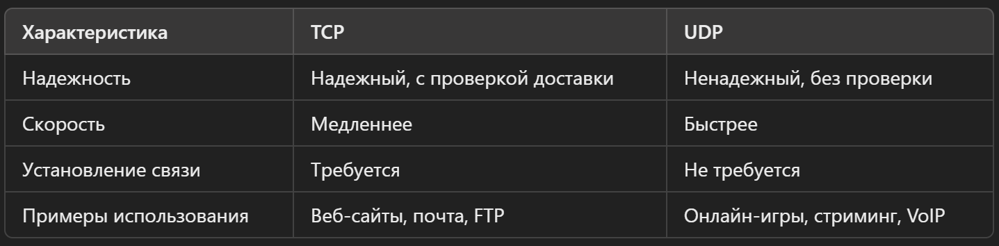
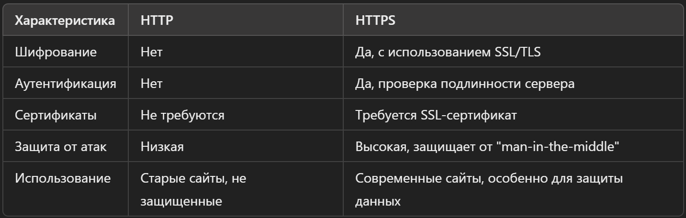
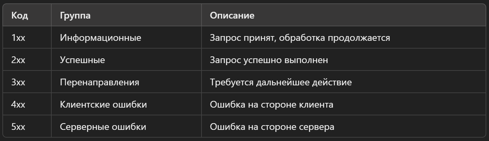
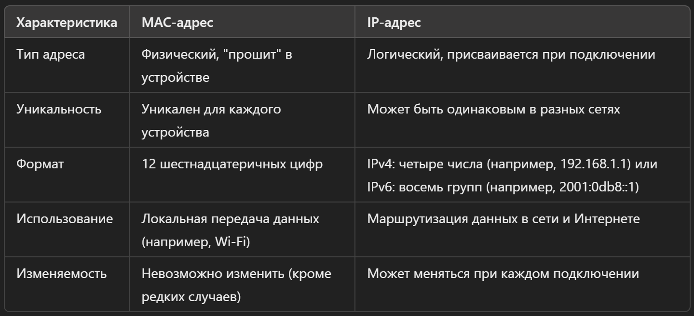
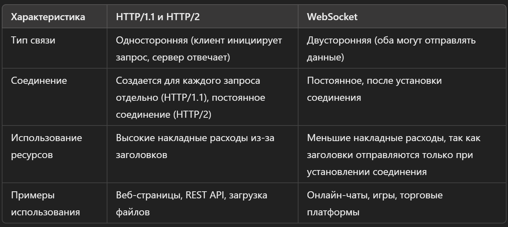
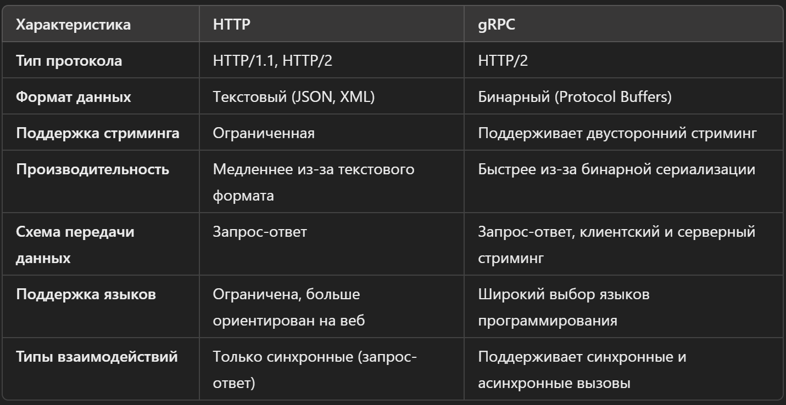

### <span style="color: lime">Какое различие между TCP и UDP-протоколами?</span>
**`TCP (Transmission Control Protocol)`** и **`UDP (User Datagram Protocol)`** — это два разных сетевых протокола, которые используются для передачи данных по сети. Основные различия между ними связаны с надежностью передачи данных, скоростью и способом установления связи.

#### Надежность передачи данных:
- **TCP** — это надежный протокол. Он гарантирует, что все данные, которые отправляются, дойдут до получателя в правильном порядке и без потерь. Если какой-то пакет данных потеряется по пути, TCP автоматически повторно отправит его. Это достигается за счет механизма подтверждений (acknowledgements) и повторной отправки (retransmissions).
- **UDP** — это ненадежный протокол. Он не проверяет, дошли ли данные до получателя, и не отправляет их повторно в случае потерь. Пакеты данных могут прийти не по порядку или не дойти вовсе, и протокол этого "не заметит".

#### Скорость передачи данных:
- **TCP** работает медленнее, чем UDP, потому что он должен устанавливать соединение и проверять, чтобы все данные были доставлены правильно. В TCP необходимо сначала установить "рукопожатие" (handshake) между отправителем и получателем, и только потом начинается передача данных.
- **UDP** работает быстрее, потому что он не тратит время на установление соединения и проверку доставки пакетов. Он просто отправляет данные и "забывает" о них. Это делает UDP более быстрым, но менее надежным.

#### Установление соединения:
- **TCP** — это протокол с установлением соединения (connection-oriented). Это значит, что перед передачей данных нужно сначала установить соединение между устройствами, и только после этого начинается передача. Это как телефонный звонок: перед тем как начать говорить, ты сначала соединяешься с другим абонентом.
- **UDP** — это протокол без установления соединения (connectionless). Он просто отправляет данные, не заботясь о том, готов ли их принять получатель. Это как отправка SMS-сообщений: ты просто отправляешь текст, и не ждешь подтверждения, что его прочитали.

#### Примеры использования:
- **TCP**: веб-сайты (HTTP/HTTPS), электронная почта (SMTP, IMAP), передача файлов (FTP), удаленные подключения (SSH).
- **UDP**: онлайн-игры, голосовые и видеозвонки (VoIP), стриминг видео (например, IPTV), протокол DNS (для быстрого запроса адресов).

#### Краткое сравнение:


### <span style="color: lime">Какое различие между HTTP и HTTPS-протоколами?</span>
**`HTTP (HyperText Transfer Protocol)`** и **`HTTPS (HyperText Transfer Protocol Secure)`** — это протоколы типа клиент-сервер, которые используются для передачи данных. Основное различие между ними заключается в уровне безопасности.

#### Шифрование данных:
- **HTTP** передает данные в открытом виде, без шифрования. Это значит, что информация, которую ты отправляешь на сайт (например, данные формы, пароли, личная информация), и данные, которые ты получаешь с сайта, могут быть перехвачены третьими лицами. Когда ты открываешь сайт по HTTP, все данные передаются в виде обычного текста, и любой, кто перехватит этот трафик, сможет прочитать его.
- **HTTPS** использует шифрование, чтобы защитить данные, передаваемые между браузером и сервером. Это значит, что даже если кто-то перехватит данные, они будут зашифрованы и не смогут быть прочитаны без специального ключа. HTTPS использует протокол `SSL (Secure Sockets Layer)` или его более современную версию `TLS (Transport Layer Security)` для создания безопасного канала связи.

#### Аутентификация и защита от подделки данных:
- **HTTP** не предоставляет механизмов для проверки подлинности данных и серверов. Это значит, что злоумышленник может подменить данные или выдать себя за легитимный веб-сайт.
- **HTTPS** обеспечивает аутентификацию. Сертификаты SSL/TLS, используемые HTTPS, позволяют удостовериться, что ты подключаешься именно к тому серверу, к которому собирался, а не к серверу злоумышленника. Это защищает от атак типа "man-in-the-middle" (когда кто-то пытается встать между тобой и сайтом, на который ты заходишь, и перехватить данные).

#### Использование сертификатов безопасности:
- **HTTP** не требует никаких сертификатов для работы, поэтому его можно использовать на любом сайте без дополнительных настроек безопасности.
- **HTTPS** требует наличия цифрового сертификата безопасности (SSL-сертификата). Этот сертификат подтверждает подлинность сайта и обеспечивает шифрование. Когда ты заходишь на сайт по HTTPS, браузер проверяет сертификат, чтобы удостовериться, что сайт безопасен. Если сертификат действителен, то браузер устанавливает защищенное соединение. Если сертификат отсутствует или неверен, браузер предупреждает пользователя о возможной угрозе.

#### Преимущества HTTPS:
- **Защищает конфиденциальность**: Данные зашифрованы, и их не могут прочитать третьи лица.
- **Гарантирует целостность данных**: Данные не могут быть изменены в процессе передачи без обнаружения.
- **Аутентифицирует сервер**: Убедись, что ты подключаешься к подлинному сайту, а не к мошенническому.

#### Примеры использования:
- **HTTP**: Раньше использовался для большинства веб-сайтов, особенно для информационных страниц, где не передавалась важная информация. Сейчас его все меньше применяют из-за проблем с безопасностью.
- **HTTPS**: В наши дни используется практически на всех веб-сайтах, особенно там, где требуется вводить личные данные, логины, пароли и прочую чувствительную информацию. Например, интернет-магазины, социальные сети, банковские системы и даже обычные сайты с информацией стараются переходить на HTTPS.

#### Краткое сравнение:


### <span style="color: lime">Какие группы status codes существуют в спецификации HTTP?</span>
Статус-коды HTTP делятся на несколько групп, каждая из которых имеет своё значение и помогает понять, что произошло с запросом. Эти коды состоят из трёх цифр, и первая цифра указывает на категорию. Всего существует **пять основных групп** статус-кодов.

#### Информационные (1xx)
- **Описание**: Эти коды информируют о том, что запрос был принят, и его обработка продолжается. Клиенту не нужно предпринимать никаких действий.
- **Примеры**:
    - **100 Continue**: Клиенту сообщается, что сервер получил начальную часть запроса, и он может продолжить его отправку.
    - **101 Switching Protocols**: Сервер принимает запрос на изменение протокола, например, переключение с HTTP на WebSocket.

#### Успешные (2xx)
- **Описание**: Эти коды говорят о том, что запрос был успешно обработан и выполнен.
- **Примеры**:
    - **200 OK**: Запрос выполнен успешно, и сервер возвращает нужные данные.
    - **201 Created**: Ресурс был успешно создан. Чаще всего используется с методами POST и PUT.
    - **204 No Content**: Запрос выполнен успешно, но сервер не возвращает никаких данных (например, после успешного удаления ресурса).

#### Перенаправления (3xx)
- **Описание**: Эти коды указывают на то, что ресурс был перемещён, и клиенту нужно предпринять дополнительные действия (например, перейти по новому URL).
- **Примеры**:
    - **301 Moved Permanently**: Ресурс был перемещён на постоянной основе, и все будущие запросы должны использовать новый URL.
    - **302 Found**: Ресурс временно доступен по другому URL, но клиент должен продолжать использовать оригинальный URL для будущих запросов.
    - **304 Not Modified**: Указывает на то, что данные не изменялись с момента последнего запроса. Это позволяет клиенту использовать кэшированную версию данных.

#### Клиентские ошибки (4xx)
- **Описание**: Эти коды говорят о том, что ошибка возникла по вине клиента (например, запрос неверный или неавторизованный).
- **Примеры**:
    - **400 Bad Request**: Сервер не может обработать запрос из-за ошибки клиента (например, неверный синтаксис).
    - **401 Unauthorized**: Для доступа к ресурсу требуется авторизация, но клиент не представил соответствующие данные.
    - **403 Forbidden**: Доступ к ресурсу запрещен, даже если клиент авторизован.
    - **404 Not Found**: Запрашиваемый ресурс не найден на сервере.

#### Серверные ошибки (5xx)
- **Описание**: Эти коды сообщают, что сервер столкнулся с проблемой при обработке запроса.
- **Примеры**:
    - **500 Internal Server Error**: Общая ошибка сервера, которая не была предвидена и говорит о внутренней проблеме.
    - **502 Bad Gateway**: Сервер, который работает как шлюз или прокси, получил неверный ответ от другого сервера.
    - **503 Service Unavailable**: Сервер временно не может обработать запрос из-за перегрузки или обслуживания.

#### Краткий обзор всех групп:


### <span style="color: lime">Что такое DNS?</span>
**`DNS (Domain Name System)`** — это система, которая переводит имена доменов (например, `example.com`) в IP-адреса (например, `192.0.2.1`). По сути, DNS — это как телефонная книга для Интернета, которая позволяет пользователям обращаться к веб-сайтам по удобным для запоминания именам, вместо того чтобы вводить сложные числовые IP-адреса.

#### Почему нужен DNS?:
Компьютеры и серверы общаются друг с другом с помощью IP-адресов. Однако для людей гораздо удобнее запоминать и вводить текстовые адреса (например, `www.google.com`), чем длинные числа (например, `142.250.64.78`). DNS решает эту проблему, выполняя роль переводчика между именами доменов и IP-адресами.

#### Как работает DNS?:
Когда ты вводишь адрес веб-сайта в браузере, происходит несколько шагов:
- **Запрос DNS**: Браузер сначала проверяет, есть ли у него уже сохраненный IP-адрес для указанного домена (это называется кэширование). Если адрес найден, то запрос к DNS-серверу не нужен, и браузер сразу подключается к сайту.
- **Поиск в локальном DNS-кэше**: Если адреса нет в кэше, запрос отправляется на DNS-сервер, который обычно предоставляется твоим интернет-провайдером.
- **Обращение к DNS-серверам**: Если и тут нет нужного ответа, запрос передается другим DNS-серверам. Эти серверы могут обращаться друг к другу, пока не найдут нужный IP-адрес.
- **Преобразование имени в IP-адрес**: Как только нужный IP-адрес найден, он отправляется обратно в браузер, который уже использует его для подключения к серверу и загрузки веб-сайта.

#### Основные компоненты DNS:
- **DNS-серверы**: Это серверы, которые хранят информацию о том, какие IP-адреса соответствуют каким доменным именам. Есть несколько типов DNS-серверов:
	- **Резолверы (Resolvers)**: Первые серверы, к которым обращается запрос. Они ищут нужный IP-адрес, обращаясь к другим серверам, если сами не знают ответа.
	- **Корневые серверы (Root Servers)**: Начальный уровень в иерархии DNS. Они направляют запросы к серверам, отвечающим за доменные зоны верхнего уровня (например, `.com`, `.org`, `.net`).
	- **Серверы доменных зон верхнего уровня (Top-Level Domain Servers, TLD)**: Эти серверы отвечают за домены верхнего уровня, такие как `.com`, `.ru`, `.org`, и направляют запросы к более точным серверам.
	- **Авторитетные DNS-серверы (Authoritative DNS Servers)**: Эти серверы содержат окончательные данные о том, какой IP-адрес соответствует какому домену. Именно они дают окончательный ответ на запрос.
- **DNS-записи (DNS Records)**: Это записи, которые хранятся на DNS-серверах и содержат информацию о доменах. Существует несколько типов записей:
	- - **A-запись (Address Record)**: Сопоставляет доменное имя с IPv4-адресом.
	- **AAAA-запись**: Сопоставляет доменное имя с IPv6-адресом.
	- **CNAME-запись (Canonical Name Record)**: Перенаправляет один домен на другой.
	- **MX-запись (Mail Exchange Record)**: Указывает серверы, которые принимают почту для домена.

#### Преимущества и важность DNS:
- **Удобство**: Людям гораздо проще запоминать и вводить текстовые домены, чем цифровые IP-адреса.
- **Гибкость**: Сайты могут менять свои IP-адреса, но при этом пользователям не нужно ничего знать об этом. Достаточно изменить DNS-запись, и домен будет работать с новым адресом.
- **Масштабируемость**: Система DNS организована иерархически, что позволяет легко обслуживать огромное количество доменов по всему миру.

### <span style="color: lime">Что такое Proxy?</span>
**`Прокси-сервер (Proxy)`** — это промежуточный сервер, который находится между пользователем и целевым сервером (например, веб-сайтом). Когда ты подключаешься к интернету через прокси, он принимает твой запрос, перенаправляет его к нужному серверу и возвращает ответ обратно. Таким образом, ты не соединяешься напрямую с веб-сайтом, а взаимодействуешь через прокси.

#### Зачем нужен прокси-сервер?:
- **Анонимность и защита приватности**: Прокси скрывает твой реальный IP-адрес, заменяя его своим. Это позволяет скрыть местоположение и личные данные пользователя, что делает интернет-серфинг более анонимным.
- **Кэширование и ускорение доступа**: Прокси-серверы могут сохранять (кэшировать) часто запрашиваемые данные, чтобы при повторных обращениях загружать их быстрее. Это уменьшает нагрузку на интернет-канал и ускоряет доступ к популярным ресурсам.
- **Контроль доступа и фильтрация контента**: Прокси может использоваться для ограничения доступа к определенным веб-сайтам (например, в офисах или учебных заведениях). Это позволяет администратору сети блокировать нежелательные сайты, следить за активностью пользователей и контролировать использование интернета.
- **Обход географических ограничений**: Некоторые веб-сайты или сервисы ограничены для пользователей из определенных стран. Используя прокси-сервер в другой стране, можно обойти эти блокировки и получить доступ к нужному контенту.

#### Типы прокси-серверов:
- **HTTP-прокси**: Эти прокси работают с HTTP-трафиком и чаще всего используются для доступа к веб-сайтам. Они могут фильтровать, кэшировать и даже модифицировать HTTP-запросы и ответы.
- **HTTPS-прокси**: Поддерживают шифрованный трафик HTTPS. Они помогают защитить данные при передаче через интернет, поскольку шифруют запросы, чтобы сохранить конфиденциальность информации.
- **SOCKS-прокси**: Универсальные прокси, которые работают на более низком уровне и могут обрабатывать не только HTTP/HTTPS-трафик, но и другие протоколы, такие как FTP (передача файлов), SMTP (электронная почта), и даже игры. SOCKS-прокси не кэшируют данные и могут работать с более широким спектром приложений.
- **Реверсные прокси (Reverse Proxy)**: Обычно используются для защиты и ускорения работы серверов. В отличие от обычных прокси, которые работают для клиентов, реверсные прокси принимают запросы от интернета и перенаправляют их к серверам внутри сети. Это помогает распределять нагрузку, ускорять обработку запросов и защищать серверы от атак.

#### Преимущества использования прокси:
- **Анонимность**: Прокси скрывает реальный IP-адрес пользователя, что делает его действия в интернете менее отслеживаемыми.
- **Скорость и кэширование**: Прокси-серверы могут сохранять копии веб-страниц, чтобы быстрее предоставлять их при повторных запросах. Это особенно полезно для популярных сайтов и в корпоративных сетях.
- **Управление доступом**: Прокси можно настроить так, чтобы ограничить доступ к определенным сайтам или сервисам. Например, в офисе можно заблокировать социальные сети или сайты с вредоносным контентом.
- **Обход блокировок**: Если какой-то ресурс заблокирован в твоей стране, использование прокси в другой стране может помочь обойти эти ограничения.

#### Недостатки прокси-серверов:
- **Замедление соединения**: Иногда использование прокси может замедлить интернет-соединение, особенно если сервер перегружен или находится далеко.
- **Проблемы с конфиденциальностью**: Не все прокси безопасны. Злоумышленники могут использовать прокси-серверы для перехвата данных, особенно если прокси ненадежный или бесплатный. Важно использовать проверенные и защищенные прокси, особенно для передачи конфиденциальных данных.
- **Ограниченная совместимость**: Некоторые прокси могут не поддерживать все типы трафика, и это может вызывать проблемы с подключением к определенным сервисам.

### <span style="color: lime">Что означает Mac-адрес и IP-адрес устройства?</span>
**`MAC-адрес`** и **`IP-адрес`** — это два разных типа адресов, которые используются для идентификации устройств в сети.

#### MAC-адрес
**MAC (Media Access Control) адрес** — это уникальный физический адрес, который присваивается сетевому оборудованию при его производстве. Каждый сетевой интерфейс (например, Wi-Fi-адаптер или сетевая карта компьютера) имеет свой собственный MAC-адрес.

Характеристики MAC-адреса:
- **Физический адрес**: Это "жестко закодированный" адрес, который "прошит" в сетевом устройстве (например, в сетевой карте или модуле Wi-Fi) на заводе-изготовителе.
- **Уникальность**: Каждое устройство имеет свой уникальный MAC-адрес, поэтому вероятность совпадения адресов на разных устройствах крайне мала.
- **Формат**: MAC-адрес состоит из 12 шестнадцатеричных цифр (от 0 до 9 и от A до F) и обычно записывается в виде шести пар, разделенных двоеточиями или тире. Пример: `00:1A:2B:3C:4D:5E`.
- **Использование на уровне канала**: MAC-адреса работают на уровне канала данных (Data Link Layer) сетевой модели OSI. Это значит, что MAC-адрес используется для передачи данных в локальных сетях (например, в сети Wi-Fi или Ethernet).

Пример использования:
- Когда компьютер подключается к Wi-Fi, маршрутизатор использует MAC-адрес для идентификации устройства и отправки данных именно ему, а не другим устройствам в сети.

#### IP-адрес
**IP (Internet Protocol) адрес** — это логический адрес, который используется для идентификации устройства в сети (например, в Интернете). В отличие от MAC-адреса, IP-адрес может изменяться в зависимости от того, к какой сети подключено устройство.

Характеристики IP-адреса:
- **Логический адрес**: Это адрес, который присваивается устройству, когда оно подключается к сети. IP-адрес можно менять, в отличие от MAC-адреса.
- Два типа IP-адресов:
	- **IPv4**: Адрес состоит из четырех чисел, разделенных точками, например, `192.168.1.1`. Каждое число может быть в диапазоне от 0 до 255.
	- **IPv6**: Адрес состоит из восьми групп по четыре шестнадцатеричные цифры, разделенные двоеточиями, например, `2001:0db8:85a3:0000:0000:8a2e:0370:7334`. IPv6 используется, чтобы преодолеть ограничение количества доступных IPv4-адресов.
- **Использование на сетевом уровне**: IP-адреса работают на сетевом уровне (Network Layer) модели OSI. Это означает, что IP-адреса используются для маршрутизации данных между устройствами в разных сетях, включая Интернет.
- Динамические и статические IP-адреса:
	- **Динамический IP-адрес**: Большинство устройств получают временные IP-адреса от маршрутизатора (или интернет-провайдера) при подключении. Это называется динамическим IP-адресом, потому что он может изменяться при каждом новом подключении к сети.
	- **Статический IP-адрес**: Это постоянный IP-адрес, который остается неизменным. Чаще всего его используют для серверов и устройств, которые должны быть доступны по одному и тому же адресу.

Пример использования:
- Когда ты вводишь URL-адрес в браузере, запрос отправляется на веб-сайт через Интернет с использованием IP-адреса сервера. IP-адрес позволяет найти путь к серверу и передать данные от него к твоему устройству.

#### Различие между MAC-адресом и IP-адресом:


### <span style="color: lime">В чем разница между HTTP/1.1 и HTTP/2?</span>
**`HTTP/1.1 и HTTP/2`** — это версии протокола HTTP, которые используются для передачи данных между клиентами (например, браузерами) и серверами в Интернете. Хотя обе версии выполняют одну и ту же основную задачу, они отличаются в том, как именно передают данные, и HTTP/2 был разработан для решения некоторых проблем и ограничений HTTP/1.1.

#### Мультиплексирование (Multiplexing)
- **HTTP/1.1**: В HTTP/1.1 для каждого запроса создается отдельное соединение. Это означает, что если браузер отправляет несколько запросов на один и тот же сервер, он должен открыть несколько TCP-соединений. Этот подход создавал проблемы, так как каждое новое соединение замедляет работу (задержка, перегрузка).
- **HTTP/2**: Главным улучшением HTTP/2 стало внедрение мультиплексирования, которое позволяет отправлять несколько запросов и получать несколько ответов по одному и тому же соединению одновременно. Это устраняет проблему "блокировки заголовка" (head-of-line blocking) и значительно ускоряет загрузку страниц.

#### Сжатие заголовков (Header Compression)
- **HTTP/1.1**: Заголовки каждого HTTP-запроса передаются в незжатом виде. Если страница содержит несколько одинаковых запросов, они каждый раз содержат одинаковые заголовки (например, cookie), что приводит к излишнему использованию трафика.
- **HTTP/2**: В HTTP/2 используется алгоритм сжатия заголовков (HPACK), который уменьшает размер передаваемых данных. Он позволяет кодировать повторяющиеся заголовки и отправлять только изменившиеся части, что снижает общий объем трафика и улучшает производительность.

#### Серверное инициирование (Server Push)
- **HTTP/1.1**: Сервер не может отправлять данные на клиент до тех пор, пока не получит от него конкретный запрос. Это значит, что, например, страница сначала загружается, а потом запрашиваются стили и скрипты, которые нужны для её отображения.
- **HTTP/2**: HTTP/2 поддерживает **серверное инициирование (server push)**, что позволяет серверу отправлять дополнительные данные клиенту еще до того, как он их запросит. Например, если пользователь запрашивает HTML-страницу, сервер может сразу же отправить связанные стили и скрипты, зная, что они понадобятся. Это уменьшает задержки и ускоряет загрузку.

#### Бинарный протокол (Binary Protocol)
- **HTTP/1.1**: Использует текстовый формат, что делает его более удобным для чтения человеком, но менее эффективным для передачи данных.
- **HTTP/2**: Перешел на бинарный формат. Это означает, что данные передаются в виде бинарных потоков, что позволяет быстрее обрабатывать и интерпретировать их. Бинарные данные проще анализировать и обрабатывать на уровне протокола, что ускоряет работу.

#### Примеры и преимущества на практике
Представим ситуацию: ты заходишь на страницу, которая загружает много картинок, стилей и скриптов.
- **HTTP/1.1**: Браузер откроет несколько соединений с сервером, чтобы загружать все элементы параллельно, что увеличивает нагрузку и вызывает задержки.
- **HTTP/2**: Браузер установит одно соединение с сервером и передаст все запросы через это одно соединение одновременно. Сервер может сразу отправить необходимые стили и скрипты через server push, что сократит время загрузки.

### <span style="color: lime">Принципы REST</span>
**`REST (Representational State Transfer)`** — это архитектурный стиль для создания веб-сервисов, который определяет принципы взаимодействия между клиентом и сервером через HTTP. REST основывается на простоте и гибкости, и такие сервисы называют **RESTful API**. Давай разберем основные принципы, которые делают сервисы RESTful.

#### Клиент-серверная архитектура (Client-Server Architecture)
В REST клиент и сервер четко разделены:
- **Клиент** отвечает за пользовательский интерфейс и отправляет запросы к серверу.
- **Сервер** обрабатывает запросы и возвращает нужные данные. Это позволяет клиенту и серверу развиваться независимо друг от друга. Например, можно обновить сервер, не меняя код клиента, и наоборот.

#### Отсутствие состояния (Statelessness)
Каждый запрос от клиента к серверу должен быть **самодостаточным** и содержать всю информацию, необходимую для его обработки. Это значит, что сервер не хранит состояние сессии между запросами.
- Пример: Если клиент делает несколько запросов, сервер не "помнит" предыдущие запросы. Каждый запрос содержит все нужные данные, такие как авторизационные токены и параметры.
- **Преимущество**: Такая система масштабируется проще, так как сервер не должен хранить данные о состоянии множества клиентов одновременно.

#### Единообразие интерфейса (Uniform Interface)
Этот принцип определяет стандарты взаимодействия между клиентом и сервером. Основные составляющие:
- **Идентификация ресурсов**: Каждый ресурс (например, пользователь, заказ, товар) имеет свой уникальный URL. Например, `https://api.example.com/users/123` может быть URL-адресом конкретного пользователя.
- **Манипуляция ресурсами через представление**: Клиент может работать с ресурсами, используя их представления, которые передаются в виде JSON, XML или другого формата.
- **Самоописывающиеся сообщения**: Запросы должны содержать всю необходимую информацию. Например, если нужно создать нового пользователя, клиент отправляет JSON с данными этого пользователя, и сервер сразу понимает, что нужно сделать.
- **Гипермедиа как движок приложения (HATEOAS)**: Ответы сервера могут содержать ссылки на другие связанные ресурсы, что позволяет клиенту динамически исследовать возможности API.

#### Разделение клиентской и серверной функциональности (Layered System)
REST позволяет использовать многослойную архитектуру:
- Клиент может не знать, общается ли он напрямую с сервером или через промежуточные серверы, такие как прокси или балансировщики нагрузки.
- Это упрощает внедрение кэширования, маршрутизации и других компонентов, что повышает масштабируемость и безопасность системы.

#### Кэширование (Caching)
REST поддерживает кэширование ответов на уровне клиента и сервера. Это означает, что сервер может указать, какие ответы могут быть закэшированы и на какой срок:
- **Преимущество**: Кэширование позволяет уменьшить нагрузку на сервер и сократить время отклика, так как клиент может использовать закэшированные данные, не отправляя запрос на сервер повторно.
- **Контроль кэширования**: Сервер может управлять кэшированием с помощью заголовков, таких как `Cache-Control` и `Expires`.

#### Использование стандартных методов HTTP (HTTP Verbs)
RESTful API активно используют методы HTTP, которые задают действия, которые нужно выполнить с ресурсами:
- **GET**: Получить информацию о ресурсе (например, получить данные пользователя).
- **POST**: Создать новый ресурс (например, создать нового пользователя).
- **PUT**: Обновить существующий ресурс (например, обновить данные пользователя).
- **PATCH**: Частично обновить ресурс (например, обновить только имя пользователя).
- **DELETE**: Удалить ресурс (например, удалить пользователя).

#### Примеры RESTful взаимодействий
- **Получить список пользователей**: `GET https://api.example.com/users`
- **Создать нового пользователя**: `POST https://api.example.com/users` (с телом запроса, содержащим данные нового пользователя)
- **Обновить данные конкретного пользователя**: `PUT https://api.example.com/users/123`
- **Удалить пользователя**: `DELETE https://api.example.com/users/123`

### <span style="color: lime">Зачем необходим OPTIONS?</span>
Метод **`OPTIONS`** в HTTP используется для определения возможностей сервера или ресурса и для проверки поддерживаемых сервером методов перед тем, как отправить основной запрос. Это помогает клиенту понять, какие действия разрешены с конкретным ресурсом и какие заголовки могут быть отправлены или приняты.

#### Что делает метод OPTIONS?
- **Проверка поддерживаемых методов**: Когда клиент отправляет запрос с методом OPTIONS, сервер отвечает и сообщает, какие HTTP-методы (например, GET, POST, PUT, DELETE и другие) можно использовать с данным ресурсом. Это позволяет клиенту определить, поддерживается ли необходимый ему метод, прежде чем отправлять полноценный запрос.
- **Узнать информацию о CORS (Cross-Origin Resource Sharing)**: Важной функцией OPTIONS является проверка кросс-доменных запросов. Когда веб-приложение пытается сделать запрос к ресурсу на другом домене, браузер отправляет предварительный запрос (preflight request) методом OPTIONS для проверки, разрешено ли это. Сервер отвечает, предоставляя информацию о допустимых источниках и заголовках, которые могут быть использованы.

#### Когда используется OPTIONS?
- **Проверка кросс-доменных запросов (CORS)**: Если веб-приложение пытается сделать запрос к серверу, находящемуся на другом домене, браузер автоматически отправляет предварительный запрос методом OPTIONS, чтобы проверить, разрешено ли это взаимодействие. Если сервер разрешает кросс-доменный доступ, он возвращает заголовки с нужной информацией, и тогда браузер выполняет основной запрос.
- **Проверка доступных методов**: Иногда клиент может захотеть узнать, какие методы поддерживаются для определенного ресурса. Например, клиент может сделать запрос методом OPTIONS к серверу, чтобы узнать, можно ли использовать PUT или DELETE с данным ресурсом.

#### Пример использования OPTIONS
Запрос методом OPTIONS:
```http
OPTIONS /api/data HTTP/1.1
Host: example.com
```

Ответ от сервера:
```http
HTTP/1.1 204 No Content
Allow: GET, POST, PUT, DELETE
Access-Control-Allow-Origin: *
Access-Control-Allow-Methods: GET, POST, PUT, DELETE
```

В ответе сервер сообщает клиенту, что можно использовать методы **GET, POST, PUT и DELETE**. Также видны заголовки **Access-Control-Allow-Methods** и **Access-Control-Allow-Origin**, которые указывают, что разрешен кросс-доменный доступ.

#### Как работает OPTIONS при CORS
Когда веб-приложение пытается отправить запрос на другой домен, браузер сначала проверяет, безопасен ли этот запрос, отправляя предварительный запрос с методом OPTIONS.
- Если сервер возвращает положительный ответ с нужными заголовками, основной запрос отправляется.
- Если сервер не разрешает кросс-доменный доступ, браузер блокирует основной запрос.

Пример предварительного запроса:
```http
OPTIONS https://api.example.com/data HTTP/1.1
Origin: https://mywebsite.com
Access-Control-Request-Method: POST
Access-Control-Request-Headers: Content-Type
```

Пример ответа сервера:
```http
HTTP/1.1 200 OK
Access-Control-Allow-Origin: https://mywebsite.com
Access-Control-Allow-Methods: GET, POST, PUT
Access-Control-Allow-Headers: Content-Type
```

#### Заключение
Метод **OPTIONS** служит важным инструментом для определения того, как и с какими методами можно взаимодействовать с ресурсом на сервере. Он помогает избежать ошибок и конфликтов при отправке запросов и обеспечивает безопасность и правильное выполнение кросс-доменных запросов через механизм CORS. Использование OPTIONS позволяет клиентам заранее проверить возможности сервера, не отправляя ненужные запросы, что может сэкономить ресурсы и время.

### <span style="color: lime">Различие между POST, PUT и PATCH</span>
**`POST`**, **`PUT`**, и **`PATCH`** — это методы HTTP, которые используются для отправки данных на сервер, но у них разные задачи и способы работы.

#### POST
- **Назначение**: Метод **POST** используется для **создания** новых ресурсов на сервере. Он позволяет отправлять данные, которые сервер должен обработать и использовать для создания нового ресурса.
- **Идeмпотентность**: **Нет**. Каждый раз, когда вы отправляете POST-запрос, создается новый ресурс. Повторение того же запроса несколько раз приведет к созданию нескольких экземпляров одного ресурса.
- **Использование**:
    - Отправка данных формы на сервер.
    - Создание новых записей в базе данных.
    - Отправка файлов или других данных для обработки сервером.

#### PUT
- **Назначение**: Метод **PUT** используется для **обновления** существующего ресурса или **создания** ресурса, если он не существует. Если ресурс с данным идентификатором (например, URL) уже есть, PUT заменяет его новыми данными. Если ресурса нет, он может быть создан с указанными данными.
- **Идempotentность**: **Да**. Это означает, что повторение одного и того же PUT-запроса несколько раз не приведет к созданию множества ресурсов. Вместо этого он будет каждый раз обновлять один и тот же ресурс.
- **Использование**:
    - Полное обновление ресурса, при котором нужно заменить все его поля новыми данными.
    - В некоторых случаях — создание ресурса, если он отсутствует.

#### PATCH
- **Назначение**: Метод **PATCH** используется для **частичного обновления** существующего ресурса. В отличие от PUT, который заменяет все данные, PATCH изменяет только указанные поля, оставляя остальные без изменений.
- **Идempotentность**: **Зависит от реализации**. Повторение одного и того же PATCH-запроса может привести к одному и тому же результату, но это не гарантировано, так как все зависит от того, как сервер обрабатывает изменения.
- **Использование**:
    - Частичное обновление ресурса, при котором изменяются только конкретные поля.
    - Например, если нужно изменить только адрес электронной почты пользователя, можно отправить PATCH-запрос только с этим полем.

#### Ключевые различия


#### Когда использовать каждый метод
- **POST**: Используйте, когда нужно создать новый ресурс или отправить данные на сервер для обработки. Например, регистрация нового пользователя.
- **PUT**: Используйте, когда нужно заменить весь ресурс или создать новый, если он отсутствует. Например, обновление всех данных профиля пользователя.
- **PATCH**: Используйте, когда нужно изменить только некоторые поля существующего ресурса. Например, изменение только адреса электронной почты или имени пользователя.

### <span style="color: lime">Что такое WebSocket-протокол?</span>
**`WebSocket`** — это протокол, который позволяет устанавливать постоянное двустороннее соединение между клиентом (например, веб-браузером) и сервером. В отличие от традиционного HTTP, который работает по принципу запрос-ответ, WebSocket поддерживает постоянное соединение, которое позволяет обмениваться данными в обоих направлениях в реальном времени.

#### Как работает WebSocket?
- **Установка соединения**: WebSocket начинается с HTTP-запроса. Когда клиент хочет установить WebSocket-соединение, он отправляет специальный **"рукопожатие" (handshake)** HTTP-запрос на сервер. Если сервер поддерживает WebSocket и может установить соединение, он отправляет подтверждение, и соединение переключается с HTTP на WebSocket.
- **Постоянное соединение**: После установки соединения оно остается открытым, что позволяет клиенту и серверу обмениваться данными без необходимости повторного установления соединения каждый раз.
- **Двусторонняя связь**: WebSocket позволяет отправлять данные в обоих направлениях — как от клиента к серверу, так и от сервера к клиенту. Это называется **"full-duplex"** связью, что означает, что оба могут общаться одновременно.
- **Низкие накладные расходы**: WebSocket значительно снижает объем данных, передаваемых при каждом сообщении, потому что не требует отправки полного HTTP-заголовка для каждого сообщения, как это делается при использовании обычных HTTP-запросов.

#### Преимущества WebSocket
- **Реальное время**: Одним из главных преимуществ WebSocket является возможность передачи данных в реальном времени. Это делает протокол идеальным для приложений, где нужно оперативно обмениваться данными, таких как чаты, онлайн-игры, торговые платформы и системы мониторинга.
- **Постоянное соединение**: Вместо того чтобы устанавливать новое соединение для каждого запроса, WebSocket позволяет открыть одно соединение и использовать его для передачи данных сколько угодно раз. Это снижает задержки и улучшает производительность.
- **Меньшие накладные расходы**: После установления соединения WebSocket сообщения имеют меньше накладных расходов, чем традиционные HTTP-запросы, так как нет необходимости отправлять HTTP-заголовки для каждого сообщения.

#### Использование WebSocket
WebSocket часто используется в случаях, когда нужно организовать **"push"** сообщения от сервера к клиенту. Например:
- **Онлайн-чаты**: WebSocket позволяет мгновенно отправлять и получать сообщения, что обеспечивает беспрерывный обмен сообщениями в реальном времени.
- **Онлайн-игры**: WebSocket может использоваться для быстрой синхронизации между игроками, обеспечивая минимальные задержки.
- **Торговые платформы**: WebSocket обеспечивает мгновенное обновление курсов валют, акций и других данных, что критически важно для трейдеров.
- **Системы мониторинга**: Позволяет мгновенно передавать обновленные данные о состоянии систем (например, данные с датчиков).

#### Чем WebSocket отличается от HTTP и HTTP/2



### <span style="color: lime">Что такое CDN?</span>
**`CDN (Content Delivery Network)`** — это сеть распределенных серверов, которые работают вместе для доставки контента (веб-страниц, изображений, видео и других файлов) пользователям по всему миру с высокой скоростью и минимальной задержкой. Цель CDN — сделать доступ к контенту максимально быстрым, надежным и безопасным, вне зависимости от того, где находится пользователь.

#### Как работает CDN
Когда пользователь запрашивает ресурс (например, видео или изображение) с веб-сайта, CDN перенаправляет этот запрос к ближайшему серверу в своей сети, который содержит копию этого ресурса. Это помогает избежать длинных маршрутов передачи данных и снижает задержки.

Пример:
- Представим, что веб-сайт находится на сервере в США, а пользователь из Японии хочет получить доступ к нему. Без CDN данные должны передаваться через весь мир, что занимает больше времени.
- С CDN ресурс будет храниться на сервере, который физически ближе к Японии, например, в Сингапуре или Токио. Пользователь подключается к ближайшему серверу, и контент загружается быстрее.

#### Основные функции CDN
- **Кэширование контента**: CDN кэширует (сохраняет) копии контента на нескольких серверах, которые размещены в разных частях мира. Когда пользователь запрашивает контент, он получает его с ближайшего сервера CDN, а не с основного сервера веб-сайта.
- **Балансировка нагрузки**: CDN помогает распределить нагрузку между серверами, чтобы ни один сервер не был перегружен. Это особенно важно при резких всплесках трафика (например, когда выходит новый популярный видеоролик или проводится онлайн-трансляция).
- **Повышение скорости загрузки**: Поскольку CDN доставляет контент с ближайшего сервера, данные преодолевают меньшее расстояние, что сокращает время отклика и улучшает скорость загрузки.
- **Защита от атак**: CDN может защищать веб-сайты от DDoS-атак (распределенных атак типа "отказ в обслуживании"), потому что распределенная сеть серверов помогает снизить нагрузку и блокировать подозрительный трафик.

#### Преимущества использования CDN
- **Ускорение доставки контента**: За счет кэширования данных на серверах, которые ближе к пользователям, CDN значительно сокращает время загрузки страниц.
- **Снижение задержек (latency)**: Когда пользователь запрашивает контент, данные проходят через меньшее количество маршрутов, что уменьшает задержки.
- **Масштабируемость**: CDN позволяет справляться с большими объемами трафика, так как нагрузка распределяется по нескольким серверам.
- **Повышение надежности**: Даже если один сервер выходит из строя, запросы могут быть перенаправлены на другой сервер в сети, что обеспечивает бесперебойную работу сайта.
- **Снижение нагрузки на основной сервер**: Благодаря кэшированию запросы не доходят до основного сервера, что позволяет ему работать более стабильно и быстрее обрабатывать другие задачи.

#### Типы контента, передаваемого через CDN
- **Статический контент**: Картинки, CSS и JavaScript-файлы, документы, аудио и видеофайлы. Статический контент обычно не изменяется часто, поэтому его можно легко кэшировать и распространять через CDN.
- **Динамический контент**: Хотя основной фокус CDN на статическом контенте, некоторые продвинутые CDN поддерживают и динамический контент (например, персонализированные страницы или данные с частыми изменениями), помогая ускорить его передачу с помощью технологий маршрутизации и сжатия данных.

#### Популярные примеры CDN
- **Cloudflare**: Одна из крупнейших CDN в мире, которая также предлагает услуги защиты от DDoS-атак и оптимизации сайтов.
- **Akamai**: Один из первых и крупнейших провайдеров CDN, широко используемый для трансляций и доставки медиа.
- **Amazon CloudFront**: CDN от Amazon, интегрированный с другими сервисами AWS, что позволяет легко настраивать и управлять им.
- **Fastly**: Высокопроизводительная CDN, популярная среди крупных компаний и сайтов.

### <span style="color: lime">Описать уровни модели OSI</span>
Модель **OSI (Open Systems Interconnection)** — это концептуальная модель, которая описывает, как данные передаются по сети между разными системами. Она состоит из **семи уровней**, где каждый уровень выполняет определенные задачи и взаимодействует с соседними уровнями. Эта модель помогает стандартизировать и структурировать сетевые взаимодействия. Уровни модели OSI (снизу вверх).

#### Физический уровень (Physical Layer)
- **Функция**: Отвечает за физическую передачу данных по сети, то есть за электрические, оптические и радиосигналы. Это самый низкий уровень модели OSI.
- **Задачи**:
	- Определение характеристик кабелей, разъемов, частот и сигналов.
	- Преобразование цифровых данных в сигналы и обратно.
	- Контроль физического подключения устройств к сети.
- **Примеры устройств**: Кабели, сетевые адаптеры, концентраторы (hubs).

#### Канальный уровень (Data Link Layer)
- **Функция**: Обеспечивает надежную передачу данных между двумя узлами, подключенными к одному физическому каналу. Управляет доступом к физическому каналу и исправляет ошибки, возникшие на физическом уровне.
- **Задачи**:
    - Формирование кадров (frames) для передачи данных.
    - Управление доступом к физической среде (кто и когда передает данные).
    - Обнаружение и исправление ошибок на уровне кадров.
- **Примеры устройств**: Коммутаторы (switches), мосты (bridges).
- **Примеры протоколов**: Ethernet, Wi-Fi, PPP.

#### Сетевой уровень (Network Layer)
- **Функция**: Отвечает за маршрутизацию данных между разными сетями и определение наилучшего пути для их передачи.
- **Задачи**:
    - Логическая адресация (например, IP-адреса).
    - Маршрутизация пакетов данных (определение пути, по которому они будут передаваться).
    - Фрагментация и сборка пакетов (разделение данных на небольшие части и их сборка на получающем узле).
- **Примеры устройств**: Маршрутизаторы (routers).
- **Примеры протоколов**: IP (Internet Protocol), ICMP.

#### Транспортный уровень (Transport Layer)
- **Функция**: Обеспечивает надежную передачу данных между узлами, контролирует целостность и последовательность данных.
- **Задачи**:
    - Управление потоками данных (разделение на сегменты и их объединение).
    - Контроль ошибок и повторная передача при необходимости.
    - Управление соединениями (установка, поддержание и завершение соединений).
- **Примеры протоколов**: TCP (Transmission Control Protocol), UDP (User Datagram Protocol).

#### Сеансовый уровень (Session Layer)
- **Функция**: Управляет сеансами связи, устанавливает, поддерживает и завершает соединения между приложениями.
- **Задачи**:
    - Создание, поддержка и завершение сеансов связи (сеанс — это период взаимодействия между приложениями).
    - Управление синхронизацией и восстановление сессий после прерывания.
- **Примеры протоколов**: PPTP (Point-to-Point Tunneling Protocol), SMB (Server Message Block).

#### Уровень представления (Presentation Layer)
- **Функция**: Отвечает за преобразование данных в формат, который может быть понятен приложению. Это включает кодирование, шифрование и сжатие данных.
- **Задачи**:
    - Кодирование и декодирование данных (например, преобразование текстовых данных в ASCII).
    - Шифрование данных для обеспечения безопасности.
    - Сжатие данных для уменьшения размера передаваемых файлов.
- **Примеры форматов данных**: JPEG, GIF, MP3, HTML.

#### Прикладной уровень (Application Layer)
- **Функция**: Обеспечивает интерфейс между пользователем и сетью, предоставляет приложениям доступ к сетевым сервисам.
- **Задачи**:
    - Определение сетевых сервисов, которые могут использовать приложения (например, отправка электронной почты, загрузка веб-страниц).
    - Поддержка работы с данными, необходимых для приложений.
- **Примеры протоколов**: HTTP, FTP, SMTP, DNS.

#### Пример взаимодействия между уровнями
Когда пользователь отправляет сообщение через веб-браузер:
- **Прикладной уровень** (7) формирует запрос HTTP.
- **Уровень представления** (6) может сжать или зашифровать данные.
- **Сеансовый уровень** (5) устанавливает сессию между клиентом и сервером.
- **Транспортный уровень** (4) разбивает данные на сегменты и отправляет их.
- **Сетевой уровень** (3) определяет маршрут и отправляет пакеты.
- **Канальный уровень** (2) преобразует пакеты в кадры и отправляет их по сети.
- **Физический уровень** (1) передает сигналы через кабели или радиоволны.

### <span style="color: lime">Разница между gRPC и HTTP.</span>
#### HTTP
- **HTTP (HyperText Transfer Protocol)** — это протокол, используемый для передачи данных в Интернете. Он работает по принципу "запрос-ответ" и позволяет клиенту (например, веб-браузеру) отправлять запросы серверу и получать ответы.
- Особенности:
	- **Односторонняя связь**: Клиент отправляет запрос, сервер отвечает.
	- **Текстовый формат данных**: Передача данных обычно происходит в виде текстовых сообщений, таких как HTML, JSON или XML. Это удобно для чтения и отладки, но может увеличивать объем передаваемых данных.
	- **Браузерный протокол**: HTTP изначально разработан для работы с веб-страницами и взаимодействия браузеров с серверами.

#### gRPC
- **gRPC (Google Remote Procedure Call)** — это современный протокол удаленного вызова процедур, который позволяет клиенту и серверу общаться напрямую. gRPC основан на **HTTP/2** и использует **Protocol Buffers (protobuf)** для сериализации данных, что делает его более эффективным по сравнению с традиционным HTTP.
- Особенности:
	- **Двусторонняя связь**: Поддерживает как запрос-ответ, так и постоянное соединение (стриминг данных), что позволяет передавать данные в обоих направлениях.
	- **Бинарный формат данных**: Использует protobuf, который сжимает данные в бинарный формат, что делает передачу данных быстрее и экономит пропускную способность.
	- **Поддержка нескольких языков**: gRPC может быть использован для создания сервисов на разных языках программирования (например, Python, Java, Go, C++).

#### Ключевые различия между gRPC и HTTP


#### Как работает HTTP
- Клиент отправляет HTTP-запрос на сервер (например, запрос на получение веб-страницы).
- Сервер обрабатывает запрос и возвращает ответ с данными.
- После получения ответа соединение может быть закрыто.
- **Преимущества**:
	- Простота и удобство использования.
	- Легко отлаживать, так как данные передаются в текстовом виде.
	- Широкое применение для взаимодействия браузеров с веб-серверами.
- **Недостатки**:
	- Текстовый формат данных делает передачу менее эффективной, увеличивая объем передаваемой информации.
	- Не поддерживает сложные двусторонние коммуникации, только запрос-ответ.

#### Как работает gRPC
- Клиент определяет, какую функцию он хочет вызвать на сервере (например, отправить данные для обработки).
- gRPC создает бинарный запрос с данными и отправляет его на сервер.
- Сервер выполняет функцию и отправляет бинарный ответ обратно.
- gRPC может поддерживать длительные соединения и двусторонний стриминг данных, что позволяет передавать данные в режиме реального времени.
- **Преимущества**:
	- Более быстрая передача данных благодаря бинарному формату.
	- Возможность передавать большие объемы данных с меньшей задержкой.
	- Поддержка асинхронных операций и стриминга данных.
	- Легкая интеграция между сервисами, написанными на разных языках.
- **Недостатки**:
	- Бинарный формат сложнее отлаживать, так как данные нельзя просто прочитать в текстовом виде.
	- Требуется предварительное создание схемы данных (файлы `.proto`), что добавляет этапы настройки.

#### Примеры использования
- **HTTP**:
	- Веб-сайты и REST API, где клиентам нужно отправлять запросы и получать ответы (например, загрузка веб-страниц, получение данных из базы).
	- Простые односторонние вызовы, где сложные двусторонние взаимодействия не требуются.
- **gRPC**:
	- Микросервисные архитектуры, где важно быстро передавать данные между сервисами.
	- Реализация реального времени, такие как чаты, видеозвонки или игровые серверы.
	- Приложения, требующие сложного взаимодействия, например, обработка данных с сенсоров или устройств IoT.
